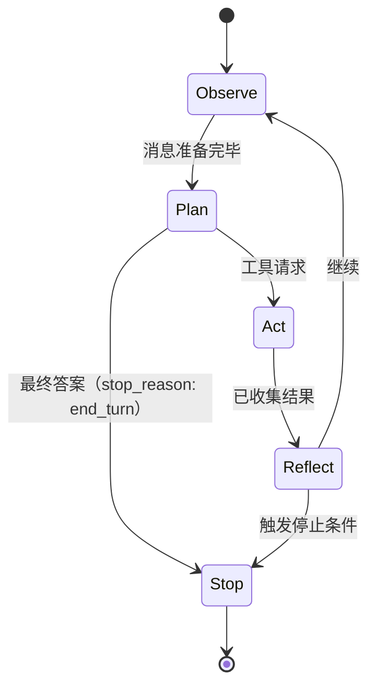
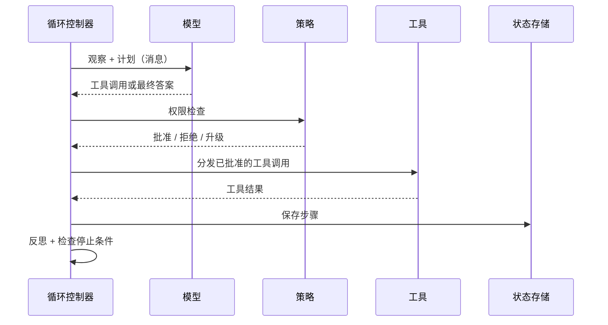

# 第 02 章 — 智能体循环

## TL;DR

第 01 章讲的是一次工具调用。本章把这次调用包进循环：模型发出工具请求，你的代码执行它，结果被送回模型，然后模型再次决定——继续调用工具，还是停止。难点不在循环体，而在如何停止。停止条件写错，你要么得到一个思考到一半就退出的聊天机器人，要么得到一个一直运行到费用爆炸的智能体。本章介绍循环的结构、结束循环的各种方式、隐藏其中的故障模式，以及每一种生产能力——持久性、可观测性、权限、审批、压缩——最终接入的步骤边界。

---

## 为什么这很重要

同事交给你一个“演示时正常、生产中却永远跑不完”的智能体。你查看代码：循环有了，模型会发出工具调用，工具结果也会返回，但没有任何东西告诉模型何时停止；当模型始终不说自己完成时，循环也不知道该怎么办。你加上 `if step > 20: break`。循环退出了，但现在会在回答中途退出。你把退出判断移到模型回复之后，大多数时候能干净结束，但模型偶尔会在看似最终答案之后再发出一次工具调用，而你悄无声息地漏掉了结果。你为此耗费一整天。

解决办法不是写更多代码，而是理解：循环有多种结束方式，它们都必须存在；模型自己的 `stop_reason` 才是主要信号，而不是行数计数器。

---

## 核心概念

### 一次工具调用通常不够

简单问题——“东京天气怎么样”——一次调用就够。真实问题——“东京本周末的天气适合野餐吗？如果适合，我周六的日程有空吗？”——至少需要查询天气、查询日历并进行比较。两次调用可能相互依赖，也可能还需要第三次调用来澄清。你无法预先准确规划需要多少次调用；模型必须在每一步根据目前掌握的信息作出决定。

这就是智能体循环：不断重复第 01 章的周期，每轮之后都有一个决策点——继续，还是停止？

### 五个阶段

想象繁忙时段的厨房。主厨（模型）报出订单，厨房（工具）负责执行；主厨品尝返回的结果，再发出下一轮指令——直到菜品装盘送出。副厨师长（循环控制器）不决定菜什么时候完成，主厨决定。但如果主厨沉默不语，或者菜已经送走还在不停下单，副厨师长就需要备用方案——预算、计时器，以及按铃停止的手——避免厨房陷入混乱。

无论你把循环叫作 ReAct、计划并执行，还是思考—行动—观察，底层都会出现相同的五个阶段：

- **观察（Observe）。** 收集模型需要的一切：用户消息、系统提示、之前的工具结果和检索到的上下文。实践中，这就是不断增长的消息数组。
- **计划（Plan）。** 调用模型。它返回工具请求、最终答案或一个问题。你的代码不在这里做决定；模型做决定。
- **行动（Act）。** 执行工具请求。一次或多次都一样——把第 01 章写好的分发逻辑放进循环。
- **反思（Reflect）。** 将工具结果连同匹配的 ID 追加到消息数组。模型现在能看到发生了什么。
- **停止（Stop）。** 检查是否触发了任一停止条件。如果触发就返回，否则回到观察阶段。



### 循环实际携带什么

循环并不只是遍历消息数组。在迭代之间，它还保存：

- **目前消耗的 token**——用于预算检查。
- **步骤计数**——用于迭代上限。
- **最近几次工具调用的简短历史**——用于检测灾难循环（见下文）。
- **中止令牌**——让用户或系统其他部分可以在循环中途取消。
- **系统提示**——在迭代间保持字节级稳定，使前缀缓存持续命中（第 04 章解释原因）。

当你第一次尝试从崩溃中恢复一个循环时，才会意识到它携带了多少状态。这是第 08 章的问题。现在只需记住：消息数组并不是全部。

### 停止条件是一条光谱，不是一张清单

每个生产级循环都会使用多个停止条件，从最柔和到最强硬逐层设置：

- **模型驱动停止。** 模型不返回工具调用，并给出 `end_turn`（或 OpenAI 风格 API 中的 `stop`）结束原因。这是主要信号——模型认为自己已经完成。
- **显式 `final_answer` 工具。** 在注册表中加入 `final_answer(text)` 工具，并规定这是模型提交结果的唯一合法方式。这迫使模型有意识地结束，防止答案已经存在后继续漂移到额外调用，也为日志提供干净、规范的输出。
- **宽限调用（grace call）。** 有些系统在预算即将耗尽时给模型最后一轮，并在提示中告诉它：“你只剩一轮，请收尾。”模型通常能干净结束。没有这一层，硬上限会切断思考。OpenClaw 是这一模式最清楚的参考。
- **步骤上限。** 迭代次数的硬性上限——通常为 10–50 次，长时间运行的助理系统有时接近 90 次。它是安全网，不是主要停止方式。如果循环大多数时候都靠它结束，说明上游出了问题。
- **Token 或成本上限。** 当总 token 或累计成本超过阈值时退出，并把已有产出标记为部分结果后返回。

在线路层面，其结构如下：

```ts
// 最小循环——展示结构，不是最终代码。
for (let step = 0; step < MAX_STEPS && totalTokens < TOKEN_BUDGET; step++) {
  const response = await llm.complete({ messages, tools });
  totalTokens += response.usage.totalTokens;

  // 模型驱动停止或显式 final_answer。
  if (isFinalAnswer(response)) return finalize(response);

  // 行动 + 反思。
  for (const call of response.toolCalls) {
    const result = await dispatch(call.name, call.args);
    messages.push(toolResult(call.id, result));
  }
}
return partialResult(messages, "budget_exhausted");
```

让你的智能体把它翻译成你的技术栈，然后加入宽限调用行为，避免在思考中途悄无声息地截断。

### 有时正确答案既不是继续，也不是停止，而是压缩

每一步之后，循环实际上有三种选择，而不是两种：进入下一次迭代；因为触发条件而停止；或者进行*压缩（compact）*——暂停、缩小消息数组，然后继续。当上下文窗口快满时触发压缩。OpenCode 的会话处理器会监视可用上下文计算结果，Hermes Agent 则根据 token 溢出检查触发。具体机制——裁剪什么、总结什么、哪些内容原样保留——属于第 05 章。本章要建立的认识是：循环有第三个控制杆，而不仅是开和关；步骤边界正是拉动它的位置。

### 错误也是一个轮次

当工具失败或模型发出格式错误的工具调用时，几乎总是应该把错误作为 `tool_result` 追加进去并继续循环。模型很擅长读取错误，然后用修正后的参数重试，或转向另一种方案。让异常逃出循环几乎从来不是正确答案。

两类错误最重要：

- **暂时性错误。** 网络波动、限流、模型过载。使用退避策略重试（生产系统的计划可能从几秒延伸到两小时）。多次失败后，回退到一个*兼容*模型——它支持相同的工具 Schema、至少具备本轮所需的上下文窗口，并满足任务对推理和内容策略的要求。缺少主要模型的工具格式、上下文容量或策略一致性的回退模型并不是回退，而是另一种故障模式。Hermes Agent 和 OpenClaw 都提供可配置的回退模型链，兼容性就在链定义中声明。
- **永久性错误。** 凭证错误、Schema 校验失败、工具不在注册表中。立即暴露。重试多少次都无法修复。

所有值得研究的系统最终都会收敛到相同结构：先对错误分类，再将其路由到重试、回退或向外暴露。让你的智能体把 `classify_error(err) → action` 接入循环，并编写测试证明每种错误都被正确路由。

### 灾难循环及其检测方法

最常见的失控模式是*灾难循环（doom loop）*：模型连续三四次用相同参数调用同一个工具，每次得到相同且无用的结果，却没有意识到自己卡住了。OpenCode 和 Hermes Agent 都有显式检测——常用规则是：“如果最近三次工具调用的名称和参数完全相同，暂停并请求继续执行的许可。”

逐字节比较能捕获大多数情况，但无法捕获调用形状不断变化却没有真实进展的慢循环——`read(file, offset=0)` → `read(file, offset=100)` → `read(file, offset=200)`——模型一直在“查看”，却始终没有找到结果。对此，你需要让工具自己跟踪进展，或者使用启发式规则判断消息数组增长了多少却没有产生有用输出。大多数团队会从逐字节比较和步骤上限开始，并接受由成本预算捕获更隐蔽的卡死模式。

### 单轮中的并行工具调用

现代服务商允许模型在一个响应中发出多个工具请求。如果这些工具相互独立且能安全并发，就应该并发执行——这会显著降低实际等待时间。OpenClaw 和 Hermes Agent 的模式是：为每个工具标注 `concurrency_safe: true | false`，在工作线程池中运行安全工具（常见上限是八个工作线程），其余工具则串行执行。只读工具通常安全；任何涉及写入、发送或付款的工具通常都不安全。

### 流式传输、部分增量与拒绝

现代服务商会以数据块形式流式返回响应：文本 token、推理块、工具使用块、结束原因，有时还有拒绝或安全中止。循环必须先把它们组装成连贯结果，再采取行动。以下五个问题只会在流式模式中出现：

- **工具调用参数逐步到达。** OpenAI 风格的流式响应会把工具调用参数作为 JSON 字符串增量分散到多个事件中——先是 `{"city"`，接着是 `: "Tok`，最后是 `yo"}`。循环必须先收集同一工具调用 `id` 的全部增量，再解析和分发。在片段不完整时分发，是最常见的流式错误。
- **参数 JSON 格式错误。** 即使完成收集，模型仍可能生成无法解析的 JSON——末尾多一个逗号、字符串没有闭合、键没有值。像处理其他可恢复错误一样处理它：返回一个 `tool_result`，说明“你的参数无法解析；这是错误；请重试”，让下一轮修正。看到解析错误后，模型很擅长修复自己的 JSON。
- **拒绝是终止轮次。** 模型可能出于安全原因拒绝调用某个工具或任何工具。Anthropic 会发出 `refusal` 块，OpenAI 则使用不同的内容类型或结束原因。对循环而言，拒绝以拒绝消息结束本轮，而不是工具结果。记录它，向用户展示它，不要对同一个提示盲目重试。
- **流式传输中途的安全停止。** 服务商的内容过滤器可能截断响应——流以 `content_filter`（OpenAI）或等价的 `finish_reason` 结束。把它视作本轮的终止失败；如果部分输出有用就展示，但不要盲目重试（相同输入会再次触发同一过滤器）。
- **流式传输中途取消。** 下一节的中止令牌也适用于数据流，而不只是下一轮边界。干净的取消会停止从服务商读取数据、关闭连接，并且不会提交任何尚未成形的工具调用。已经分发的调用会收到“用户已取消”的 `tool_result`。

不同服务商的线路格式各不相同；循环的响应方式——收集、校验、分发或向外暴露——处处相同。

### 中断与取消

用户按下 Ctrl-C、触发超时、父进程认为循环运行过久——这些信号都需要向内传播。常见模式是：每个循环持有一个中止令牌，每个长时间运行的步骤都检查它；令牌被触发后，干净地展开调用栈并返回部分结果，而不是直接撕掉进程。“中断发生在工具调用中途”值得单独考虑：让工具完成（或让工具自己检查令牌），不要遗留完成一半的写操作。

### 步骤边界是所有能力的接入点

行动与反思之间——结果已经收集，但尚未追加——是天然的检查点。此时循环持有一个完整工作单元：一次计划、一组工具调用、一组结果。以下五类生产能力都挂接在这个边界：

- **持久性。** 保存状态，在崩溃后恢复且不重复昂贵操作。→ 第 08 章。
- **可观测性。** 为每一步发出结构化追踪：调用的工具、使用的 token、延迟和错误数。→ 第 16 章。
- **权限检查。** 在分发前对行动阶段设置门控。→ 第 03、12 章。
- **人工审批。** 在高风险操作前暂停并等待批准。→ 第 12 章。
- **上下文压缩。** 裁剪过大的结果、去重、总结较早轮次。→ 第 05 章。



循环体很小，围绕它的边界才是生产系统真正存在的地方。

---

## 真实系统笔记

- **OpenCode** 在 `SessionProcessor` 中运行循环，为每一步的每个部分流式发送事件，通过工作线程池分发工具，并在上下文窗口开始填满时触发压缩。
- **Hermes Agent** 在 `run_conversation` 中运行类似循环，最大迭代上限接近 90；它维护凭证池，在限流错误时轮换 API 密钥，并使用回退模型链处理上下文溢出。
- **OpenClaw** 是优雅停止行为最清楚的参考：它计算迭代次数，在距离预算只差一次时给模型一次*宽限调用*，之后才强制硬停止。
- **Paperclip** 自己不运行内层循环——由适配器运行。它负责的是循环*之外*的循环：调度、心跳、从几分钟到几小时的延迟重试策略、存活检查和持久运行日志。

---

## 常见故障案例

*这些故障长期存在，而修复方式演进最快——这里指出模式，把当前具体做法留给你和你的 AI 搭档。*

- **运行总是在步骤上限停止。** 长任务在迭代上限而不是模型驱动的 `end_turn` 结束，因此每次运行都支付最大模型调用次数的成本。*修复：把 `final_answer` 停止工具设为唯一合法结束方式，并对停止原因建立指标和告警（第 16 章）。*
- **一次短暂波动变成重试风暴。** 服务商短暂故障造成负载和账单远超故障本身：同步重试同时冲击服务商，昂贵调用在后台重复执行。*修复：使用全抖动退避让请求错开；先分类再重试并设置有限预算；使用熔断器快速失败。*
- **循环已经卡住，灾难循环过滤器却从未触发。** 智能体没有真实进展地空转，而逐字节相等检测器看到不断变化的调用形状，认为一切正常。*修复：在相等检查之外加入无进展启发式规则——使用进展受限循环，要求每一步推进一个可测量的量。*
- **并行执行了不适合并行的工具调用。** 并发执行速度更快，却偶尔以非确定方式出错，因为一个被过度乐观标为安全的工具在共享状态上发生竞争。*修复：让 `concurrency_safe` 默认为 false，并划分每个批次——已经证明安全的集合并发运行，其余按发出顺序串行执行（第 03 章）。*

---

## 与你的智能体结对

以下提示词很适合用于本章：

- *“把最小循环伪代码翻译成我的技术栈。加入宽限调用和另外四种停止条件，并指出每一种在哪里触发。”*
- *“实现灾难循环检测：逐字节比较最近三次工具调用。带我看一个能捕获的真实卡死案例，以及一个无法捕获的案例。”*
- *“把这些错误分类为暂时性或永久性——限流、Schema 校验失败、工具不存在、模型过载、凭证过期——将 `classify_error → action` 接入循环，并编写测试。”*
- *“把中止令牌贯穿整个循环。展示用户在工具调用中途和模型调用中途取消时分别会发生什么，以及部分结果的结构。”*
- *“带我理解 OpenCode 的 SessionProcessor 如何在继续、压缩和停止之间做决定。然后用我的技术栈和惯用写法实现等价结构。”*

---

## 下一步

你已经有了循环。接下来，循环需要能够信任它的工具。第 03 章讲 Schema 之外的契约——参数校验、副作用分类、幂等性、可恢复错误与致命错误的区别，以及为什么安全路径比安全代码更重要。
