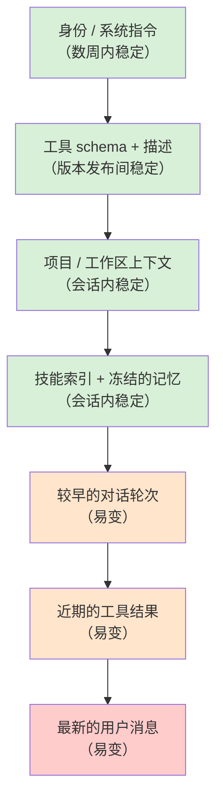

# 第 04 章 — 提示词、上下文，以及为它们买单的缓存

## TL;DR

系统提示词不是一个字符串，而是一个由两部分组成的装配结构：一部分是轮次之间不应变化的稳定前缀（系统规则、工具 schema、项目上下文、冻结的记忆快照），另一部分是会变化的易变尾部（最新的用户消息、近期的工具结果）。服务商会缓存前缀，因此稳定的前缀只需付费一次，之后的每一轮都可以复用——而只要前缀有一个字节发生变化，每一轮就都要支付全额费用。本章将介绍如何装配提示词才能真正触发缓存、什么会破坏缓存（几乎总是某件你没有注意到的事），以及如何设计构建器，使记忆更新、工具变更与压缩不会悄无声息地让你刚刚付费建立的一切失效。

---

## 为什么这很重要

你交付了一个智能体。它运行良好。两周后，你的账单却是预期的四倍。你查看模型用量日志，发现 `cache_read_input_tokens` 接近于零，而 `cache_creation_input_tokens` 居高不下。提示词每一轮都在从头重建。你检查系统提示词——然后在最上方发现了 `Date.now()`，这是你为了让“助手知道当前时间”而添加的贴心功能。每一轮的时间戳都不同，每一轮都缓存未命中，每一轮都支付全额费用。

修复只需要一行。教训却更大：缓存节省在失效之前是看不见的，而提示词有半打方式可以悄无声息地破坏缓存。本章要讲的，就是如何设计提示词来避免这种情况。

---

## 核心概念

### 提示词是一种装配结构

一个有用的心智模型是：提示词是一叠分层内容，从上到下按照最不可能变化到最可能变化的顺序排列。



稳定与易变之间的分界线，大致也是可缓存与不可缓存之间的分界线。设计提示词，主要就是把内容放到这条线正确的一侧，并让它们一直待在那里。

OpenCode、Hermes Agent、OpenClaw 和领先的商业编码智能体，大体都按这个顺序构建系统提示词，并采用确定性的合并方式，确保没有任何实质变化时，各次调用得到的字节序列完全相同。

### 不可变规则

最令人意外、也是大多数团队在违反之后才发现的一条规则是：*系统提示词一旦构建完成，就会被冻结。*

如果某个工具在循环中途运行并写入 `MEMORY.md`，当前运行中的系统提示词不会改变。更新要到*下一次会话*才可见，而不是当前会话。Hermes Agent 明确执行这条规则——基于文件的记忆更新有意不会反映到运行中的提示词里。领先的编码智能体也采用相同做法。原因很机械：前缀字节序列的任何变化，都会使后续每一轮的缓存失效。

这条规则有两个值得真正理解的后果：

- **只有在没有任何东西于运行中重写前缀时，才能让提示词缓存在长会话中始终保持温热。** 后台记忆写入落到磁盘；它们在下一次会话开始时才会被读取。
- **“实时”提示词比冻结的提示词更昂贵**，成本往往高出数倍。如果某个功能看起来需要实时更新提示词（“每一轮都向模型显示当前时间”），应把它放在易变尾部，而不是稳定前缀中。

### 用与服务商无关的方式理解缓存

服务商真正缓存的是消息流的一个*前缀*。如果下一次请求的前缀与上一次请求的前缀逐字节匹配，服务商就会跳过对这些词元的重新处理，并只收取正常价格的一小部分。不同服务商的机制有所差异：

- **OpenAI 风格 API** 会自动缓存前缀。无需标记——如果你的词元与之前某次请求匹配，就能获得折扣。
- **Anthropic 风格 API** 要求显式设置 `cache_control` 数据块。你最多可以标记四个断点；服务商会分别缓存截至每个断点的内容。
- **其他服务商**（Bedrock、Gemini、Vertex）介于两者之间，通常通过 SDK 的规范化层暴露缓存能力。

无论哪种情况，提示词构建器都遵循同一条规则：保持前缀字节完全相同，并把变化放在末尾。服务商之间的差异，只在于你能以多高的精度塑造缓存，以及如何度量命中情况。

```ts
// Anthropic 风格的显式缓存——在稳定前缀末尾标记一个断点。
{
  system: [
    { type: "text", text: identitySection },
    { type: "text", text: toolSchemas },
    { type: "text", text: projectContext,
      cache_control: { type: "ephemeral" } }  // ← 缓存到这里
  ],
  messages: [ ...volatileTurns ]
}
```

### 四块滑动窗口

Anthropic 的缓存允许你把断点放在*消息*上，而不只是系统数据块上。生产系统中逐渐形成了一种*四块滑动窗口*模式：在系统提示词末尾放一个断点，再在最近的几个用户/助手轮次上放三个断点。Hermes Agent 的 `apply_anthropic_cache_control` 正是这样做的；领先的商业编码智能体也呈现出相同形态。

它带来的收益是：长对话可以让系统提示词永远保持温热，*同时*每一轮都会重新缓存最后两三个轮次，因此下一轮实际新增词元的成本，大致只包括用户刚刚输入的内容和最新的工具结果。没有这种模式时，五十轮的对话会在每一步重新处理越来越多的近期历史；采用它之后，近期历史的开销会大致保持恒定。

你不需要在第一天就使用它。当你第一次看到成本随着对话长度超线性增长时，自然会需要它。

### 缓存 TTL：短时、长时与预热

缓存条目不会永远存在。截至 2026 年年中，Anthropic 的临时缓存默认在每个断点保留大约五分钟，也可以选择延长到约一小时，但每词元需支付额外费用；OpenAI 风格的自动缓存采用相似的服务商托管窗口。在调优之前，请查看服务商的当前定价——这些数字会变。然而，架构层面的权衡是稳定的：

- **短 TTL** 适用于连续轮次相隔几秒或几分钟的活跃会话。每次命中都会刷新条目，因此繁忙的对话不会遇到过期。
- **长 TTL** 适合值得支付前期溢价的突发式会话——用户问一个问题，离开半小时，然后回来。没有更长的 TTL，用户返回时整个前缀都要重新付费。
- **缓存预热** 是一种小众但有用的网关系统模式：会话创建后（或在被驱逐后从磁盘恢复时），先发送一个很小的无操作请求，在用户真正的第一条消息到来前预热缓存。一些生产网关会为高价值会话透明地执行这一操作。

正确的设置来自观察真实流量中实际的*轮次间隔时间*。如果轮次间隔的 p50 小于一分钟，默认 TTL 就足够了。如果 p90 超过十分钟，支付长 TTL 的溢价几乎肯定比让缓存冷却、并在每次返回时重新支付全额更便宜。这项决定应由数据驱动——让你的智能体拉取直方图并选择阈值；不要凭感觉判断。

### 什么会破坏缓存

几乎每一种诱人的做法都很危险。具体来说，常见的罪魁祸首包括：

- **前缀中的 `Date.now()` 或任何时间戳。** 每一轮都是新值。每一轮都缓存未命中。
- **工具注册表变更。** 添加或移除工具会改变 schema 字节，而它们位于前缀靠前的位置。应按（智能体、模型）组合记忆化 schema 数组，但也要明白注册表变更代价高昂。
- **非确定性排序。** 如果你通过 `Object.entries()` 或未排序的文件系统遍历装配提示词，顺序可能随运行时版本、操作系统，甚至运气而变化。OpenClaw 使用静态的 `CONTEXT_FILE_ORDER` 映射；Hermes Agent 使用固定的章节列表。选定一个顺序，并将它固定下来。
- **后台记忆写入更新了运行中的提示词。** 不可变规则已经讲过——这里值得重申，因为这是最容易无意间引入的问题。
- **注入共享前缀的用户特定数据。** 如果多个用户访问同一个智能体，每用户数据应放在尾部；前缀应与用户无关。
- **空白与格式漂移。** 多一个换行符也算未命中。如果使用模板生成提示词，应锁定空白格式。
- **依赖区域设置的格式化**（对数字使用 `toLocaleString()`、对日期使用 `format()`）会在不同机器上产生不同字节。
- **包含会话 ID 的“会话开始”横幅。** 看起来无害，却会扼杀跨会话缓存。
- **自动格式化器或 linter 重写磁盘上的提示词模板。** 保存时重新格式化的工具插入一个尾随换行符或规范化引号，会在服务下一次部署时悄无声息地使每个已缓存的前缀失效。
- **高精度数值格式化。** 把评分或价格以完整浮点精度渲染进前缀，在不同机器或不同库版本上可能产生不同的末尾数字。

最短的调试路径是：在每个请求中记录一个指纹——渲染后前缀的 SHA——并观察它在各轮次间的值。如果没有任何实质变化时指纹却发生了变化，就说明存在泄漏。本章还会再使用这个指纹两次。

### 前缀漂移时使用分层指纹

单个覆盖整个前缀的指纹可以捕获漂移；但它不会告诉你漂移来自*哪里*。低成本的改进方式，是在整体指纹之外，为前缀的每一层各记录一个指纹：

```ts
debug: {
  prefixFingerprint:   sha(prefix.bytes).slice(0, 12),
  identityFingerprint: sha(prefix.identity).slice(0, 12),
  toolsFingerprint:    sha(prefix.toolSchemas).slice(0, 12),
  contextFingerprint:  sha(prefix.projectContext).slice(0, 12),
  memoryFingerprint:   sha(prefix.frozenMemory).slice(0, 12)
}
```

当整体哈希发生漂移时，各层哈希可以定位原因。部署前后工具哈希发生变化，通常意味着启用的工具有增减或描述被编辑。会话中途上下文哈希发生变化，通常是工作区遍历顺序改变，或磁盘上的上下文文件被重写。会话期间记忆哈希发生变化，说明不可变规则遭到了破坏。分层视图用一行日志，就能把*“缓存在某处坏了”*变成*“有人编辑了一条工具描述”*。

如果分层哈希缩小了嫌疑范围，却仍无法指出具体字节，可以把最近一次成功渲染的前缀保存到磁盘（或一个小型内存环中），然后把当前版本与之进行 `diff`。一个多余的换行符、一个重新排序的键、一个高精度数字——都会立刻显现。OpenCode 和 Hermes Agent 已经出于其他原因（压缩、会话恢复）持久化了渲染后的前缀；把它转变为调试界面只需要几行代码，并非一个新系统。

当缓存命中率下降而*“什么都没有变”*时，就该使用这个工具。

### 工具 schema 是前缀的一部分

工具定义位于提示词靠前的位置，并且往往很大。它们的变化也比人们预期的更多——启用新工具、调整描述、收窄枚举、添加参数，都会改变字节。生产系统普遍采用以下模式：

- **按智能体配置记忆化工具 schema 数组。** OpenCode 按（智能体、模型）组合执行这一操作，使相同的智能体共享相同的 schema 字符串。
- **固定顺序。** 工具每次都应以相同顺序出现。可以按字母排序，也可以使用保持插入顺序的注册表，但绝不要遍历无序哈希。
- **把工具描述编辑视为前缀变更。** 它们*就是*前缀变更。应在会话边界发布，而不是在会话中途发布。

这也是第 03 章所说“工具越少，推理越敏锐”带来的第二重收益：更少的工具意味着更少的前缀字节，也意味着更多的缓存复用。

### 压缩是缓存的不连续点

第 02 章把压缩作为每次迭代的一种结果，与继续和停止并列，并把具体技术留到第 05 章讨论。*这里*值得指出的是：压缩会在触发的那一轮破坏消息级缓存——消息数组已被重写，从该点开始，服务商看到的是一个新的前缀。

一个实用的设计选择是：在历史记录的*后部*进行压缩（把最早的轮次总结成简报，保留近期轮次不动），而不是在中间压缩。尾部压缩牺牲的是本来也即将被移出窗口的内容缓存；中间压缩会使压缩点之后的一切失效，而那可能是对话的大部分内容。OpenCode 的 `SessionCompaction.Service` 和 Hermes Agent 的 `ContextCompressor` 都采用这种方式——它们保护近期轮次的窗口，只重写较早的内容。

压缩触发器本身也是一个需要考虑缓存的决策。过早压缩（每五轮一次）会频繁烧掉缓存；响应式压缩（只在即将溢出时进行）能让缓存保持温热更长时间。大多数系统最终都会采用响应式策略。

### 避免每智能体提示词变体引发缓存爆炸

多智能体系统（第 10 章、第 14 章）会为不同智能体配置不同提示词——探索、构建、规划、压缩、标题生成、总结。简单处理会产生 N 个不同的系统提示词和 N 份不同的缓存。保持缓存可共享的模式是：

- **把真正共享的部分放在最前面**——通用规则、基础工具注册表、项目上下文。
- **把智能体特定的覆盖内容放在后面**——额外工具、权限规则、智能体角色设定、角色专用指令。
- **在两部分的边界处进行缓存。**

OpenCode 使用的正是这种结构：一个由两部分组成的系统数组，前半部分是模型家族规则，后半部分是智能体特定内容。前半部分会在会话中的所有智能体之间保持缓存温热；只有当你从 `explore` 切换到 `build` 时，后半部分才会缓存未命中。节省会不断累积：在智能体频繁交接的会话中（编码工作流很常见），共享的前半部分可以命中缓存数千次。

### 项目上下文有其来源

图中的“项目 / 工作区上下文”层不会凭空出现。生产智能体通过一条在会话开始时运行一次的固定流水线来发现它：

- **从工作目录向上遍历**，寻找上下文文件（`AGENTS.md`、项目级指令文件、`README.md`、仓库根目录标记）。领先的编码智能体通常在遇到第一个 git 根目录或文件系统边界时停止。
- **按确定性顺序读取。** OpenClaw 的 `CONTEXT_FILE_ORDER` 是一张静态映射（`soul.md`、`identity.md`、`AGENTS.md`、`MEMORY.md`、`README.md` 位于固定位置）；Hermes Agent 在 `build_system_prompt` 中使用固定的章节列表。固定顺序，确保同一项目每次运行产生的字节完全相同。
- **限制大小。** 把一个 50 KB 的 `README.md` 塞进前缀，意味着第一次缓存未命中时要处理 50 KB，而且之后要永远维持 50 KB 的载荷温热。要么截断，要么在会话开始时用便宜的模型总结一次，并把总结缓存到磁盘。
- **先做快照，然后冻结。** 会话开始时磁盘上是什么，运行中的提示词就看到什么，仅此而已。会话中途对这些文件的编辑只影响下一次会话，而不是当前会话——这和记忆遵循同一条不可变规则。
- **尊重隐私边界。** 多用户智能体不得把用户特定文件读入共享前缀。要么按用户划分缓存范围（每个用户使用不同缓存行），要么把用户数据留在尾部。

OpenCode 通过每项目缓存解析项目范围的状态，因此两个项目的上下文不会渗入彼此的提示词。各系统普遍遵循的规则是：*发现过程是构建器的一部分，而构建器正是指纹所覆盖的对象。* 如果工作区遍历发现了新文件，或某个文件在两次会话之间发生变化，你的指纹就应该变化，而且你应该预料并接受这次缓存未命中。固定顺序和限制大小的目的，是确保只有*真正的*变化才会造成缓存未命中——而不是文件系统遍历顺序造成的伪变化。

### 快照与实时：记忆在何处进入提示词

到第 05–07 章时，大多数系统至少拥有两种记忆来源：

- **基于文件的记忆**（MEMORY.md、USER.md、技能文件）——在会话开始时读取，*嵌入*系统提示词并冻结。
- **外部记忆或查询所得记忆**（向量数据库、知识库、检索到的文档、新鲜的搜索结果）——每轮获取，存在于*易变尾部*而非前缀中。

这种划分的存在正是*因为*缓存。任何必须重新查询的内容都无法安全缓存；任何能够一次加载并保持稳定的内容都可以缓存。Hermes Agent 明确区分二者：`MemoryManager.prefetch_all()` 在循环开始前只运行一次，它返回的内容会被折叠进冻结的前缀；循环中的记忆查询则作为工具结果添加到尾部。

规则是：如果记忆层想进入前缀，就冻结它。如果想保持实时，就接受它属于尾部。试图二者兼得——实时更新一个“稳定”前缀——是团队意外摧毁缓存命中率的最常见方式。

### 缓存与恢复按钮是同一件事

有一个副作用值得注意：保持缓存温热所需的纪律，与实现会话恢复所需的纪律完全相同。冻结的前缀、确定性的构建、稳定的字节序列——这些也正是从磁盘重新水化智能体并继续运行而不出现意外所需要的条件。

如果你能证明进程重启后前缀指纹仍然相同，就可以在温热缓存的基础上恢复。Hermes Agent 在 `SessionDB` 中持久化系统提示词正是为了这个目的——网关可以停止并重启智能体，而不必为自身前缀重新付费。Paperclip 的适配器会话编解码器在技术栈更上层实现了相同目的：编排器存储不透明状态，让下一次心跳能够逐字节地从上一次停止的位置继续。

这就是为什么跳过第 04 章这套纪律的团队会付出双重代价：缓存命中率很差，*而且*恢复机制很脆弱。这是从两个角度看到的同一个问题，也共享同一种修复方式。我们会在第 08 章继续讨论。

### 缓存命中率就是可观测性

没有度量的缓存，就是无法信任的缓存。服务商会在每次响应中返回用量字段；跟踪它们，并观察其比率随时间的变化：

```ts
// 缓存命中率——输入词元中有多大比例来自缓存。
type Usage = {
  input_tokens: number;
  cache_read_input_tokens?: number;     // 命中
  cache_creation_input_tokens?: number; // 首次，按全额付费
  output_tokens: number;
};

function cacheHitRatio(usages: Usage[]) {
  const cached  = sum(usages.map(u => u.cache_read_input_tokens     ?? 0));
  const created = sum(usages.map(u => u.cache_creation_input_tokens ?? 0));
  const fresh   = sum(usages.map(u => u.input_tokens));
  return cached / Math.max(cached + created + fresh, 1);
}
```

按会话和智能体绘制这个数值。对于稳定的多轮工作流，正确的数值通常在 60% 到 95% 之间。当它下降时，首先应检查上一小节提到的前缀指纹；其次应检查是否发布了某个更改工具描述、指令或上下文文件的版本。

这项指标属于第 16 章的追踪流水线。越早接入它，就越能在账单到来之前发现下一个等同于 `Date.now()` 的问题。

### 提示词构建器契约

一个整洁的提示词构建器有两个方法和一个调试辅助项：

```ts
type PromptBuilder = {
  buildStablePrefix(session: Session): Promise<StablePrefix>;
  buildVolatileTail(run: RunState):   Promise<Message[]>;
};

async function buildRequest(s: Session, r: RunState, b: PromptBuilder) {
  const prefix = await b.buildStablePrefix(s);
  const tail   = await b.buildVolatileTail(r);
  return {
    system:   prefix.blocks,
    messages: tail,
    debug:    { prefixFingerprint: prefix.sha256 }  // 每个请求都记录
  };
}
```

这份契约会强制执行上述纪律。稳定内容走一条路，易变内容走另一条路；任何溜进错误半区的东西，都会被类型系统或指纹捕获。指纹是内容悄然变化时的确凿证据——一行日志就能抓住单元测试无法发现的回归。

Hermes Agent 更进一步，把渲染后的前缀持久化到 SessionDB。当网关驱逐内存中的智能体，下一条用户消息又将它重建时，会重放*完全相同的字节*，缓存也能跨驱逐命中。这是网关式架构的黄金标准，因为其中的智能体不会永久驻留在内存里。如果无法持久化完整前缀，至少要持久化指纹以及生成它的输入——这样，缓存未命中时，你就能证明究竟是构建器 bug，还是一次合理的变化。

---

## 真实系统笔记

- **OpenCode** 使用由两部分组成的系统数组（模型家族规则 + 智能体特定覆盖内容），并在各次调用间保持不变以支持 Anthropic 缓存；它按（智能体、模型）组合记忆化工具 schema，并使用 `SessionCompaction.Service` 在总结较早历史时保护一个近期轮次窗口。
- **Hermes Agent** 是端到端缓存感知设计的最佳参考：基于文件的记忆会在会话开始时成为嵌入提示词的冻结快照；系统提示词持久化在 `SessionDB` 中，以跨越智能体驱逐；由 `cache_control` 断点构成的四块滑动窗口（系统 + 最后三条消息）则让近期轮次可以被重新缓存。
- **OpenClaw** 通过静态的 `CONTEXT_FILE_ORDER` 映射保持缓存稳定，以确定性地合并文件（`soul.md`、`identity.md`、`AGENTS.md`、`MEMORY.md`、`README.md` 始终位于同一位置）；同时隔离服务商特定的提示词文件，使模型家族的变化不会让其他服务商的缓存失效。
- **Paperclip** 不会自己构建内部系统提示词——这由适配器完成——但它会不透明地持久化会话参数，以便适配器在多次心跳间重放。编排层面的教训是：提示词连续性是一个状态管理问题，而不是字符串构建问题。

---

## 常见失败情况

*这些故障模式经久不变，而具体修复方式演化得最快——每一项只给出模式，把当前实现细节留给你和你的 AI 伙伴。*

- **一个实时值溜进了前缀。** 时间戳、会话问候语或每轮计数器改变了稳定前缀，因此缓存永远不会触发，账单悄无声息地成倍增长。*修复：把前缀指纹变成警报，并把所有动态内容都视为有罪，直到证明它是静态的；动态内容属于易变尾部。*
- **一次部署悄悄使所有温热缓存失效。** 格式化器、依赖升级或一条经过编辑的工具描述改变了前缀字节，所有会话同时重新预热。*修复：把渲染后的前缀视为受变更控制的构建产物，为各层设置指纹，并在会话边界推出有意的变更。*
- **租户一多，缓存纪律就崩溃。** 与用户无关的前缀跨租户泄漏；或者把每用户数据折叠进来，将共享缓存打碎成只能使用一次的条目。*修复：在构建器和缓存键中明确共享与每租户内容的边界——共享数据块只缓存一次，范围受限的尾部按租户设键（第 15 章）。*
- **压缩触发得太早，导致缓存一直冰冷。** 固定节奏的触发器在上下文压力迫使压缩之前就重写消息数组，丢掉了对话即将复用的缓存。*修复：响应式地压缩，而不是按固定节奏压缩；始终在后部而不是中间压缩（第 05 章）。*

---

## 与你的智能体结对

以下提示词很适合用于本章：

- *“审计我当前的系统提示词。找出调用之间可能变化的每一部分——时间戳、区域格式、非确定性排序、用户特定数据、会话 ID——并重写构建器，使前缀逐字节稳定。”*
- *“在每一条请求日志中加入渲染后稳定前缀的 SHA-256 指纹。运行一个真实的十轮会话，并展示每一轮的指纹。如果发生漂移，找出原因。”*
- *“实现四块滑动窗口模式：在系统提示词末尾设置一个 `cache_control` 断点，在最近的用户/助手消息上再设置三个。然后绘制二十轮对话中 `cache_read_input_tokens` 与 `cache_creation_input_tokens` 的变化。”*
- *“把提示词装配重构成由两部分组成的系统数组——先放模型家族规则，再放智能体特定覆盖内容。添加第二个智能体配置，并向我证明它们共享缓存的前半部分。”*
- *“我的智能体有一个会在会话中途更新的 `MEMORY.md` 文件。修改循环，让更新写入磁盘，但运行中的系统提示词保持冻结。通过指纹验证写入记忆后，前缀字节没有变化。”*
- *“带我了解 Hermes Agent 如何在 SessionDB 中持久化系统提示词，并在智能体被驱逐后逐字节相同地重放。然后为我的技术栈实现等价机制——即使只是一个能挺过进程重启的最小版本。”*
- *“拉取我最近五十个会话的轮次间隔时间直方图。使用 p50 和 p90 推荐缓存 TTL 设置，并给出背后的计算——比较长 TTL 溢价与冷返回时重新缓存的成本。”*

---

## 下一步

现在，你已经拥有一个经过设计、能够保持缓存温热且可复现的提示词。下一个问题是它所依托的易变尾部——每一轮都会增长的对话历史、工具结果与工作记忆。第 05 章将介绍如何防止尾部爆炸，同时又不破坏你刚刚建立的缓存；第 06–07 章则介绍会反馈进*下一次*会话前缀的长期记忆，而本章建立的纪律会在那里开始带来回报。
