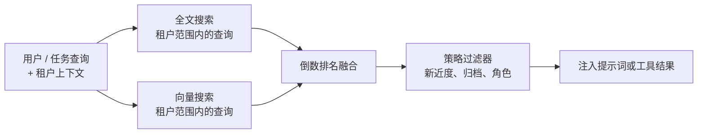

# 第 06 章 — 长期召回

## TL;DR

短期记忆（第 05 章）是模型此刻看到的内容。长期召回则是让当前运行中任何有用的东西存续到下一次运行——以及让你能够再次找到它。召回有三种范式（语义向量搜索、全文搜索、精选知识），可以在循环中的三个位置接入召回（作为冻结快照放在前缀中、作为工具结果放在易变尾部中、在会话开始时预取），还有一条将它们全部联系起来的设计约束：放进前缀的任何内容都必须在各轮之间保持字节稳定，否则你就会失去第 04 章介绍的缓存。本章讨论如何选择正确的组合——不是“添加一个向量数据库”，而是通过正确的机制检索出这次决策所需的正确上下文，并将其注入正确的位置。

---

## 为什么这很重要

没有长期记忆的智能体，会在每次会话中重新学习相同的项目事实、用户偏好和过去的失败。使用错误记忆的智能体则会悄无声息地检索出错误内容——用户询问某个特定错误代码时，向量搜索却自信地返回一段改写文本；关键词搜索则会漏掉会话间经过改述的一切内容。两者都会静默失败，都会教给模型错误的东西，也都很容易被误诊为*模型不行*。

有效的召回，其失败模式必须可见。本章讨论三种主要机制、它们如何失败，以及如何组合它们，从而避免某一种机制的失败演变成静默的错误答案。

---

## 核心概念

### 长期记忆究竟是什么

在各种生产系统中，“长期记忆”通常是层层叠加的四类东西：

- **纯 Markdown 文件**——`MEMORY.md`、`USER.md`、智能体笔记、技能文件。人类可读、可编辑，在会话开始时冻结到系统提示词中。Hermes Agent 和 OpenClaw 都以这种形态为核心。
- **结构化表**——SQLite（`sessions`、`messages`，配有 FTS5 索引），更大型的系统则使用 Postgres。审计记录只追加写入；召回时可以查询。
- **向量索引**——可选，通过 `sqlite-vec`、`pgvector` 或专用存储叠加在上层。当关键词搜索不够用时，用于语义相似度检索。
- **外部提供方**——Honcho、Mem0、自定义检索服务，或封装上述任一层的 MCP 工具。

单凭 Markdown 文件就足以支撑一个小型单用户智能体——只有一名用户、一台机器和少量笔记的个人助理，使用文件完全没问题。一旦你需要跨会话搜索、审计历史，或扩展到一名用户之外，结构化表就会成为承重组件——而大多数生产路径最终都会走到这一步。向量索引和外部提供方叠加在其上；即使没有它们，你也能构建出能力强大的智能体，而且大多数路径在第一天都不需要它们。

### 根据访问模式选择存储形态

| 形态 | 最适合 | 更新 | 检索 |
|---|---|---|---|
| Markdown 文件 | 身份、用户模型、项目规则、技能内容 | 人工或策展器 | 会话开始时读取整个文件 |
| 结构化表（+ FTS） | 审计日志、会话搜索、按 ID 查找 | 只追加 | SQL 查询、全文搜索 |
| 向量索引 | 语义召回、改述查询 | 追加 + 嵌入 | k 近邻 |
| 外部提供方 | 跨产品记忆、大规模知识 | API 推送 | API 查询 |

第一列也可以变成你在添加一层之前要问的问题：*我的智能体需要记住什么，是上面的层还无法处理的？* 如果答案是什么也没有，你就不需要这一层。大多数生产智能体最终停留在“Markdown + SQLite+FTS”，只有当改述查询变得常见时才会采用向量。

### 三种召回范式

你可以从三种主要技术中选择并组合使用：

- **向量搜索**对文本进行嵌入并检索邻近向量。擅长处理改述、相似的过往问题和概念性问题。不擅长精确标识符——工单号、错误代码、提交哈希、函数名。
- **全文搜索**（BM25 或 FTS5）索引精确词项。擅长处理 ID、代码、文件名、精确短语。不擅长改述和概念性查询。
- **精选知识**是一小组持续维护的 Markdown 页面。当知识集边界明确且值得人工编辑时效果最佳。不擅长规模化——无法处理数千条事实。

```ts
// 三种范式都实现同一种形态——背后使用不同的存储。
type Retriever = {
  search(query: string, opts: {
    tenantId: string;
    topK?: number;
    filters?: Record<string, unknown>;
  }): Promise<Array<{
    id: string;
    text: string;
    score: number;
    metadata: Record<string, unknown>;
  }>>;
};
```

统一的 `Retriever` 接口让你可以替换实现，或将它们叠加起来。

`tenantId` 过滤器不是可选项——检索就是数据访问，而一个智能体把某位用户的记忆召回到另一位用户的会话中，是安全事件，不是 bug。应在存储层强制执行它（拒绝没有租户的查询），而不是在调用点执行（在那里，只需一个很容易犯下的 bug 就会跳过它）。

### 混合检索是默认选择

对于大多数智能体，向量搜索与全文搜索结合使用，效果优于单独使用其中任何一种。标准的合并方法是倒数排名融合：



租户范围限定是*查询时*谓词，不是合并后的过滤器——搜索本身就拒绝返回跨租户的行。任何在合并后执行的过滤（新近度提升、归档拒绝、基于角色的可见性）都是策略，而不是访问控制。混淆二者正是一种典型 bug 模式：位于检索下游的租户过滤器，意味着跨租户的行已经进入内存；在大多数威胁模型下，这本身就等同于泄漏。

```ts
// RRF：不需要训练数据，让在多个列表中排名靠前的记录浮现出来。
function rrf(rankedLists: Array<Array<{ id: string }>>, k = 60) {
  const scores = new Map<string, number>();
  for (const list of rankedLists) {
    list.forEach((r, idx) => {
      scores.set(r.id, (scores.get(r.id) ?? 0) + 1 / (k + idx + 1));
    });
  }
  return [...scores.entries()]
    .map(([id, score]) => ({ id, score }))
    .sort((a, b) => b.score - a.score);
}
```

RRF 会奖励出现在多个列表中的记录，同时仍允许单个强信号将某条结果推到前面。它不需要训练，只需要两个形态相同的排名列表。接入后，让向量搜索和 FTS 并行运行，再把两者的输出送入融合器——这是整个记忆栈中成本最低的质量改进之一。

### 排名考虑的不只是相似度

纯相似度分数经常会把错误条目排在前面。两年前语义完全匹配的结果，通常不如上周略弱一些的匹配有用。生产系统在结果排名时，会依赖三个额外信号：

- **新近度。** 在基础分数上应用小幅的线性或指数衰减。余弦相似度相同时，昨天的条目胜过去年的条目。Hermes Agent 的会话搜索在汇总结果时会纳入新近度权重；OpenClaw 则在向量和 FTS 命中之上叠加新近度提升。
- **置信度。** 相似度相同时，标记为 `user-confirmed` 的条目排在 `agent-inferred` 之上。标签来自第 07 章介绍的写入路径，但它真正发挥价值的地方是检索层。
- **访问频率。** 智能体本月查阅过三十次的条目，很可能比无人触碰的条目更有用。记录 `last_accessed_at` 并将其纳入排名，成本低且效果好。

RRF 之后的小型重排器——新近度 + 置信度 + 访问频率——通常比替换底层向量模型更能改善感知质量。让你的智能体接入一个这样的重排器，并记录每次查询的排名变化；直方图会告诉你哪个信号真正起作用，哪个只是无用负担。

同一个重排器也是直接拒绝候选项的地方。如果一个条目的访问频率为零、置信度为 `agent-inferred`，而且存续时间超过 90 天，那么它几乎总是噪声。应在它抵达提示词之前将其丢弃，而不是交给模型判断。

### 召回在循环中的位置

召回并非只有一个接入点。它有三种放置选择，各有不同的取舍：

- **会话开始时放在前缀中（冻结）。** 读取一次，烘焙进系统提示词，在本次会话期间冻结。缓存温热，之后每一轮的成本都很低。适用于 `MEMORY.md`、`USER.md`、技能索引、项目上下文。约束是：注入这里的任何内容都不能在会话中途变化，否则会破坏第 04 章介绍的缓存。
- **作为工具结果放在易变尾部中。** 模型在运行时决定调用 `search_memory` 或 `session_search` 工具。结果以工具消息形式返回。数据实时、查询时获取，且没有缓存惩罚（无论如何，结果都会位于尾部）。最适合依赖对话刚刚发现之内容的查询。
- **会话开始时预取，注入第一条用户消息。** 循环开始前，执行框架查询外部提供方（Honcho、自定义服务）；结果以围栏块的形式进入*尾部*。Hermes Agent 的 `MemoryManager.prefetch_all()` 就是这种形态。这是一种折中——无需每轮额外调用工具就能获得新鲜数据，但第一轮要承受缓存未命中。

大多数生产智能体会同时使用这三种方式。对每一段记忆要做的决策是：*它会在会话内发生变化吗？如果不会，放进前缀。如果会，作为工具结果。如果它来自外部、速度慢，但一开始就需要，则预取。*

### 技能索引模式——渐进式披露

前缀中最常见的记忆内容是*技能索引*：一个由 `(skill_name, one-line description)` 对组成的列表，无论有多少技能，都只占几百个词元。任一技能的完整内容都通过 `skill_view(name)` 工具按需加载。

这就是渐进式披露。模型每一轮都能看到索引（便宜、缓存温热）。只有真正决定使用某项技能时，它才会支付完整内容的成本。Hermes Agent 和 OpenClaw 都使用 `~/.hermes/skills/` 或 `~/.openclaw/skills/` 中的 Markdown 文件实现这一模式；YAML 前置元数据（`name`、`description`、`version`、`platforms`）会成为索引条目。

```ts
// 会话开始时提示词看到的内容。
function buildSkillIndex(skills: SkillFile[]): string {
  return skills
    .filter(s => !s.archived)
    .map(s => `- ${s.name}: ${s.description}`)
    .join("\n");
}

// 模型想获取完整技能正文时调用的内容。
const skillViewTool = {
  name: "skill_view",
  description: "按名称加载技能的完整内容。",
  input_schema: {
    type: "object",
    properties: { name: { type: "string" } },
    required: ["name"]
  }
};
```

这一模式可以推广。任何条目带有简短摘要的记忆存储，都可以用这种方式暴露——Wiki、FAQ 数据库、运行手册、项目 README。第 14 章会深入讨论技能作为设计单元；本章关注的是技能赖以运行的*检索模式*。

### 记忆命名空间

记忆是数据，而数据需要范围。真实系统沿四个维度将其分隔：

- **按用户 / 按租户**——最重要的边界。跨越这条边界会在客户之间泄漏数据。
- **按项目 / 按工作区**——编码智能体通常限定在某个项目内；调试项目 A 时写入的记忆，不应在处理项目 B 时浮现。
- **按智能体角色**——探索智能体和构建智能体可以共享记忆；审计智能体和生产智能体则不应共享。
- **按环境**——预发布环境和生产环境绝不能共享记忆。预发布环境中的测试场景写入了一条误导性事实，这条事实不得在真实生产会话中浮现。

具体机制各不相同。Hermes Agent 使用工作区范围内的 MEMORY.md 文件。OpenCode 通过 `InstanceState` 解析每个项目的状态。Paperclip 通过 `companies` 表实现显式多租户，并对其他一切数据实施行级范围限定。可扩展的形态是：每次记忆查询都接收一个*租户上下文*参数，而且存储层在没有该参数时拒绝返回条目。“默认”命名空间就是一个等待被利用的安全漏洞；即使在开发环境中也不要交付这种设计。

除了范围之外，记忆还有*生命周期*：应用户要求删除条目、通过 TTL 使条目过期、由策展器软删除并等待复核。检索层必须在查询边界遵守这些状态——从向量索引返回一条已软删除的条目，与租户泄漏属于同一类正确性 bug。第 07 章介绍写入侧机制（策展器生命周期、删除标记、归档）；第 18 章介绍同意权、被遗忘权、保留策略和审计义务。第 06 章的职责，是拒绝返回那些被上述层标记为禁止访问的内容。

### 提示词中的记忆：格式与预算

记忆如何进入前缀，比人们预想的更重要。常见形态包括：

- **带分隔符的 Markdown 小节。** Hermes Agent 和 OpenClaw 使用 `§`（章节符号）分隔 MEMORY.md 条目，让模型无需依赖布局就能识别条目边界。
- **YAML 前置元数据。** 技能文件使用 `name`、`description`、`version` 块，提示词构建器可以机械地读取它们。
- **围栏块。** 外部记忆查询结果经常以 `<memory-context>...</memory-context>` 围栏注入；智能体 UI 可以从用户可见的显示中移除它们，同时让模型仍然看得见。

大小预算是真实存在的。每次会话都把一个 50 KB 的 `MEMORY.md` 塞进前缀，就意味着 50 KB 的缓存温热载荷——如果它确实承重，这没问题；如果大部分是噪声，代价就很高。设定一个软上限（前缀中的记忆总量从 10–20 KB 起步是合理的），并让第 07 章的策展器强制执行。智能体感受不到“10 KB 聚焦的笔记”和“50 KB 累积的碎屑”之间的区别，除了延迟和成本——推理质量也可能受到影响，因为前缀中的噪声越多，模型每一轮需要浏览的噪声就越多。

### 外部记忆提供方

本地文件和 SQLite 之外的一切都是外部记忆提供方——Honcho、Mem0、云提供商的向量服务、你自己的检索 API。各系统采用的模式是：提供方注册为插件，从前面三种放置钩子之一被调用，并让结果遵循同一个 `Retriever` 形态。

Hermes Agent 明确强制执行一条很有用的纪律：*每种召回目的只使用一个提供方*。为同一个目的混用两个提供方，往往会产生不一致、相互冲突的召回结果，而模型无法裁决。如果你需要为同一种目的提供冗余，就让一个作为主提供方运行，另一个作为影子提供方，在日志中比较二者，而不要并行注入。两个提供方服务于真正*不同*的目的——一个处理用户偏好，另一个处理组织知识库——则没有问题；这条纪律针对的是每种目的，而不是笼统地限制每次会话。

延迟也很重要。外部提供方让会话开始多花 800 毫秒是可以接受的；让*每一轮*都多花 800 毫秒则不可接受。本章前面介绍的放置规则直接回答了这个问题：慢速提供方应位于预取路径或工具调用路径中，绝不能成为模型每轮都要等待的同步查询。

### 嵌入模型迁移

向量召回与特定的嵌入模型绑定，而这个模型终将被替换——供应商发布新版本、切换到更便宜或自托管的嵌入器、端点弃用。嵌入发生变化后，索引中的每个向量都会处于错误的空间，召回质量则会悄无声息地下降。

有效的迁移形态如下：

- **在每条记录上标记嵌入模型**（`model: "text-embedding-3-small@2024-01"`）。否则你不会记得哪个模型写入了哪些向量，而混有多个模型的半迁移索引会给出毫无意义的分数。
- **在后台重新嵌入；双写新索引。** 在新索引完全填充之前，继续由旧索引提供查询服务。长时间迁移没有问题；让填充一半的索引承接实时查询则不行。
- **原子切换查询路径。** 新索引通过一组留出的已知优质查询验证后，再翻转读取路径。将旧索引保留一段恢复窗口，以防新模型在留出集遗漏的某些方面出现退化。

从第一天就为此做好规划——最低限度是在每个嵌入旁持久化模型版本——这样你才不会等到某个已弃用端点下线的那天才发现问题。外部提供方（Honcho、Mem0、托管向量存储）会在内部处理此事，这是使用它们一个相当充分的理由；如果你运行自己的索引，迁移责任也归你所有。

### 将召回视为可观测性

如果你不度量召回层，就只能等到用户投诉时才发现它的静默故障。下面三项度量值得从第一天就接入，并与前面章节介绍的缓存命中和压缩信号并行使用：

- **空手率。** 有多大比例的检索返回零条结果？如果很高，说明你的存储内容稀疏，或查询有误。如果为零，则可能注入了过多噪声。
- **触达率。** 在*注入的*记忆条目中，有多大比例确实被模型在下一轮引用？如果模型从不采用你注入的内容，说明检索正在交付错误的上下文。正因如此，Hermes Agent 和领先的编码智能体都会记录 `last_accessed_at`。
- **租户完整性。** 在租户 A 中发起一条本应只匹配租户 B 所写条目的合成查询，这条查询*绝不能*返回该条目。应将它作为生产环境中的持续测试运行，而不是只在部署时运行。

这些指标应进入第 16 章的追踪管线，与前面章节的缓存命中率和压缩方法直方图放在一起。它们共同告诉你：精心设计的前缀和尾部是否真的在服务模型——还是只是在消耗词元。

### 子智能体的召回边界

当父智能体把任务委派给子智能体时（第 10 章），召回是边界决策之一。常见策略有三种：

- **子智能体继承父智能体的命名空间。** 子智能体看到相同的记忆和技能索引。成本低且一致；但如果子智能体只是短命实验，其“经验教训”本不应成为永久召回内容，就可能造成污染。
- **子智能体获得限定范围的切片。** 子智能体只看到为其角色标记的记忆（`explore`、`build`、特定技能族）。OpenCode 的按智能体工具集可以自然地推广为按智能体记忆集。
- **子智能体什么也得不到。** 子智能体只接收父智能体交给它的提示词，其他一切都不可见。适合一次性计算；但子智能体可能重复执行父智能体本可凭借记忆跳过的工作。

应按智能体配置选择，而不是全局选择。检索层除了租户之外，还应接收一个*智能体身份*——仍然是同一个 `Retriever` 接口，只是多了一个过滤维度。

### 陈旧索引与会话连续性

会话开始时正确的记忆索引，到第十五轮时可能已经陈旧。下面几种情况值得留意：

- **策展器在会话中途归档了技能。** 运行中提示词里的索引仍然提到它们，但文件已经不存在。智能体调用 `skill_view(name)` 后得到“not found”。应在工具中优雅处理这种情况，而不是重建前缀。
- **本次会话写入的记忆。** 它已经位于磁盘上，但在运行中的提示词里不可见（会话开始时已冻结）。它会在下次会话中可见。不应向智能体暗示其他情况。
- **外部提供方在会话之间更新。** 新条目已经进入。下次会话开始时会获取它们；当前会话不会。

这是缓存约束的反面：稳定性为你换来低成本的轮次，代价则是轻微的陈旧。大多数团队会接受这种取舍，并在工具层优雅恢复，而不是与之对抗。

### 再述缓存约束

本章的一切都受第 04 章的一条规则塑造：你注入系统提示词的任何内容都会成为缓存前缀的一部分，而缓存需要字节稳定的字节。对记忆而言，其实际影响如下：

- **前缀中的文件在会话开始时冻结。** 会话中途的写入要到下次会话才可见，本次不可见。第 07 章介绍写入路径；冻结规则之所以放在这里，是因为它约束了什么内容可以放在哪里。
- **前缀中的外部提供方结果会破坏缓存**，前提是它们在会话之间发生变化。你可以接受会话开始时的缓存未命中（Hermes Agent 就是这样做的），也可以把这些结果作为工具结果推入尾部。
- **技能索引在文件列表变化前保持稳定。** 如果第 07 章介绍的策展器在会话中途归档了一项技能，这次变化要到下次会话开始时才可见。这是有意为之。

召回层和提示词构建器层并非两个彼此独立的问题——它们是从两个角度观察的同一个问题。如果你只打算内化这两章中的一条规则，就记住这一条。

---

## 真实系统笔记

- **Hermes Agent** 是分层记忆方面最强的参考：以文件为后端的 `MEMORY.md` 和 `USER.md`、SQLite+FTS5 会话存储、通过 `sqlite-vec` 实现的可选向量索引、通过 Honcho 实现的可选外部提供方，全部统一在一个 `MemoryManager` 之下；它会在循环开始前预取，并暴露一个 `session_search` 工具用于实时查询。
- **OpenClaw** 提供了同一种形态：每个工作区一个 `MEMORY.md`、JSONL 会话记录、用于语义搜索的可选 `active-memory` 插件，以及确定性的文件顺序，从而使缓存前缀在不同会话间保持字节稳定。
- **OpenCode** 以会话存储和项目范围内的状态（`InstanceState`）为核心，并通过一个隐藏的 git 快照仓库跟踪每一步的文件变更，为回退 UI 提供支持。这里的经验是：长期召回可以是代码状态，而不只是文本——磁盘上的文件及其提交历史同样也是记忆。
- **Paperclip** 是长期记忆的工作流控制平面版本：`issues`、`agents`、`runs`、`approvals`、`cost_events`——全部持久、全部可查询、全部按公司限定范围。这是组织流程层面的召回，只是将同一种形态应用于不同领域。

---

## 常见失败情况

*这些故障模式经久不变，而具体修复方式演化得最快——每一项只给出模式，把当前实现细节留给你和你的 AI 伙伴。*

- **向量搜索总会返回某些内容。** k-NN 无法什么都不返回，所以当没有任何内容真正匹配时，智能体仍会自信地引用最不无关的噪声。*修复：设置分数下限，再添加一个查询类型路由器，优先将标识符发送给全文搜索。*
- **糟糕的分块限制了召回上限。** 正确的文档明明在存储中，智能体检索到的却是错误片段，或只有半个片段。*修复：按语义边界分块并设置重叠，使用 recall@k 黄金集进行度量，而不是使用相似度分数。*
- **索引落后于事实来源。** 检索返回了几分钟前已被编辑或删除的条目，或漏掉一条刚写入的条目。*修复：把索引视为故障安全的派生视图，依据规范记录重新验证，并对其延迟发出告警（第 08 章）。*
- **一次迁移悄无声息地让召回质量减半。** 没有任何错误发生，但混合两个向量空间，会让你更换嵌入器的那一周里，答案变得更加含糊。*修复：以评估为门禁执行迁移，用留出查询集作为门槛，并拒绝跨嵌入版本比较结果（第 16 章、第 17 章）。*
- **没有租户范围的查询会在客户之间泄漏数据。** 一条新代码路径在查询存储时没有传递租户上下文，导致某位客户的记忆泄露到另一位客户的会话中。*修复：在存储层实施故障关闭式租户范围限定，并持续运行跨租户金丝雀测试（第 18 章）。*

---

## 与你的智能体结对

以下提示词很适合用于本章：

- *“为我构建一个 `Retriever` 接口和三种实现：通过 sqlite-vec 实现向量检索、通过 FTS5 实现全文检索，以及一个 Markdown Wiki。把它们接入同一个 RRF 组合器。展示一个返回三个排名列表的查询，以及融合后的输出。”*
- *“选出我的智能体需要的三段具体记忆（一项用户偏好、上周的一个错误代码和一条项目规则）。告诉我哪种检索方法负责处理每一段，以及它应该注入循环的哪个位置——前缀、工具结果，还是预取。”*
- *“实现技能索引模式：提示词构建器读取每个技能文件的 YAML 前置元数据，并生成每个技能一行的索引。模型调用 `skill_view(name)` 加载完整内容。把两者都展示给我，然后添加文件在会话中途被归档的情况。”*
- *“为我的检索层添加租户范围限定。编写一个测试，证明租户 A 中的查询无法返回租户 B 写入的任何条目，即使输入被故意构造为畸形也不行。”*
- *“分析十次会话中系统提示词记忆部分的大小。如果平均超过 15 KB，提出哪些内容应从前缀移到按需工具结果模式，并估算成本差异。”*
- *“带我了解 Hermes Agent 的 `MemoryManager.prefetch_all()`。然后为我的技术栈实现等价功能：在会话开始时查询外部提供方，并将结果作为围栏块注入第一条用户消息。”*
- *“建立 A/B 日志：针对同一组查询，比较仅向量、仅 FTS 和混合（RRF）三种方案。让上周的会话全部通过这三种方案，并按查询类型报告哪种策略最常检索到正确内容。”*
- *“添加检索可观测性：空手率、触达率（模型是否真的使用了我注入的内容？）和租户完整性测试。按天绘制这三项指标，并告诉我哪一项正在退化。”*
- *“在我的混合管线中添加一个重排器，在 RRF 分数之上提升新近条目和用户确认条目的排名。记录排名变化，并告诉我重排器是在真正发挥作用，还是只是在打乱分数相同的结果。”*

---

## 下一步

现在，你已经知道记忆存储在哪里、如何检索它、如何对返回内容进行排名，以及它如何融入第 04 章介绍的缓存纪律。

更困难的问题是：最初该把什么写入记忆——以及如何防止它腐烂。第 07 章会介绍写入模式、记忆边界的安全过滤器、原子写入与并发写入者争用、冲突解决、让记忆保持精简的策展器生命周期，以及子智能体在哪些情况下可以、哪些情况下不可以写回。
