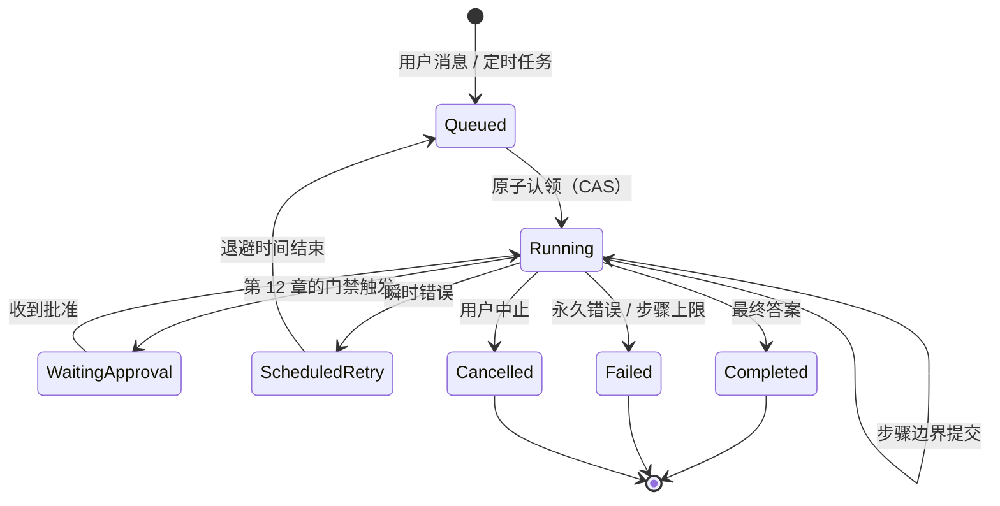
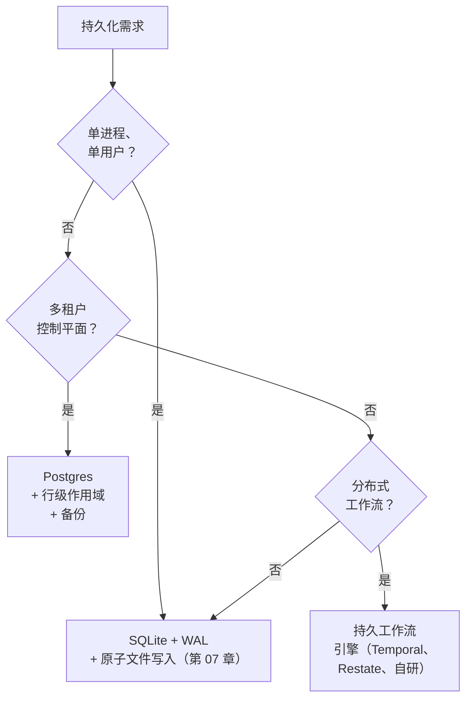

# 第 08 章 — 状态与持久化

## TL;DR

一个长时间运行的智能体应该能够经受进程重启、节点故障或循环中途的部署——既不重复已经完成的昂贵工作，也不把破坏性工作执行两次。本章讨论持久执行：运行时哪些内容算作状态（消息数组、进行中的工具调用、中止令牌、凭据、提示词指纹），步骤边界的提交点位于何处，运行状态机和比较并交换认领如何协调多个进程，心跳和孤儿回收器如何处理卡住的工作，怎样在 SQLite、Postgres 和持久工作流引擎之间做选择，以及崩溃恢复、恢复会话与用户点击标有“恢复”字样的按钮之间有何区别。

---

## 为什么这很重要

一个编码智能体已经运行了四十分钟。它读取了五十个文件，完成了十二处编辑，生成了三份拉取请求描述。部署开始。进程重启。智能体丢失了内存中的中止令牌，但检查点表明它正处于第 23 步。重放时，你发现智能体重新发送了其中一份拉取请求描述，因为发布描述的工具不具备幂等性，而智能体框架重试了它。现在你团队的 GitHub 上出现了一个重复的 PR。模型没问题。智能体代码没问题。是持久化层发生了泄漏。

这类故障不会在开发环境中暴露——它会在你第一次真正承载负载进行部署时出现。代价要么由可靠性承担，要么由本章所讨论的细致工作承担。

---

## 核心概念

### 对智能体而言，“持久”究竟意味着什么

并非所有运行时状态都相同。在编写任何代码之前，先列出下面这份清单会很有帮助：

- **消息数组**——每一轮模型交互、每一次工具调用、每一个工具结果。仅追加、持久化，是重放的事实来源。（这就是第 05 章的审计日志，只不过从运行时角度来看。）
- **工具执行状态**——对每次工具调用而言：待处理、运行中、已完成、失败。在 OpenCode 中，它与消息相邻，保存在 `ToolPart.status`；在 Paperclip 中保存在 `heartbeat_runs.status`；在 Hermes Agent 中则保存在内联结果里。
- **进行中的副作用**——已经*开始*但尚未返回的写入、发送和支付。它是最难恢复、也最容易误判的一类状态。
- **工作记忆**——第 05 章介绍的小型可变暂存区。它必须能够跨崩溃持久保存，因为根据对话记录重建它，结果未必能够完全复现。
- **中止令牌**——进程本地信号。*无法经受重启。*如果失控的运行只能通过中止令牌停止，那么崩溃会让它们继续运行。
- **身份验证配置与凭据**——必须在启动时重新加载，或者能够从凭据池中重建。Hermes Agent 将它们存储在 `~/.hermes/agents/<id>/auth-profiles.json` 下；Paperclip 则把加密行存储在 Postgres 中，并由一个主密钥文件保护。
- **提示词指纹**——第 04 章介绍的 SHA。它必须完整往返于存储层，才能让重建后的系统提示词逐字节一致，使缓存在重启后仍然有效。
- **成本与词元账本**——用于预算上限的累计总数（第 17 章）。Hermes Agent 在恢复时根据消息日志重新计算；Paperclip 为了可审计性，将其单独持久化到 `cost_events` 表。如果必须*跨越*重启执行预算限制，账本就需要具备自身的持久性——从日志重新计算在日志被部分压缩前没有问题，压缩后就不行了。

在持久运行时中，上述每一项都有明确的策略：提交前持久化、提交后持久化、恢复时重建，或者接受丢失。这里没有“默认”答案；逐项做出选择、记录下来，再让你的智能体根据这份清单生成持久化代码。

### 将步骤边界作为提交点

一个步骤就是一次完整的循环迭代：模型调用 → 任意工具分发 → 反思。提交点位于“反思”与“停止”之间——也就是第 02 章所指出的、所有机制都接入的同一边界。一个步骤完成后，循环交出控制权之前，磁盘上应该已经存有三样东西：

- 追加到审计日志中的新消息。
- 已转换为终态值的工具执行状态。
- 已更新的工作记忆以及所有成本/用量计数器。

OpenCode 在每个 `LLM.stream()` 周期之后刷写；Hermes Agent 通过形如 `_flush_messages_to_session_db` 的写入执行同样的操作；Paperclip 则按每条 `heartbeat_run_events` 记录提交。这个模式是通用的：交出控制权之前先写入。如果一个步骤在其写入持久化之前就返回给调用方，那么这个步骤就可能丢失。

```ts
// 步骤边界提交所包含的内容。
type Checkpoint = {
  sessionId:           string;
  stepIndex:           number;
  status:              "running" | "waiting_for_approval"
                     | "completed" | "failed";
  messageRange:        [number, number];   // 在此步骤中追加
  workingMemory:       WorkingMemory;
  tokensSpent:         number;
  costSpent:           number;
  promptFingerprint:   string;             // 第 04 章
  lastError?:          string;
  committedAt:         string;
};
```

不要把秘密写入检查点——存储秘密的*引用*，并在运行时解析。不要把重试计数器写入消息日志——它们属于检查点，应当在那里更新。

### 运行状态机

一次运行，是从用户消息（或定时触发器）到其最终答案之间的工作单元。每个生产系统都会用显式状态机对此建模。智能体系统中一半的重复副作用 bug，都源于隐式转换。



Paperclip 几乎逐字实现了这一模型——`heartbeat_runs.status IN (queued, running, completed, failed, cancelled, scheduled_retry)`。规则如下：

- 每个依赖当前状态的转换都需要条件更新——最低要求是 `UPDATE ... WHERE status = <expected>`。典型竞态是 `queued → running`（两个工作进程争抢同一行），下一小节会详细讲解这种模式；但同一个 `WHERE` 子句也会保护批准（`running → waiting_approval`）、中止（`running → cancelled`）、重试转换和终态写入，防止并发覆盖。基于一个已在你脚下发生变化的状态进行转换，就是更新丢失——同一种 bug，不同的标签。
- `running → terminal` 在*成功抢到后具有幂等性*：重复提交在已经处于终态的行上设置相同的终态不会产生任何操作，这正是重放或重试时想要的行为。
- 终态永远不会反向转换。需要重试的 `failed` 运行会产生一个*新的*运行，并用 `parent_run_id` 链接回去——绝不原地复活。

这一层的大多数智能体 bug 都是状态机 bug：隐式转换让同一工作发生两次，或者缺失转换使一次运行永久卡住。

### 崩溃恢复、恢复会话与“恢复按钮”

这三者听起来相似，行为却截然不同。

- **崩溃恢复**是*意图相同、进程载体不同*。部署引发了重启；用户期望工作继续。系统提示词没有变化；如果前缀通过磁盘逐字节一致地完成了往返，*并且*服务商的 TTL 尚未过期，*并且*你仍然路由到相同的模型和区域，那么缓存*可能*仍然是热的（缓存按服务商、模型划分，通常还按区域划分——详见第 04 章）。进行中的工具调用需要谨慎分诊。
- **恢复会话**是*同一会话、时间更晚*。用户关闭标签页，几小时后又回来。缓存可能已经过期（第 04 章的 TTL）。两次访问之间，系统提示词可能被编辑过。审计日志可以干净地重放，但外部世界可能已经发生变化。
- **“恢复按钮”**是继续一个已暂停会话的*显式用户操作*。用户知道中间存在间隔；系统可以更自由地请求确认、展示发生了什么，并在适当时重置工作记忆。

混淆三者会产生隐蔽的 bug。对于*能够安全重放的工作*，崩溃恢复应该静默而积极——只读操作、标记为 `idempotent: true` 的工具（第 03 章），以及由发件箱支持的副作用。其余任何工作都要经过下一小节所述的进行中调用分诊；不可重放的工具调用应当展示给用户，而不是静默重试。恢复会话应该尽可能保留缓存，无法保留时则接受成本。“恢复”按钮应该向用户*展示*当前所在位置，以及即将重新运行的内容。

### 崩溃期间进行中的工具调用

这是整章最棘手的情况。一个工具调用已经开始；结果尚未返回；进程就死掉了。重启时有四种选择，按优先顺序排列：

1. **工具带有元数据标记 `idempotent: true`（第 03 章）。** 重放它。第二次调用会返回相同结果。
2. **工具具有外部幂等键。** 使用相同的键重放；下游系统会进行去重。
3. **工具在执行前写入了持久发件箱。** 重放时读取发件箱；如果意图已被标记为履行，则跳过；否则使用相同的键重试。
4. **工具无法安全重放。** 将运行标记为失败，并展示给用户。与其发送重复邮件，不如略显尴尬地问一句*“这件事发生了吗？”*

第 03 章介绍的元数据标志，让智能体框架无需思考就能选择正确选项。没有这些标志的工具默认采用第（4）项：大声失败、询问用户、绝不静默重试。反过来默认重试，正是重复 PR 出现的原因。

### 使用比较并交换进行原子认领

任何跨多个进程运行的系统——例如拾取排队工作的心跳调度器，或争抢同一会话的两个 API 服务器——都需要原子认领。各种数据库采用的模式都相同：在状态列上执行比较并交换。

```sql
-- 以原子方式认领排队中的运行。只有赢得竞态时才返回该行。
UPDATE runs
   SET status      = 'running',
       claimed_by  = :worker_id,
       claimed_at  = now()
 WHERE id     = :run_id
   AND status = 'queued'
RETURNING *;
```

如果 `UPDATE` 影响零行，说明另一个工作进程先认领了它；继续处理其他工作。如果影响一行，那么在你将其转换为终态或租约超时之前，这项工作都归你所有。Paperclip 在 `heartbeat_runs` 上使用这种形式；在 Postgres 技术栈中，事务内的 `SELECT ... FOR UPDATE` 与之等价；在使用 WAL 的 SQLite 中，同样的 `UPDATE ... WHERE status=...` 也能工作，因为写入者会被串行化。

对于单进程系统（单用户模式下的 Hermes Agent、OpenCode 开发服务器），CAS 属于过度设计。对于任何以后*可能*横向扩展的系统，从第一天起就接好它——成本只是一列和一个 `WHERE` 子句；日后再补的成本要高得多。

### 心跳与孤儿恢复

没有心跳的认领就是一种缓慢泄漏——工作进程死去，运行仍停留在“运行中”，没有其他进程会接手。生产系统会为认领配上另外两列：

- **`last_heartbeat_at`**——运行存活期间，工作进程每隔几秒更新一次。
- **`lease_expires_at`**——超过该时间仍未见心跳时，这次运行就被视为孤儿。

回收器服务会定期扫描 `lease_expires_at < now()` 的运行，要么将它们重新排队（`status → queued`，开始新的尝试），要么在重试次数耗尽后将其标记为失败。Paperclip 的 `reapOrphanedRuns()` 做的正是这件事；它还会在清除租约之前确认操作系统 PID 已经死亡，以处理心跳只是变慢而非消失的情况。

两个调优常量体现了真实的权衡：

- **心跳间隔。** 越短，检测孤儿越快，但写入流量越大。Paperclip 每隔几秒写入一次。
- **租约超时。** 越长，越能容忍缓慢工具（例如耗时 30 分钟的编译）；越短，恢复越快。Paperclip 默认为六小时，并允许适配器按工作负载调节。

对于分布式智能体而言，回收器不是奢侈品。只有它能防止单个崩溃的工作进程让工作永久卡住。

回收器自身也需要存活性。把它作为具有自身心跳的独立作业运行，否则其他每个工作进程都可能在启动时争当回收器。Paperclip 使用与运行相同的 CAS 模式选出单个回收器——在一个小型 `service_locks` 表中认领并刷新一行。

### 仅追加事件日志与逐步骤快照

各系统中会出现两种持久化形态，而且通常结合使用：

- **仅追加事件日志。** 每个步骤写入新行；按顺序读取所有行以计算当前状态。Hermes Agent 的 `messages` 表属于这种形式；Paperclip 的 `heartbeat_run_events` 也是；OpenCode 的 `PartTable` 大体如此。
- **逐步骤快照。** 每个步骤写入*整个*状态对象，并覆盖前一个对象。恢复更快（无需重放）；占用磁盘更多；更难审计，因为中间值会丢失。

大多数生产级智能体对审计日志采用仅追加方式（因为第 05 章无论如何都需要完整对话记录），对工作记忆和检查点元数据采用逐步骤快照（因为它们需要快速随机访问和较小占用）。这种组合运维成本低，同时兼顾审计和恢复，且两者都无需重复存储。

### 选择存储



SQLite 能够承担数量惊人的生产负载。Hermes Agent 和 OpenCode 都以 SQLite 为后端，并运行真实工作负载。原因是：WAL 模式无需任何配置就能提供并发读取和单一写入者，`fsync` 保证持久性，而且数据库文件就只是一个文件——易于复制、易于备份、易于通过 CLI 检查。

当*多个进程*必须协调写入、需要由数据库强制执行*多租户*行级作用域，或者需要一个能跨节点唤醒延迟作业的*调度器*时，就应该超越 SQLite。Paperclip 选择 Postgres 正是出于这些原因：它是一个同时需要这三项能力的控制平面。持久工作流引擎（Temporal、Restate 或自研等价物）位于更上一层——当智能体自身的逻辑最适合表达为一种工作流，其中包含必须保证重放安全的任意副作用步骤时，它会很有用。

WAL 模式并非没有代价。它会在 `.db` 旁边增加一个 `-wal` 文件和一个 `-shm` 文件，在大量写入阶段使磁盘占用大约翻倍。对于移动端或边缘智能体，普通日志模式可能才是正确选择。Hermes Agent 的 `apply_wal_with_fallback` 会处理 WAL 不可用（NFS、SMB）的情况，并优雅地回退到 `journal_mode=DELETE`。

### 步骤边界的幂等性，而不只是工具的幂等性

第 03 章介绍了工具级幂等键。步骤级幂等性提供的是另一种保证：*同一步骤在重放时，必须产生相同的可观察效果。*

```ts
function stepIdempotencyKey(c: {
  sessionId: string; stepIndex: number; action: string;
}) {
  return sha256(`${c.sessionId}:${c.stepIndex}:${c.action}`).slice(0, 32);
}
```

在此基础上有两种模式：

- **发件箱模式。** 在发起副作用之前，把*意图*（以及它的幂等键）写入持久表。副作用成功后，把意图标记为已履行。重放时，智能体框架首先读取该表：已履行的意图会被跳过；未履行的意图使用相同的键重试。这将*决策*的持久性与*交付*的持久性解耦。
- **履行标记。** 面向非分布式系统的简化版本：检查点上的 `step_complete` 布尔值。一旦设置，该步骤永远不会重新运行，即使其中某个子操作始终没有返回值。它真实的局限在于：这个标记只能告诉你*自己的*提交情况，而不是外部世界的情况。如果一个副作用跨越了网络，而进程死在调用抵达之后、标记持久化之前，恢复过程就无法知道实际发生了哪一种情况。盲目跳过可能丢失工作；盲目重试可能把工作执行两次。正确做法是*对账*——询问下游系统该调用是否已抵达——这正是发件箱模式的用途。因此，一旦副作用离开你的进程，履行标记就不再够用。

大多数生产级智能体使用第二种模式；当副作用跨越一个你无法完全信任的网络边界（第三方 API、消息队列、自身也会崩溃的下游服务）时，才会采用发件箱模式。

### 压缩链与恢复相遇

第 05 章介绍了会话轮换：当压缩不再足够时，创建一个新会话，并用 `parent_session_id` 链接回旧会话。从持久化角度看，这也是一种*恢复原语*。失败的长时运行会话可以由一个新会话替代；新会话从概括父会话状态的交接块开始，审计日志仍然可以一路追溯到最初，而新会话的缓存能够重新预热，不必拖着旧会话的臃肿内容。

推论是：绝不要因为子会话恢复了父会话，就删除父会话。可以归档它、标记它已被取代，但链条必须保持完整。恢复、审计和回滚都依赖它。第 07 章“绝不修剪审计日志”的规则在这里同样适用——角度不同，原则相同。

### 存储运维：备份、恢复、迁移

没有备份的状态就是终将丢失的状态。相关模式如下：

- **备份。** Paperclip 自带定期 `pg_dump`，并提供可配置的保留窗口。以 SQLite 为后端的系统应该按计划运行 `VACUUM INTO` 快照，并将文件复制出去。最低要求是每日一次完整快照；更好的是增量 WAL 备份。低于“每日”标准的做法，终会成为事故后由你讲述的故事。
- **恢复。** 始终恢复一个*一致的*快照——绝不要把备份中的部分行选择性恢复到在线存储，除非你能够证明它们不会违反状态机。恢复还必须遵守第 07 章的删除标记——当旧快照恢复时，根据用户请求或保留策略删除的内容仍须保持删除，否则你刚刚复活了自己承诺删除的数据。恢复很少发生；应在真正需要之前演练，最好把它纳入部署清单。
- **Schema 迁移。** Schema 会在不同部署之间变化。OpenCode 和 Paperclip 使用 Drizzle 迁移；Hermes Agent 通过一行 `schema_version` 显式标记 schema 版本。前向路径已经非常成熟；*后向*路径却几乎从来不是。默认使用增量迁移（新增带默认值的列），把破坏性迁移留给显式的数据清理部署。
- **跨越迁移的进行中运行。** 如果 v4 删除或重命名了某一列，在 schema v3 下写入的检查点可能无法在 v4 下正确反序列化。每个检查点都要标注写入它的 schema 版本（`checkpointSchemaVersion: 3`）。让恢复路径感知版本——应用逐版本强制转换，将检查点向前升级；无法转换时应大声失败，而不是静默生成损坏的运行。执行破坏性迁移时，先*排空*进行中的运行：停止队列，等待活动运行终止或被取消，然后再迁移。暂停五分钟吞吐量，胜过花三天调试迁移到一半的检查点。

### “恢复按钮”究竟需要什么

如果你交付了一个标有*“恢复”*的按钮，用户期待的不只是崩溃恢复。他们期待系统如实回答：*我现在在哪里，接下来会发生什么？*具体来说：

- 必须能够从磁盘完整加载会话——审计日志、检查点、工作记忆、成本账本，全部内容无一遗漏。
- 系统提示词必须逐字节一致地重建，否则必须告知用户，缓存将承担重建成本（第 04 章）。
- 上一次尝试遗留的任何进行中工具调用，都必须先完成分类（幂等 / 发件箱 / 不安全）并展示出来，循环才能继续。
- 用户应该能够看到*智能体最后做了什么*以及*它正准备做什么*——最后一个已完成步骤和下一个计划动作。

这是第 05、06、07 和 08 章*共同*实现的系统。记忆在正确的位置留存，审计日志按正确顺序重放，缓存能保持温热的地方就保持温热，用户看到的是连贯画面，而不是一句*“你的智能体崩溃了；点击此处。”*“恢复”按钮只是表面；它下面的一切才是本章的主题。

---

## 真实系统笔记

- **OpenCode** 是编码智能体场景下嵌入式持久性的最佳参考：SQLite + WAL 配合 Drizzle 迁移，仅追加的 `SessionTable` / `PartTable` / `SyncEvent`，一个支持撤销的隐藏 git 快照仓库，以及不会经受重启的逐会话中止控制器（这是有意为之——中断仅属于运行时）。
- **Paperclip** 是控制平面层面分布式持久性的参考：Postgres 使用 `SELECT ... FOR UPDATE` 实现原子认领，具有显式转换的 `heartbeat_runs` 状态机，`reapOrphanedRuns` 回收器会在清除租约前确认操作系统 PID 的存活性，每张表都有多租户作用域，定期执行并带保留策略的 `pg_dump` 备份，以及适配器进程隔离，使父进程崩溃后子进程仍可继续运行。
- **Hermes Agent** 是第 04 章“缓存—恢复”对偶性在这里应用的参考：`SessionDB.sessions.system_prompt` 持久化逐字节一致的提示词，使被逐出后又恢复的智能体能够重放热缓存；`apply_wal_with_fallback` 处理不适合 WAL 的文件系统；定时任务调度器基于文件的锁则展示了最简单的咨询锁模式。
- **OpenClaw** 存储逐会话 JSONL 对话记录以及凭据和记忆状态，展示了一种基于文件的持久化模型：无需数据库，也能为单用户多渠道使用场景扩展。它很好地提醒我们，只要工作负载合适，“持久”并不要求数据库。

---

## 常见失败情况

*这些故障经久不变，而具体修复方式演化得最快——每一项只给出模式，把当前实现细节留给你和你的 AI 伙伴。*

- **重启会重新运行已经发生的工作。** 崩溃或部署后，智能体重新发送邮件、重新发布 PR，或者再次扣款。*修复：反转默认行为，让缺乏重放安全信号的进行中调用大声失败并发起询问，而不是静默重试（第 03 章）。*
- **检查点与实际工作不一致。** 磁盘表明步骤已经完成，但副作用从未发生；或者副作用已经发生，磁盘却忘记了。*修复：采用发件箱模式——执行工作前先写入意图，并在恢复时与下游系统对账。*
- **每次部署后的缓存都冷得像石头。** 恢复是正确的，但回来后的第一轮成本远高于应有水平。*修复：持久化逐字节一致的前缀及其提示词指纹，恢复时根据存储的字节重建，并尽可能固定模型/区域（第 04 章）。*
- **崩溃的工作进程让运行卡住，或者运行在中途被回收。** 标记为“运行中”但没有任何进程触碰的运行，或者一次健康的长时运行被从脚下杀死。*修复：根据真实的 p99 步骤时长调节租约，并让回收器在清除租约前确认 PID 的存活性。*
- **恢复每周都变得更慢。** 原本一秒就能恢复的会话现在要十秒，而且检查点文件极其庞大。*修复：让逐步骤快照保持小巧且有界，存储一个指向仅追加日志的 messageRange 指针，而不是复制整份对话记录。*

---

## 与你的智能体结对

以下提示词很适合用于本章：

- *“逐项盘点我的运行时状态——消息数组、工具状态、进行中的副作用、工作记忆、中止令牌、凭据、提示词指纹。对每一项，告诉我当前存储是否会将其持久化，并为没有持久化的项提出修复方案。”*
- *“使用显式 `status` 列和 CAS 认领，实现本章的运行状态机。编写一个压力测试，让两个工作进程争抢同一个排队中的运行，并验证其中恰好一个获胜。”*
- *“为我的运行添加心跳和孤儿回收器。回收器应该在清除卡住的租约前确认操作系统 PID 的存活性。针对我的工作负载调节心跳间隔和租约超时，并用三个要点解释这种权衡。”*
- *“根据第 03 章的 `idempotent` 标志对我的所有工具分类。然后编写崩溃后恢复逻辑，使用该标志决定重放还是跳过并询问。通过在工具执行中途故意注入崩溃来测试它。”*
- *“为一个具体的外部副作用（发送 Slack 消息）接入发件箱模式。写入意图、发送、标记为已履行。在每一对操作之间注入崩溃，并验证恢复后的结果。”*
- *“分析十个真实会话中的检查点载荷。如果平均超过 50 KB，提出哪些内容应该从逐步骤快照移至仅追加日志。”*
- *“将崩溃恢复、恢复会话和‘恢复’按钮实现为三条不同的代码路径。分别展示以下情况会触发哪一条：部署后进程重启、用户在 24 小时后回来、用户在失败的运行上点击‘恢复’。”*
- *“编写恢复演练：停止我的服务，恢复昨天的快照，重新启动，证明状态机保持一致。测量端到端耗时，让我知道真正发生事故时需要多长时间。”*

---

## 下一步

现在，你拥有了一个能够经受重启、跨进程协调工作，并且能够干净恢复而不会把破坏性工作执行两次的运行时。

再往上一层是*规划*——智能体如何在执行之前，决定跨越多个步骤要做什么。第 09 章会介绍四种规划形态（无规划、清单、规划—执行—重规划、依赖图）、每种形态何时有帮助、何时有害，以及隐藏在最简单选择中的故障模式。
