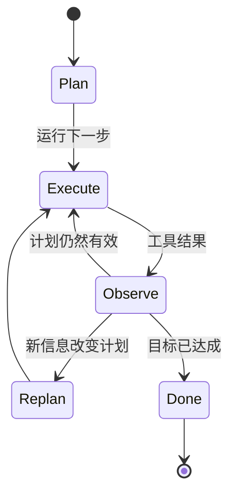

# 第 09 章 — 规划模式

## TL;DR

有些任务模型一步就能回答；有些需要三步；还有些需要三十步。规划层负责判断面对的是哪类任务，以及如何组织智能体完成任务的路径。本章介绍生产环境中出现的四种规划形态（无计划、检查清单、规划—执行—再规划、依赖图）、决定如何选择它们的设计决策（隐式与显式、仅规划与构建、由谁编辑计划）、在智能体投入执行前捕捉陈旧计划的再规划触发条件，以及隐藏在每种形态中的故障模式。目标是：选择符合任务的最简单规划模式，并识别任务何时需要升级到下一种模式。

---

## 为什么这很重要

没有计划，智能体就会来回折腾——把同一批文件读两遍，在第 4 步走错方向却始终没有察觉，调用工具去做前一个工具已经完成的工作。计划*过多*时，同一个智能体会花掉一半词元来提出一份 20 步蓝图，却在第一个工具结果与之矛盾时立刻变得毫无用处。代价会体现在词元、延迟上，而最糟糕的是：智能体自信地给出最终答案，却解决了错误的问题。

解决办法不是“永远做更多规划”，而是让规划形态与任务匹配，并且知道何时需要再规划。本章余下内容将介绍这四种形态以及围绕它们的规则。

---

## 核心概念

### 四种形态，并排比较

深入讨论前，先建立一幅实用的思维地图：


通常只需问两个问题，就能判断任务需要哪种形态：*目标的定义有多清晰？*以及*第 1 步的结果改变第 2 步计划的可能性有多大？*目标定义清晰、分歧可能性低的任务适合前两种形态；后两种则适用于路径真正不确定，或存在独立分支的任务。

### 形态 1——无计划

智能体选择一个工具并运行它，然后直接回答，或继续选择下一个工具。这是简短问答、一次性查询和简单转换的默认模式。当任务特征足够简单时，OpenClaw 的响应式流程和多数领先的商用聊天智能体都会采用这种模式——*“安装的 node 是什么版本？”*不需要计划。

快速、便宜、流畅。遇到真正需要多步完成的任务时，也很容易来回折腾。

### 形态 2——检查清单

模型在行动前写出一份简短的有序列表，并在执行过程中逐项勾选。OpenCode 的 `TodoWriteTool` 是最清晰的参考：模型在工作记忆中维护一份 Markdown 检查清单；提示词构建器会在每一轮注入当前列表。Hermes Agent 使用技能形态的任务笔记，实现了类似效果。

```ts
// 检查清单工具返回的内容。该列表就是模型下一轮读取的内容。
type ChecklistPlan = {
  objective: string;
  steps: Array<{
    id:     string;
    text:   string;
    status: "pending" | "in_progress" | "done" | "skipped";
  }>;
};
```

适用于：3–8 个有序步骤，模型可以合理地在脑中容纳整个计划，但跟踪进度会有所帮助。列表就是记忆；模型以它为基准进行自我纠正。

### 形态 3——规划—执行—再规划

模型提出计划，执行一个或多个步骤，观察结果，然后在结果改变整体局面时*重新提出*计划。多数领先的商用智能体在交互模式下处理非简单任务时都会这样工作；Paperclip 的 `plan_only` 执行模式则专门实现了这一模式中“现在规划、稍后执行”的前半部分。



适用于：调查、调试、研究——任何直到第 3 步完成后，你才知道第 5 步会是什么样子的任务。代价是每次再规划事件都会增加一次模型调用；收益则是智能体不会被束缚在陈旧的计划上。

### 形态 4——依赖图

对于存在独立分支的任务（并行审查三个文件；从三个来源获取信息并合并），可以把计划表示为有向图，并行执行其中可运行的节点。在实践中，这种形态位于纯规划之上的委派层（第 10 章）——可运行节点通常会变成对子智能体的调用。

```ts
// 可运行 = pending + 所有依赖均已完成。这是一个极简调度器。
function runnableNodes(nodes: PlanNode[]) {
  const done = new Set(
    nodes.filter(n => n.status === "done").map(n => n.id)
  );
  return nodes.filter(n =>
    n.status === "pending" && n.dependsOn.every(id => done.has(id))
  );
}
```

适用于：具有显式并行关系和汇合点的工作流。不适用于：任何看起来是线性的任务，因为此时依赖图只是在为复杂而复杂。

### 选择一种形态

| 任务形态 | 规划形态 |
|---|---|
| 一个显而易见的动作 | 无计划 |
| 3–8 个有序步骤 | 检查清单 |
| 路径不确定；结果会改变下一步 | 规划—执行—再规划 |
| 带有汇合点的独立分支 | 依赖图 |

要留意两种反模式：因为依赖图看起来更高级，就在检查清单已经够用时选择依赖图；以及明明任务显然需要结构，却仍然停留在“无计划”模式。模型会顺从这两种选择——你的设计必须抵制它们。

### 计划是记忆，而不是漂浮在消息中的文本

计划只是文本——但保存位置很重要。它可以存在于三个地方：

- **工具结果中。** 模型调用了 `todo_write`；结果就是新列表；该列表像其他工具结果一样出现在易失尾部。
- **工作记忆中**（第 05 章的可变暂存区）。列表是 `WorkingMemory.currentPlan` 的一部分，提示词构建器会在每一轮渲染它。
- **用户可以编辑的单独文件中**（`plan.md`、OpenCode 的 `plan.ts` 流程）。智能体和用户共享这一工件；双方都可以修订。

跨轮次把计划保存在同一个位置，让模型知道去哪里找。不要有时把它写入文件，有时又在工具结果中返回；二选一。Hermes Agent 把任务计划保存在技能文件中；OpenCode 把它们保存在待办事项工具中；领先的商用智能体则倾向于把它们保存在工作记忆中，并在每一轮重新渲染到提示词里。

### 仅规划智能体与构建智能体

真实生产系统采用的一种实用分工是：负责*规划*的智能体与负责*构建*的智能体使用不同的工具集。OpenCode 分别注册了 `plan` 和 `build` 智能体配置；Paperclip 通过 `planning_mode_directive` 把议题路由给规划器或构建器。具体形态如下：

- **仅规划智能体。** 只有只读工具，不能编辑、不能使用 shell，输出为结构化计划。通常廉价模型就足够了。
- **构建智能体。** 拥有完整工具访问权限，包括写入、编辑和 shell。昂贵模型用在这里。

交接方式是：规划器的计划获得批准（由用户或策略批准），然后构建智能体以该计划作为起始上下文运行。当规划器和构建器是不同的智能体时，这属于第 10 章的范畴；在单智能体设置中，同一个智能体会在不同轮次之间切换模式。

### 隐式计划与显式计划

有些智能体从不写计划——它们只是不断选择下一个工具。另一些智能体则把写计划作为第一个动作。对于小任务，隐式计划更快；显式计划则能提早捕捉建立在脆弱假设上的故障模式。一项实用的默认规则是：*如果任务描述中列出了两个或更多交付物，就要求显式计划；否则让模型逐轮决定。*

推动模型采用这种方式，成本最低的做法是：对看起来需要多步完成的任务，在系统提示词中加入*“先写出你的计划”*。模型通常会照做，而它写出的计划本身就是一种有用信号——如果模型无法清楚说明计划，说明任务定义不够充分。

### 何时再规划

以下四种信号意味着“计划已不再有效”：

- **新信息**——工具结果与计划中的假设相矛盾。
- **步骤失败**——某个步骤报错或返回了意外输出。留意第 02 章提到的厄运循环特征：同一步骤以相同方式失败三次，意味着应该再规划，而不是重试。
- **范围蔓延**——用户增加了新要求；现有计划没有覆盖它。
- **陈旧假设**——计划是在文件位于 `path/A` 的假设下写成的；现在文件位于 `path/B`。这是最难检测的一种：智能体必须显式*检查*假设，而不能只是认为它仍然成立。

```ts
// 低成本防御：每个步骤执行前检查前置条件。
async function preconditionsHold(step: PlanStep, ctx: AgentContext) {
  for (const check of step.preconditions ?? []) {
    if (!(await check(ctx))) return false;
  }
  return true;
}
```

再规划本身并非免费——它会产生一次模型调用。当出错成本很高时（操作生产数据），应该积极再规划；当出错成本较低时（研究摘要），则可以延后再规划。

### 计划也是状态

计划存在于工作记忆中（第 05 章），并与其余运行时状态一起写入检查点（第 08 章）。崩溃后，恢复过程应该接续已有计划和已完成步骤列表——*而不是*发明一份新计划并重新执行已经完成的步骤。这正是第 08 章的步骤边界提交防止规划层重复执行的方式。

```ts
type PlanningCheckpoint = {
  goal:              string;
  plan:              ChecklistPlan | { nodes: PlanNode[] };
  completedStepIds:  string[];
  lastReplanReason?: string;
  lastReplanAt?:     string;
};
```

接入持久化时，要把计划纳入检查点。接入恢复机制时，要在第一次模型调用*之前*加载计划，让模型知道任务正在中途。

### 检查后选择与预先规划

对于“无计划”与“规划—执行—再规划”之间的模糊地带，一种实用的理解框架是：在每一步，智能体可以先*检查*当前状态并选择下一步行动（响应式），也可以*承诺*执行预先规划好的下一步（声明式）。二者并不互斥——多数生产智能体都是混合形态。

- **检查后选择。** 延迟低、流畅，适合探索。代价是：模型可能忘记高层目标，转而追逐局部最优解。
- **预先规划。** 启动延迟较高（计划会产生一次模型调用），但智能体会锚定目标；下游步骤会继承这一框架。代价是：当计划之下的世界发生变化时，它会变得僵化。

最常胜出的混合方式是：预先规划到足以确立工作*形态*的程度（三到七个步骤），然后在每一步内部检查后选择。计划是脚手架；每一步的决策则填充其中的细节。

### 计划的抽象层级

一份 50 步计划是规格说明，不是计划。一份只有一步的计划等于没有计划。合适的粒度位于两种反形态之间：

- **过于详细。** 四十七个步骤。第一步失败，整份计划就会失效；维护成本占据主导。
- **过于模糊。** *“修复 bug。”*没有提供智能体可以据以执行的结构。

一项实用规则是：**每个计划步骤应该对应一到两次工具调用。**如果一个步骤要求智能体在行动前先思考一整段文字，就把它分解开。如果一个步骤是*“使用参数 Y 调用工具 X”*，那是实现细节，不是计划——让模型自行推导。对于中等复杂的任务，多数生产智能体最终都会采用 5–12 个步骤。

用同一个任务（一次登录功能回归）做具体对比：

| 粒度 | 示例步骤 |
|---|---|
| 过于模糊 | *“修复登录 bug。”*——没有点明资源，也没有点明结果。智能体无从开始。 |
| 过于详细 | *“调用 `read_file({path: 'src/auth.ts'})`；找到第 42 行；调用 `write_file(...)`，把 `userId` 改为 `user.id`；调用 `run_shell({cmd: 'npm test'})`。”*——这是实现细节，不是计划；第一次失败就会让后续一切失效。 |
| 可检查的里程碑 | *“在开发服务器上复现失败的登录流程；追踪 500 错误，定位到 `src/auth.ts` 中出错的字段；修复字段引用；重新运行身份验证的单元测试和集成测试。”*——每一步都点明了结果和资源；智能体自行选择工具。 |

中间一行是允许运行时模型*执行*的内容，而不是计划的*用途*。最下面一行才是计划：智能体拥有足以采取行动的结构，而你也拥有足以在执行途中进行检查的结构，无需阅读代码。

### 计划修订体验

如果用户可以在执行途中编辑计划，你就能获得好得多的反馈循环——这也是保持智能体诚实的最低成本方式之一。模式如下：

- 计划存在于用户可以看到的位置（文件、UI 面板或聊天消息）。
- 智能体在每一轮开始时重新读取计划。
- 用户的编辑会在下一轮可见，并可能触发再规划。

OpenCode 的 `plan.md` 文件可由用户编辑。领先的商用智能体通常会在 UI 中渲染计划，并接受内联编辑。在计划只存在于模型工作记忆中的系统里，这项能力大多缺席——错失了一个机会。如果你能让用户抓住计划这个把手，就应该这样做。

### 规划也是可观测性

与前面章节中的缓存、压缩、检索和记忆指标相对应，有三项规划指标值得从第一天就开始记录：

- **再规划率**——触发再规划的步骤占比。过高（>30%）意味着计划的抽象层级不对；过低（<5%）通常意味着智能体忽略了本应触发再规划的新信息。
- **计划与执行的偏差**——会话结束时，将最初提出的计划与实际发生的事情进行比较。偏差很大，说明规划器产出了执行器会忽略的低价值计划；偏差很小但结果很差，则说明计划从一开始就是错的。
- **首次行动耗时**——从用户消息到智能体第一次调用工具经过了多长时间。如果规划器总是在做任何事情之前先花费两次模型调用，说明你可能对小任务规划过度；如果它从不规划，则可能对大任务规划不足。

这些指标应该与前面章节的指标一起进入第 16 章的追踪管线。结合起来，它们可以告诉你规划形态是否与实际流量匹配——或者是否有某个团队在检查清单已经够用时，却选择了依赖图。

### 故障模式

| 故障 | 症状 | 修复 |
|---|---|---|
| 过度规划 | 模型一轮又一轮地完善计划，却始终不执行 | 限制规划轮数；要求在 N 轮后执行 |
| 规划不足 | 发生偏移；智能体解决了错误的子问题 | 如果任务看起来需要多步完成，则要求显式计划 |
| 计划过于详细 | 一次失败让整份计划失效 | 把每一步分解到 1–2 次工具调用 |
| 计划过于模糊 | 智能体无法据此行动 | 拒绝步骤中没有点明具体结果和资源的计划——要说明改变*什么*以及在*哪里*改变，而不是调用哪个工具 |
| 陈旧计划 | 计划是在 X 成立的假设下写成的；现在 X 已不成立 | 在每个步骤前加入前置条件检查 |
| 从不重新读取计划 | 模型凭记忆执行，忽略编辑 | 每一轮都把计划渲染到提示词中 |

每种故障都只需用一种很小的措施来防御；合在一起，它们就是你在生产环境中会遇到的大多数规划 bug。

---

## 真实系统笔记

- **OpenCode** 在编码智能体场景中提供了显式规划原语：分别具有不同工具集的 `plan` 和 `build` 智能体配置、由模型维护检查清单计划的 `TodoWriteTool`，以及用于创建用户可编辑文件式计划的 `plan.ts` 流程。
- **Paperclip** 在编排层表达规划：`planning_mode_directive` 在仅规划与构建模式之间切换议题；恢复议题可以为范围明确的任务请求更轻量的模型。监督器（心跳服务）把工作路由给规划智能体或构建智能体。
- **Hermes Agent** 把计划保存在技能和工作记忆中：长时间运行的任务会变成带有步骤列表的技能文件；由 cron 触发的工作会按照一份轻量的预写计划运行，并使用第 05 章介绍的持久状态。
- **OpenClaw** 更偏向响应式——规划存在于底层智能体运行时内部，而不是渠道适配器层——因此它是研究“无计划”这一极端情况，以及思考何时计划只是无谓噪声的实用参考。

---

## 常见失败情况

*这些故障模式经久不变，而具体修复方式演化得最快——每一项只给出模式，把当前实现细节留给你和你的 AI 伙伴。*

- **每个短任务都要缴纳规划税。** 一个过去只需一次工具调用就能回答的问题，现在却先花费一次模型调用来写计划。*修复：根据任务信号决定是否启用规划，而不是全局启用，并关注首次行动耗时。*
- **智能体仍在按照已经失真的计划工作。** 世界发生了变化——文件被重命名、测试现在已经通过——但计划文本没有改变，于是智能体执行了一个前提已经不成立的步骤。*修复：每一轮开始时，从计划的事实来源重新读取计划，并在每个步骤前用低成本的只读前置条件检查提供保障。*
- **智能体每一步都重写计划，永远无法完成。** 再规划触发条件过于敏感，因此每一轮都在重新生成计划，而没有取得进展。*修复：为再规划设置预算和连续再规划次数上限，并修订计划而不是重新生成。*
- **恢复后重新运行已经完成的步骤。** 重启过程仅根据目标重建计划，并从第 1 步开始，重复已经完成的工作（有时甚至是破坏性的工作）。*修复：在步骤边界把计划与已完成步骤列表一起写入检查点，并在第一次模型调用前同时加载二者（第 08 章）；破坏性步骤必须是幂等的（第 03 章）。*
- **一份 40 步计划在第一步就崩塌。** 一份过度指定的蓝图写明了每一次工具调用，因此早期出现一次意外，就会让之后的一切失效。*修复：在接受计划时强制执行抽象层级要求，并将仅规划智能体与构建智能体分开。*

---

## 与你的智能体结对

以下提示词很适合用于本章：

- *“查看我的智能体最近二十次运行。根据实际使用的四种规划形态（无计划／检查清单／规划—执行—再规划／依赖图）对每次运行分类。告诉我哪些运行使用了不适合任务的形态，以及原因。”*
- *“实现一个在工作记忆中维护检查清单的 `todo_write` 工具。在每一轮提示词顶部渲染当前列表。向我展示一次模型在完成步骤时逐项勾选的运行过程。”*
- *“为我的计划步骤添加前置条件检查。每个步骤运行前，验证它依赖的假设——文件存在、测试仍然失败、分支是最新的。检查失败时，触发再规划并记录原因。”*
- *“把我的智能体拆分成 `plan` 配置（只读、廉价模型）和 `build` 配置（完整工具、昂贵模型）。接通交接流程：规划器输出计划，用户批准，构建器执行。向我展示两个智能体的系统提示词，以及两者之间的批准界面。”*
- *“让我的计划可由用户编辑。把它渲染在侧边栏中；允许用户以文本方式编辑；确保智能体在每一轮开始时重新读取计划，并在用户修改计划后进行再规划。”*
- *“分析过去一周会话中的再规划频率。如果智能体在超过 30% 的步骤上再规划，说明计划的抽象层级不对——提出如何让步骤更粗粒度。如果再规划比例低于 5%，它可能过于僵化——提出如何让它更灵活。”*

---

## 下一步

现在，你已经知道何时进行规划，以及如何表达计划。下一个问题是：当计划需要*另一个智能体*执行其中一部分时，该怎么做。第 10 章介绍委派——父智能体交给子智能体的任务包、返回的结果契约、递归上限、隔离模式，以及何时应该委派，何时使用工具就够了。
