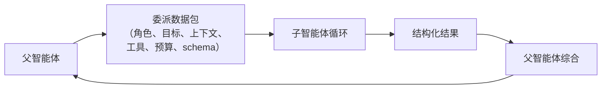
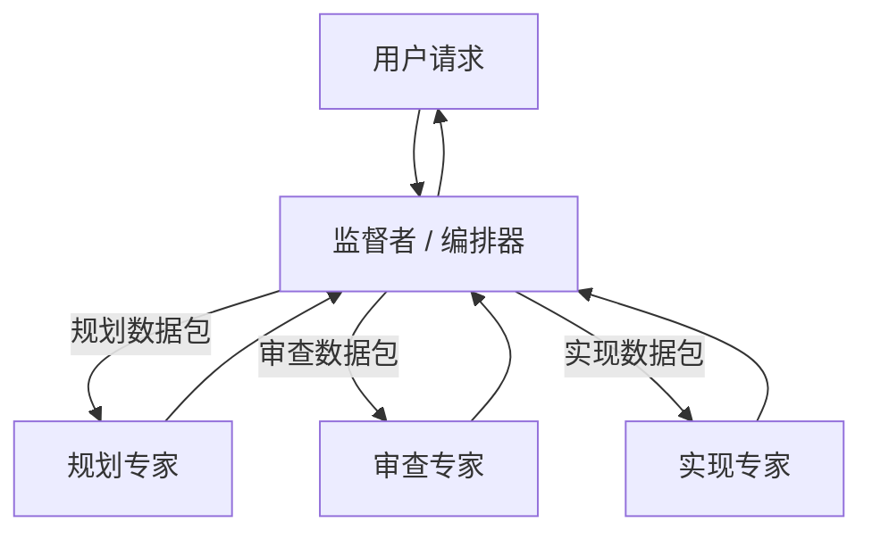

# 第 10 章 — 多智能体委派

## TL;DR

多智能体系统，是由一个智能体（父智能体）将另一个智能体（子智能体）作为有边界的工作单元来运行。做得好，它能隔离子任务，让父智能体的上下文保持整洁，并让子智能体使用不同的工具集、模型或信任边界。做得不好，它就会抛出一句含糊的*“研究一下这个”*，配上不受限制的工具且没有输出契约，然后让你花一周时间调试。本章介绍委派数据包、结果契约、同步与异步以及顺序与并行模式、递归上限和隔离模式、监督者与专家拓扑，以及如何判断委派究竟是正确选择，还是一次成本更高的工具调用。

---

## 为什么这很重要

第一次构建多智能体系统时，你会同时发现三件事：子智能体使用的词元比你预期的多，返回的文本比你想要的长，还做出了你无法审计的决策。这些都是契约失效。数据包含糊不清。结果 schema 并不存在。审计轨迹只是隐含存在。

第二次构建时得到的收益，正是无论如何都值得学习它的原因：形态良好的委派，是让智能体实现专业化成本最低的方式。父智能体保持通用；子智能体则获得严格限定的角色、小型工具集和适合任务的模型。与单个无所不知的智能体相比，整个系统成本更低，推理也更好。

---

## 核心概念

### 何时委派（以及何时不该委派）

至少满足以下一项时，可以考虑委派：

- 子任务需要**自己的上下文**——不同的系统提示词、不同的记忆、不同的关注重点。
- 子任务应该**隔离副作用**——使用工作树、沙箱或独立的信任边界。
- 子任务需要**不同的模型或工具集**——狭窄的查找任务使用便宜模型，深度推理使用昂贵模型。
- 子任务可以与其他子任务**安全地并行执行**——并行进行三项审查，然后综合结果。

以下情况*不要*委派：

- 确定性工具能够回答这个问题。
- 技能可以教会父智能体完成它。
- 子智能体无论如何都需要父智能体的完整上下文（你会为上下文成本支付两次）。
- 子任务太小，不值得再启动一个模型循环（委派有设置成本——系统提示词、工具列表、数据包构建）。

大多数团队都会跳过的最低成本改进：问一问每次委派是否正在取代一次原本成本更低的工具调用。

### 委派数据包

父智能体发送给子智能体的是一个*数据包*，而不是一份对话记录：

```ts
type DelegationPacket = {
  role:            string;       // "researcher" | "reviewer" | "implementer" | ...
  objective:       string;       // 用自然语言描述的子任务
  context:         string;       // 经过筛选的片段，而非父智能体的完整对话记录
  allowedTools:    string[];     // 比父智能体的范围更窄
  constraints:     string[];     // “不要写入 /tmp 以外的位置”，“最多读取 10 个文件”
  maxSteps:        number;       // 硬性上限
  budget?:         { tokens?: number; cost?: number };
  outputSchema:    JsonSchema;   // 结果必须具备的结构
  remainingDepth:  number;       // 剩余委派深度（参见“递归上限”）
};
```

来自生产实践的几条规则：

- **默认不要把父智能体的对话记录全部倾倒进去。** 对其进行总结，或只挑选子智能体真正需要的少数消息。全部倾倒会增加词元成本、提示词注入攻击面，以及子智能体偏离任务的概率。
- **收紧工具列表。** 审查者子智能体只获得读取工具。实现者获得写入工具，但范围限定在一个工作树内。外部研究者获得网络工具，但没有 shell。
- **传递剩余委派深度。** 每次创建子智能体都将其减一。当它降到零时，不得继续创建。



### 结果契约

返回的内容必须可以检查。只返回一个没有结构的段落，就是在等待发生的契约失效。生产系统最终会采用类似这样的结构：

```ts
type ResearchResult = {
  answer:       string;
  evidence:     Array<{ source: string; quote: string }>;
  uncertainty:  "low" | "medium" | "high";
  followups:    string[];
  toolsUsed:    string[];      // 用于审计（第 16 章）
  cost?:        number;        // 用于汇总到父智能体的预算
};

function validateAgainstSchema(result: unknown, schema: JsonSchema) {
  // 如果子智能体的输出不匹配，就拒绝它。
  // 不良输出是可恢复错误——父智能体可以使用纠正提示词重试，
  // 或者明确地失败。
}
```

结构化输出让父智能体能够机械地推理：校验 schema、评估置信度、比较多个同级子智能体、向用户呈现结果。非结构化输出迫使父智能体再次调用模型来解释它——每次委派都由此产生第二笔隐藏成本。

### 同步与异步；顺序与并行

这是两个相互正交的维度：

- **同步**——父智能体等待子智能体。大多数生产设置都是如此（OpenCode 的 `task` 工具、Hermes Agent 的 `delegate_task`）。
- **异步**——子智能体在后台线程或进程中运行。Hermes Agent 的 `spawn_background_review_thread` 是典型参考；Paperclip 的心跳调度在系统层面是异步的。

- **顺序**——父智能体委派 A，等待其完成，再委派 B。A 的结果会影响 B。
- **并行**——父智能体一次创建 A、B、C；它们独立运行；全部返回后，父智能体综合结果。

```ts
// 当输入真正相互独立时，并行执行。
const [api, ui, db] = await Promise.all([
  delegate(apiReviewPacket, ctx),
  delegate(uiReviewPacket, ctx),
  delegate(dbReviewPacket, ctx),
]);
const final = await synthesize([api, ui, db], ctx);

// 当一个结果会塑造下一个数据包时，顺序执行。
const investigation = await delegate(investigationPacket, ctx);
const patchPlan      = await delegate(buildPatchPlanPacket(investigation), ctx);
const final          = await synthesize([investigation, patchPlan], ctx);
```

并行可以节省实际经过的时间；顺序可以让推理保持有序。把二者结合起来——收集阶段并行，综合阶段顺序执行。

### 递归上限与默认深度 1

能够创建自己子智能体的子智能体，就是一个等待发生的栈溢出。生产实践中有三种模式：

- **默认深度 1**（最常见的生产选择）：父智能体可以创建子智能体；子智能体不能继续创建。它最安全、最简单，也是你应该采用的起点，除非具体需求迫使你选择其他方式。
- **有界深度**（OpenClaw 的深度为 5）：允许达到一个较小的上限；耗尽时抛出错误。
- **拓扑上限**（Paperclip）：完全不允许在循环内创建；由调度器分发；智能体的父子关系作为数据跟踪，而不是作为栈帧。

```ts
function assertCanSpawnChild(ctx: AgentContext) {
  if (ctx.remainingDelegationDepth <= 0) {
    throw new Error("Delegation depth exhausted; flatten or hand off via supervisor");
  }
}
```

一个容易忽略的陷阱：深度上限通常基于计数，但位于深度 N−1 的两个子智能体可以各自创建一个子智能体，从而使深度 N 的实际工作量翻倍。如果成本比嵌套层级更重要，就切换到*基于成本*的上限——限制创建的子智能体所用词元总量，而不是嵌套次数。

### 隔离模式

每个子智能体获得哪种级别的隔离：

| 模式 | 隔离的内容 | 成本 | 适用场景 |
|---|---|---|---|
| **同一进程，共享内存** | 仅系统提示词和工具集 | 最低 | 快速专家查询 |
| **独立会话，共享存储** | 记忆命名空间、审计日志 | 低 | 大多数子智能体用途 |
| **工作树** | 文件系统（每个子智能体一个 git worktree） | 中 | 不得触碰主工作区的代码编辑 |
| **沙箱** | 操作系统级隔离（Docker、Modal、Vercel） | 高 | 不受信任的执行 |
| **独立进程 / 适配器** | 完整的进程边界 | 最高 | 不同的运行时；渠道适配器风格 |

OpenCode 支持工作树隔离。Hermes Agent 的工具环境（`tools/environments/`）在每个工具的层面支持 Docker、SSH、Modal、Vercel Sandbox。Paperclip 在独立进程中运行每个适配器。如何选择取决于信任与预算：更高级别的隔离成本更高，但能遏制更多风险。

记忆与召回方面——子智能体可以读取和写入什么——由第 06 章（召回边界）和第 07 章（写回边界）介绍。两方面应选择一致的答案；混合策略（子智能体可以读取一切，但不能写入）通常可行；反过来（可以写入但不能读取）几乎从来行不通。

### 在共享制品上并行工作

当子智能体在相关制品上并行运行时（例如三个审查者审查同一个代码库，两个实现者编辑同一文档的不同部分），应在创建它们*之前*选定协调形态。两种模式几乎可以覆盖所有情况：

- **隔离编辑 + 综合时合并。** 每个子智能体在自己的工作树、沙箱或命名空间中工作；全部返回后，父智能体合并输出。重叠会以合并失败的形式暴露，并在一个统一位置解决——由父智能体的综合步骤解决（编辑互不相交时进行确定性合并），由审查者专家解决（存在重叠但可以干净地进行语义合并），或由用户解决（确实存在冲突时）。这是更安全的默认选择；它把冲突推迟到一个解决点，而不是让同级子智能体在共享状态中竞速。
- **共享黑板。** 一种小型结构化存储（JSON 文件、Redis 哈希、数据库行），同级子智能体可以在运行期间读取和写入——适用于*“我已经检查过 `auth.ts`，跳过它”*这类协调。黑板继承第 07 章（原子写入）的锁与第 08 章（CAS 转换）的 CAS 纪律；没有这些机制的黑板，只是伪装成协调模式的竞态条件。

特别是对编码智能体来说，工作树隔离加上综合后的合并步骤，是已经确立的模式：每个子智能体获得自己的检出目录，父智能体并排检查差异，而合并要么是确定性的（没有重叠），要么会被呈现出来等待解决（检测到重叠）。让并行子智能体在同一个仓库状态中竞速，是成本最高的一类多智能体编码 bug——局部且相互不一致的编辑，在逐个文件查看时似乎合理，却在集成时出错。增加一个工作树的成本，远低于撤销这些修改的成本。

### 监督者与专家拓扑

两种角色在不同系统中反复出现：

- **监督者 / 编排器**决定由谁运行、按什么顺序运行、使用什么输入。通常是主智能体循环。Paperclip 的心跳服务是控制平面级的监督者。
- **专家**是范围严格受限的子智能体，拥有狭窄的工具集和清晰的角色——`explore`、`review`、`summarize`、`extract`。专家不决定要做什么；由监督者决定。



可扩展的模式是：为专家命名。每个专家都有系统提示词、工具列表、结果 schema 和一行描述。监督者按名称选择。OpenCode 的内置智能体配置（`build`、`plan`、`general`、`explore`）是典型参考；随着新的专家需求出现，你通常会为每个项目添加少量自定义配置。

### 每个子智能体的限制

父智能体对专家施加的每项限制，也都会为第 04 章所讲的优化带来收益。只有三个工具的专家，其系统提示词更短（不同专家之间可以获得更多缓存复用）。使用更便宜模型的专家，每次调用成本更低。这些节省会在多次委派中不断累积。

在实践中：

- **工具。** 按角色设置显式允许列表；默认拒绝。（第 03 章的元数据标志会告诉监督者，哪些工具对哪些专家是安全的。）
- **模型。** 狭窄任务使用便宜且快速的模型；真正困难的子问题使用推理模型。
- **记忆。** 按照第 06 章限定范围；通常读取父智能体的命名空间，写入自己的命名空间。
- **审批关卡。** 如果专家能够采取破坏性操作，它就继承父智能体的权限规则——第 12 章介绍这个关卡。

### 上下文交接

子智能体最大的单项成本，是父智能体传递给它的上下文。以下三种模式按成本从低到高排列：

- **仅提供全新的系统提示词 + 目标。** 子智能体从干净状态开始。成本最低。适用于目标本身已经包含全部上下文的情况。
- **总结式交接。** 父智能体的压缩（第 05 章）把相关轮次总结到一个 `<context>` 数据块中。成本适中；通常是正确选择。
- **经过筛选的对话记录片段。** 父智能体选取最近 N 轮，或选择所有符合某种过滤条件的轮次。成本最高；仅用于子智能体确实需要原始措辞的情况。

第 05 章提供了一条实用规则：父智能体经过*压缩*的工作对话记录，通常比完整审计日志更适合作为交接起点。压缩过程已经选择了重要内容。

### 子智能体输出纪律

一个专家本可以用一句话回答，却写出多个段落，这就是词元泄漏。父智能体应该强制执行：

- **简洁的最终答案。** 几句话或一个结构化对象。更长的内容都代表综合失败。
- **没有中间噪声。** 默认情况下，父智能体不应该在*自己的提示词上下文中*看到子智能体的工具调用或推理——只看到最终答案。（OpenCode 的 `task` 工具就是这样做的；Hermes Agent 的 `StreamingContextScrubber` 会从父智能体的视图中隐藏注入的记忆。）这是*提示词上下文*规则，而不是*审计*规则：子智能体的工具调用、推理和中间轮次仍会记录在审计日志（第 05 章）和追踪管道（第 16 章）中，并且可以继续用于调试、重放和事后审查。对父智能体的提示词隐藏它们，以节省词元并让父智能体保持专注；绝不要对操作人员隐藏。
- **答案需要证据时提供引文。** 每个承重结论都应附上一个父智能体可以检查的来源。

训练专家保持简洁，通常采用与第 05 章的总结器相同的方式：在系统提示词中明确说明目的，使用结构化输出 schema，并在综合步骤中采用较低的温度。模型能够做到；父智能体必须明确提出要求。

### 子智能体故障处理

子智能体可能以三种彼此可区分的方式失败：

- **可恢复**（例如 schema 校验失败）。父智能体使用纠正提示词重试，最多尝试 1–2 次。
- **永久性**（例如工具不可用、凭据无效）。父智能体呈现故障，然后尝试不同的专家，或把失败上报给用户。
- **静默**（例如输出通过校验，但答案错误）。这是最困难的一种。防御措施存在于结果 schema（置信度字段、引文、结构化字段）和交叉验证（由第二个子智能体审查第一个）之中。

持续跟踪子智能体的成功率。一个有 30% 概率失败的专家，要么范围界定不当，要么被用于错误的任务；无论哪种情况，它都是值得及早捕获的第 16 章信号。

### 长期运行控制平面中的监督者

有一种模式值得单独说明，因为它看起来不像子智能体：监督者位于智能体循环*之外*，并跨越多次运行而持续存在。Paperclip 的心跳服务正是如此。它负责调度、重试、监视孤儿任务、执行预算，并将工作路由给智能体。它所监督的“智能体”并不是进程内子智能体——而是完整的智能体运行，可能会持续数分钟或数小时。

这种模式对于工作生命周期超过单次智能体调用的生产系统非常重要：长期运行的自动化、多步骤审批、异步用户交互。监督者是持久层；智能体是工作者。第 08 章的持久化和状态机构成了它的基础。把监督者本身也当作一次第 08 章所述的运行：状态机、原子认领、心跳、清理器。

### 后台子智能体

最简单的非阻塞式委派：在一次成功的交互轮次后运行守护线程，并把结果写回记忆或技能。Hermes Agent 的后台审查分支是典型参考（第 07 章从记忆写入的角度进行了介绍）。把它用于*“判断是否应该记住本次会话中的某些内容”*或*“在后台总结当天的工作”*——不要用于任何用户正在等待结果的事项。

需要遵守的约束：

- 后台子智能体应该使用不同的（通常更便宜的）模型。
- 使用受限的工具集——通常仅限记忆和技能工具。
- 它们的结果在*下次会话*可见，而不是本次会话。第 04 章的缓存规则反向同样适用：不要从后台进程修改正在运行的提示词。

### 验证与交叉检查

一种较新的模式，在参考系统中尚未普及但值得指出：创建*第二个*子智能体，其唯一工作是根据同一份上下文审查第一个子智能体的输出。审查者专家获得原始数据包以及第一个子智能体的结果，并返回*批准*或*此答案存在的问题*。这是防范静默故障的低成本保障。

两条实践建议：审查者的工具集应比工作者更严格（通常只读）；并且审查者的预算应只是工作者成本的一小部分——如果审查者比它所审查的工作成本还高，这次调用就不值得。

---

## 真实系统笔记

- **OpenCode** 提供了最整洁的进程内委派参考：一个 `task` 工具使用经过筛选的上下文创建子会话，并通过 `Agent.Service.handleSubtask` 流程向父智能体返回单个结构化观察结果。内置的 `build` / `plan` / `general` / `explore` 配置展示了监督者与专家的分工。
- **Hermes Agent** 是两种风格的参考：同步的 `delegate_task` 用于内联子智能体，`spawn_background_review_thread` 用于具有严格工具允许列表的异步后台子智能体。
- **Paperclip** 是控制平面模式：监督者（心跳调度器）把议题路由给智能体，跟踪 `parent_run_id` 谱系，并在多次运行间执行预算和审批。恢复任务可以通过 `assigneeAdapterOverrides` 请求更轻量的模型——在编排层面为每个子智能体选择模型。
- **OpenClaw** 使用渠道适配器作为一种跨越进程边界的委派形式：入站消息被分发到下层智能体运行时；适配器就是边界。它是*“子智能体是另一个进程”*这一模式的实用参考。

---

## 常见失败情况

*这些故障模式经久不变，而具体修复方式演化得最快——每一项只给出模式，把当前实现细节留给你和你的 AI 伙伴。*

- **扇出让词元账单变成三倍。** 一项任务被拆分并扇出给多个子智能体，产生许多循环外加一次综合，但单条追踪记录看起来都不惊人。*修复：把扇出预算汇总到父智能体运行，并对整棵树设置基于成本的上限，而不是按叶节点分别计数。*
- **子智能体返回一堵文本墙。** 好工作被包裹在冗长文字中，父智能体不得不再花一次模型调用来解释，消耗缓存和上下文。*修复：把简洁性作为经过校验的约束——使用有界的结果 schema 和硬性输出上限，超出时拒绝并重试。*
- **并行子智能体破坏共享制品。** 同级子智能体同时编辑相同状态，合并以任何单项输出都无法解释的方式失败。*修复：对工作进行分区，让同级子智能体无法冲突；只有在重叠不可避免时，才退回到真正的并发控制（第 08 章）。*
- **子智能体返回自信但错误的答案。** 结果具有正确的形态，但内容虚假，而 schema 校验无法发现。*修复：由能够独立访问证据的一方进行对抗性交叉检查，并提供可检查的引文，而不是使用自我评分的置信度字段。*
- **后台子智能体死亡，父智能体永远等待。** 异步工作者崩溃，结果始终没有落地；这种故障表现为缺失，没有可以捕获的异常。*修复：把异步委派视为具有截止时间的租约式运行，并为部分返回设置扇入策略（第 08 章）。*

---

## 与你的智能体结对

以下提示词很适合用于本章：

- *“对于我当前调用的每个工具，判断它应该继续作为工具，还是变成对专家子智能体的委派。应用本章的四项标准，并解释每个决定。”*
- *“为我的项目设计两个专家子智能体：一个 `reviewer`（只读、便宜模型、简洁的结构化输出）和一个 `implementer`（工作树隔离、昂贵模型）。编写二者的系统提示词和结果 schema，以及决定何时调用它们的监督者逻辑。”*
- *“把本章的委派数据包接入我的代码库。添加 `remainingDepth` 字段和 `assertCanSpawnChild` 守卫。编写一个测试，证明深度为 2 的嵌套创建会干净地失败，并给出有用的错误消息。”*
- *“选取我的一项多步骤研究任务，把它重构为并行委派，并在末尾添加综合步骤。将实际经过时间和总成本与顺序版本进行比较。”*
- *“从我上周常见的子智能体故障中选三个。把每一个分类为可恢复 / 永久性 / 静默。针对每一类，编写父智能体侧的处理代码，并向我展示它生成的审计轨迹。”*
- *“添加一个后台审查子智能体，在每次交互成功后运行，工具允许列表为 `{memory, skill_manage}`。确保它的写入只在父智能体的下次会话中可见（第 04 章规则）。使用前缀指纹进行验证。”*
- *“针对我的智能体，按专家统计过去一个月的子智能体成功率。如果任何专家的失败率超过 20%，提出更严格的范围或不同的模型。”*
- *“实现一个审查者子智能体，在 `implementer` 专家向父智能体返回结果前复核其所有输出。把审查者的预算设置为实现者词元花费的 30%；如果审查者不同意，就拒绝并重试。”*

---

## 下一步

现在，你已经拥有一个能够规划的父智能体、一种把子智能体工作表达为有边界数据包的方法，以及让委派保持专注的纪律。第 11 章会把第 01–10 章的所有内容组合成一个统一的智能体框架——循环、工具注册表、提示词构建器、记忆层、持久化引擎、规划器和委派界面——形成一个可以适配你的技术栈的可组合架构。
