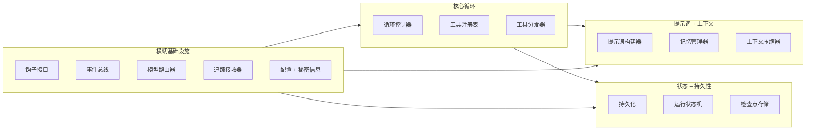
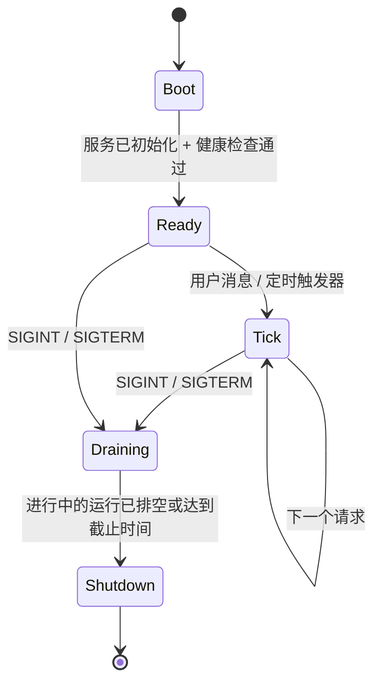
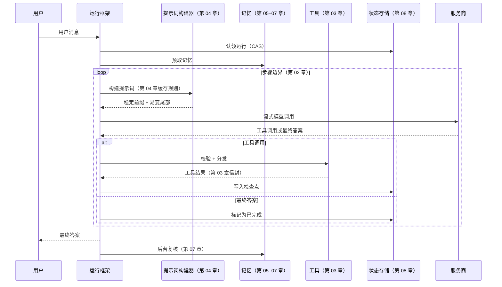

# 第 11 章 — 智能体运行框架

## TL;DR

运行框架是模型周围的运行时。第 01–10 章的每一章都在讨论其中一个组成部分：循环、工具、提示词、记忆、持久化、规划、委派。本章要把这些部分组合成一个程序：它拥有清晰的生命周期（引导启动 → 单轮运行 → 关闭）、定义明确且可供扩展的钩子接口、不泄露秘密信息的配置模型，以及运行框架本身与使用它的应用代码之间清晰的边界。模型带来判断力；运行框架带来结构。学完本章，你应该能够观察任何生产级智能体，并说出它的组成部分、生命周期，以及每个扩展接入的位置。

---

## 为什么这很重要

理解什么是运行框架，可以帮你避开三种故障模式。

第一种：你把工具分发器直接写进循环，把提示词构建器直接写进分发器，再把记忆层直接写进提示词构建器。六周后，任何一部分都无法独立扩展，否则就会破坏其他部分。运行框架存在的意义，就是让每一章介绍的组件都有清晰的接口和明确的归属位置。

第二种：你拥有出色的组件，却没有生命周期。第一次工具调用之后数据库才连接，第一次调用模型之后插件加载器才运行，迁移完成之前心跳就已启动。运行框架定义启动顺序，让这些问题不再成为意外。

第三种——Anthropic 在关于长时间运行应用的文章中说得很好：*运行框架中的每个组件，都编码了一个关于模型无法独立完成什么的假设。*如果没有这种认识，即使底层模型早已不再需要某些能力，运行框架仍会不断堆积功能。运行框架不是一座永久的纪念碑；它是应该随模型一起演进的脚手架。

---

## 核心概念

### 什么是运行框架，什么不是

运行框架负责：循环、提示词构建器、工具注册表与分发器、记忆管理器、持久化层、钩子系统、总线、模型路由器，以及把它们连接起来的生命周期。

运行框架*不*负责：智能体相信什么、积累哪些具体技能、特定工具的提示词，以及决定解决哪些任务的业务逻辑。这些属于应用代码。同一个运行框架今天应该能承载探索型智能体，明天承载客户支持智能体，下周承载分析型智能体——而运行框架本身不需要任何改动。

一条实用规则：如果移除某项功能会破坏*这个系统能解决什么任务*，它就是应用代码。如果移除它会破坏*这个系统究竟如何运行*，它就是运行框架。Paperclip 是这种职责划分最清晰的参考——Paperclip 本身不调用模型；它启动适配器进程（应用）并对其进行编排。OpenCode 也以同样方式，把服务器／服务（运行框架）与智能体定义（应用）分开。

### 组件清单

每个生产级运行框架都具备十项服务，外加几个可选服务：



每一个区块都对应你已经读过的章节。第 01 章——循环体；第 02 章——循环控制器；第 03 章——工具注册表 + 分发器；第 04 章——提示词构建器；第 05 章——记忆管理器 + 压缩器；第 06–07 章——记忆存储 + 写入器；第 08 章——持久化 + 运行状态 + 检查点存储；第 09 章——规划器（循环之上的一层）；第 10 章——委派（监督者位于循环中，并由它启动专家智能体）。钩子、总线、路由器、追踪接收器和配置是横切型的基础设施——接下来会介绍。

运行框架就是这张图。前面的章节就是其中的各个部分。

### 组合：服务如何连接

生产级运行框架中常见三种模式，形式化程度大致依次递增：

- **闭包工厂。** 每项服务都是一个函数，接收其依赖项并返回一个由方法组成的对象。所有连接只在 `main` / `app.ts` 中完成一次。Paperclip 使用这种模式——小巧、明确，也很容易通过传入伪实现来测试。
- **服务注册表。** 组件在启动时把自己注册到带类型的注册表中；消费者按名称查找。当存在许多同类事物（工具、智能体、服务商）时很有用。
- **分层依赖注入（DI）。** 每项服务通过类型签名声明依赖项；运行时按顺序解析这些依赖项。OpenCode 使用 Effect 的 `Layer.effect`，做的正是这件事。

选择一种并坚持到底。最糟糕的运行框架会把三种模式混在一起——有些服务通过注入获得，有些通过注册获得，还有些作为单例导入。服务在构造时究竟采用异步还是同步也同样如此：选择一种约定并始终遵守。

```ts
// 带类型的运行框架——服务作为字段，所有依赖项都显式声明。
type Harness = {
  config:        Config;
  bus:           EventBus;
  hooks:         HookRunner;
  tracer:        TraceSink;
  prompt:        PromptBuilder;     // 第 04 章
  memory:        MemoryManager;     // 第 05–07 章
  tools:         ToolRegistry;      // 第 03 章
  loop:          LoopController;    // 第 02 章
  state:         RunStateStore;     // 第 08 章
  checkpoints:   CheckpointStore;   // 第 08 章
  router:        ModelRouter;       // 第 17 章（后文）
};
```

### 生命周期：引导启动、单轮运行、关闭



三个阶段各有自己的规则。大多数运行框架 bug 都出现在它们之间的边界上——引导启动尚未完成就使用服务、开始排空后仍接受请求、关闭时没有等待运行状态机写入检查点。

### 引导启动顺序

启动顺序并非任意安排——每一步都依赖前一步。下面这个顺序适用于各种生产系统：

1. 加载并解析配置文件（支持环境变量覆盖）。
2. 校验配置 schema；遇到错误立即失败，并一次性显示*所有*错误。
3. 替换环境变量并解析 `$secret:` 引用。
4. 打开数据库；执行所有待处理的迁移。
5. 初始化存储服务（会话、对话记录、记忆存储）。
6. 从内置路径和用户路径**发现插件**；加载每个插件的*清单*——它贡献的工具、智能体配置、钩子处理函数和命令——但暂不激活。
7. 以确定性顺序构建工具注册表：先内置项，再插件贡献项，最后是配置声明项（第 04 章的缓存规则适用于此——顺序在启动时固定，之后不再改变）。
8. 以同样方式构建智能体注册表：先内置配置，再插件配置，最后是配置文件中的配置。
9. 针对现已稳定的注册表**激活插件钩子**；这是第二遍处理。
10. 启动可选子系统（调度器、MCP 服务器、WebSocket 总线、cron）。
11. 运行健康检查——数据库可访问、模型服务商可访问、插件握手正常。
12. 翻转就绪标志；开始接受流量。

两遍处理的形式是承载整个设计的关键细节。插件会向工具注册表和智能体注册表*贡献内容*，因此不能在加载插件清单之前构建注册表；但插件钩子需要*针对*稳定的注册表触发，因此必须等注册表构建完才能激活。把插件加载拆成“发现清单”（第 6 步）和“激活钩子”（第 9 步），是在不让注册表在运行时可变（那会破坏第 04 章的缓存稳定性）的前提下，解决这种依赖关系最简单的方法。

有两个标志值得区分：*存活性*（进程是否存活？）和*就绪性*（是否正在接受流量？）。它们是发送给负载均衡器或监督器的两个独立信号。把两者混为一谈，是智能体系统中一半部署期故障的根源。

### 一次单轮运行的完整过程

一次单轮运行 = 一条用户消息 → 一个最终答案。每一章的贡献都会出现：



每一个箭头都是一个钩子点。LLM 前置与后置钩子包围模型调用。工具前置与后置钩子包围分发过程。会话开始与会话结束钩子包围整个单轮运行。插件通过在这些位置注册处理函数来扩展运行框架，无须修改循环。

### 优雅关闭

信号处理函数——SIGINT 或 SIGTERM——会让运行框架切换到排空模式。在排空期间：

- 拒绝新请求（或将其排队，取决于策略）。
- 为进行中的运行设定一个截止时间（通常是几分钟），让它们到达步骤边界并干净地写入检查点。
- 截止时间过后，仍未结束的运行会在状态机中标记为 `cancelled`（第 08 章）；它们的租约将由下一个实例回收。
- 等待待处理的后台复核分支结束，或将其标记为已放弃。
- 数据库连接池排空；总线关闭；进程退出。

跳过优雅关闭的代价通常不可见，直到某次部署中断了十个长时间运行的智能体会话；接着，下一个实例就必须查明之前发生了什么。第 08 章的回收器负责*恢复*；本章负责*预防*。

### 钩子接口

钩子是运行框架的扩展 API。六个生命周期点可以覆盖大多数生产需求：

| 钩子 | 触发时机 | 用途 |
|---|---|---|
| `pre_session` | 会话开始时触发一次 | 注入身份、设置命名空间、启动预取 |
| `pre_llm_call` | 每次模型调用前 | 最后一次修改提示词、执行门控、脱敏 |
| `post_llm_call` | 每次模型调用后 | 统计 token、脱敏、提取计划 |
| `pre_tool_call` | 每次分发工具前 | 权限检查（第 12 章）、参数转换 |
| `post_tool_call` | 每次工具返回后 | 对秘密信息脱敏、附加元数据、记录日志 |
| `post_session` | 会话结束时触发一次 | 后台复核（第 07 章）、汇总成本、归档 |

运行框架按照注册顺序触发每个钩子，并传入带类型的上下文对象。插件返回一条指令（`continue`、`modify`、`deny`），任何副作用（日志、事件）都通过运行框架执行，而不是直接修改共享状态。Hermes Agent 和 OpenClaw 都以这种方式注册钩子；OpenCode 的总线事件模型与之很接近。

来自生产实践的两条规则：

- **钩子必须具备幂等性。** 重试的步骤（第 08 章）会再次触发相同钩子。如果钩子写入计数器，应使用幂等键执行递增。
- **失败时放行还是拒绝，取决于钩子的职责。** *观测型*钩子（追踪、指标、普通日志、事后转换）采用失败时放行：记录故障，循环继续。*门控型*钩子——安全（第 18 章）、审批（第 12 章）、脱敏、策略——必须采用失败时拒绝：审批钩子失败，意味着操作*没有*获得批准；脱敏钩子失败，意味着未经脱敏的字节绝不能到达下一阶段；策略钩子失败，意味着拒绝该操作。注册每个钩子时，用标签标明其失败语义；运行框架根据标签处理故障。让所有钩子默认失败时放行，是一种伪装成韧性的漏洞。

### 服务商抽象（以及它的泄漏）

运行框架把服务商封装在统一接口之后，使循环、工具和提示词无须关心使用的是哪一家。实践中，这是一种存在三处已知漏洞的*泄漏抽象*：

- **工具 schema 格式**因服务商而异（Anthropic 使用 `input_schema`；OpenAI 使用 `function.parameters`）。适配器在输入时进行统一。
- **流式事件**因服务商而异（Anthropic 发出 `content_block_delta` 和 `tool_use`；OpenAI 发出 `choice.delta.tool_calls[i].function.arguments` 片段）。每家服务商都有自己的传输适配器。
- **缓存控制语法**由服务商决定（第 04 章详细介绍了 Anthropic 的显式标记形式和 OpenAI 的自动前缀形式）。只在拥有该语法的适配器内部应用；对于不支持这种标记的服务商，则直接透传。

```ts
// 每个运行框架的循环背后都有一个整洁的服务商接口。
// metadata() 用于能力协商——运行框架询问服务商支持什么，
// 并据此调整请求，而不是把这些能力硬编码进去。
interface ModelProvider {
  stream(req: ModelRequest): AsyncIterable<ProviderEvent>;
  countTokens(text: string): number;
  metadata(): {
    contextWindow:             number;
    maxOutput:                 number;
    supportsCacheControl:      boolean;
    supportsParallelToolCalls: boolean;
    supportsStructuredOutputs: boolean;
    supportsHostedTools:       boolean;
    refusalShape:              "block" | "finish_reason" | "none";
  };
}
```

这就是*能力协商*：运行框架不会硬编码每家服务商支持哪些能力，而是在启动时（以及重新加载配置时）读取元数据，并据此进行路由／适配。服务商新增能力时无须修改代码；缺少能力时，则表现为路由器拒绝把该请求路由给该服务商，而不是在循环深处发生运行时故障。

运行框架通过模型路由器选择服务商（属于第 17 章的内容）；循环只看到这个接口。当一家服务商失败时，路由器回退到下一个*兼容*的服务商——使用相同的工具 schema 方言、上下文窗口至少满足本轮所需，并且推理能力与策略能力等同（第 02 章已在循环的错误处理规则中介绍这项准则）。缺少主服务商能力的回退方案不叫回退；它是另一种故障模式。凭据池（遇到 429 时轮换 API 密钥）也位于路由器中——Hermes Agent 和 Paperclip 都实现了这一机制。

### 配置

运行框架的配置接口通常如下：

- **文件。** YAML、JSON 或 TOML；启动时加载一次。热重载是可选能力，也存在风险——它可能在运行期间修改工具描述，从而破坏缓存（第 04 章）。
- **环境变量覆盖。** 每一个键都可以由环境变量覆盖。环境变量优先于文件。使用有文档说明且带前缀的命名约定；随意使用不带前缀的环境变量，会成为调试陷阱。
- **秘密信息引用。** 敏感值存储在其他位置——钥匙串、AWS Secrets Manager、加密文件。配置中只保存 `$secret:NAME` 指针，并在运行时解析；秘密信息绝不出现在加载后的配置对象中。
- **Schema 校验。** Pydantic、zod、JSON Schema——选择一种。遇到校验错误就在启动时失败，并一次性显示*所有*错误。配置无效时，智能体不应该启动。
- **插件贡献项。** 插件可以用自己的键扩展 schema，并在加载时合并。

一个值得提前防范的常见 bug：把包含已解析秘密信息的配置值写入磁盘。序列化器应该重新输出 `$secret:` 引用，绝不能输出解析后的值。通过单元检查测试这一点——执行序列化，然后 grep 已知的秘密内容。

### 会话、运行、子智能体——统一词汇

不同系统反复使用四个工作单元术语；明确固定其含义，才能让代码与文档保持一致：

- **会话（Session）**——一个工作区中，一名参与者通过一个渠道进行的一条对话线程。具有稳定 ID；持久化对话记录 + 状态；可以恢复（第 08 章）。
- **运行（Run）**——循环的一次调用。有开始、有结束、有最终状态（成功／失败／已取消）。一个会话在其生命周期内包含多次运行。
- **子智能体（Subagent）**——父运行启动的子运行（第 10 章）。它看到的是父级上下文经过筛选的一个切片；返回一条观察结果。
- **心跳（Heartbeat）**——控制平面（Paperclip）使用的唤醒单轮：监督器定期唤醒，并检查每个会话是否有工作要做。一次心跳不一定会产生一次运行。

OpenCode 的 `SessionID` 和 `RunID` 标记类型，是区分这些概念最清晰的参考；Paperclip 的 `issues` / `heartbeat_runs` / `agent_task_sessions` schema 则最为全面。

### 实例状态与租户作用域

为多个项目、用户或租户提供服务的运行框架，需要*实例状态*——服务按项目划分作用域，而不是全局共享。OpenCode 的 `InstanceState.make()` 就是这种模式：针对每个 `(project, agent)` 组合延迟构造服务，并将其缓存。Paperclip 的多租户设计更进一步——每张表都有 `company_id`，每条查询都携带它。

可扩展的做法是：在每次运行框架操作的边界，根据当前 `(tenant, project, agent)` 查找实例，并通过该实例路由。绝不要从请求处理函数访问全局服务。最终会反噬你的泄漏，是因为共享了全局单例，导致一个用户看到另一个用户的记忆。第 06 章的命名空间规则和第 08 章的租户作用域状态机，都依赖这项准则。

### 总线与流式接口

生产级运行框架会把两个相邻的关注点分开处理：

- **内部事件总线**允许插件与可观测性系统订阅运行框架事件（`session_started`、`tool_completed`、`run_failed`），同时不修改共享状态。大多数运行框架使用简单的进程内发布／订阅；总线默认*不*具备持久性——需要在重启后继续存在的事件，应单独持久化（第 08 章）。
- **流式接口**向 UI（TUI、Web、CLI）传递 token、工具事件和状态更新。服务器发送事件（SSE）与 WebSocket 都很常见。运行框架把总线事件扇出给按会话筛选后的已连接客户端。

让两者保持分离。总线服务于进程内发布／订阅；流式接口是网络侧的对外界面。混合两者会产生别扭的耦合——每个 UI 事件都会变成全局总线事件，而总线在负载下会变成串行化瓶颈。

### 健康与就绪

从第一天起就值得交付两种探针：

- **存活性**——进程究竟是否存活？成本很低：返回简单的 HTTP 200，不检查任何依赖项。
- **就绪性**——运行框架是否已准备好服务真实流量？检查数据库、模型服务商（使用缓存一分钟的微型测试调用，以免反复轰击）、插件握手，以及启动时任何关键钩子错误。

三项指标在第一个月就能收回投入：活跃运行数量、队列深度、每分钟错误率。它们属于第 16 章的追踪管线，但值得从一开始就在运行框架层接好。

### 更简单的运行框架更经得起时间考验

Anthropic 的 *Harness design for long-running agentic applications* 一文提出了一条实用规则：*运行框架中的每个组件，都编码了一个关于模型无法独立完成什么的假设。*随着模型改进，这些假设会逐渐减弱。上个季度还有存在价值的组件，这个季度可能已成为不必要的开销。

这带来两个实际后果：

- **每年审计一次运行框架。** 对每个组件都问：*当前模型还需要它吗？*移除不再物有所值的部分。Anthropic 提到，当更强的模型已经能够完成连贯性更强、持续时间更长的工作时，他们移除了“冲刺（sprint）”分解层。
- **以同样的纪律增加复杂度。** 每个新的运行框架组件都应该解决一种*经过度量*的故障模式，而不是理论上的故障模式。出于预想而加入的组件，几乎从来不会再被移除。

目标不是最复杂精密的运行框架，而是能够可靠处理你的工作负载的最简单运行框架。本章中的模式，是一份说明什么能力*可用*的清单，而不是要求什么组件必须*存在*的清单。

---

## 真实系统笔记

- **OpenCode** 是嵌入式运行框架最强的端到端参考：使用 Effect Layers 进行带类型的服务组合、清晰分离会话与运行、为每个服务商家族提供传输适配器、使用 SSE 事件总线，以及采用按项目划分的 `InstanceState` 模式。可以把它视为编码智能体的“默认”运行框架形态来阅读。
- **Hermes Agent** 是运行框架与网关分离的参考：内部智能体循环独立于渠道适配器（Telegram、CLI、cron），因此同一个运行框架可以服务于多种界面。它的插件钩子接口（`pre_llm_call`、`post_tool_call` 等）结构良好，值得借鉴。
- **Paperclip** 是控制平面运行框架：它不直接调用模型；而是通过心跳调度器，对*其他*运行框架（适配器进程）进行编排，并提供显式运行状态机、原子认领和回收器（第 08 章）。它是多租户、多进程生产部署最强的参考。
- **OpenClaw** 在个人助理运行框架之上提供了最整洁的渠道网关抽象——尤其适合研究网关／运行框架边界。

开源代码库之外还有一份参考资料：Anthropic 的 *“Harness design for long-running agentic applications”*（anthropic.com/engineering），它是有关上下文重置与压缩（属于第 05 章的内容）、评估智能体（第 10 章的验证模式），以及“运行框架的复杂程度应该与模型能力同步”这一原则的最佳短篇读物。

---

## 常见失败情况

*这些故障模式经久不变，而具体修复方式演化得最快——每一项只给出模式，把当前实现细节留给你和你的 AI 伙伴。*

- **依赖项就绪之前就被使用。** 全新启动后的第一个请求失败，第二个请求却能成功，而且你永远无法在本地复现。*修复：强制设置就绪门，在每个已声明的依赖项都报告健康之前拒绝翻转——采用两遍处理的插件形式，先执行发现再构建注册表，最后激活钩子。*
- **存活性与就绪性使用同一个探针。** 缓慢的依赖项让健康的进程看起来像已崩溃，监督器于是让整个机群陷入重启循环。*修复：存活性不依赖任何事物，就绪性依赖所有事物，并分别连接到不同的消费者。*
- **门控型钩子失败时放行。** 被阻止的操作仍然通过，只留下一个没有触发任何告警的钩子错误日志。*修复：在注册时用必填的显式标签指定失败时拒绝——门控型钩子必须声明该语义，观测型钩子则主动选择失败时放行（第 12 章）。*
- **一个租户看到另一个租户的会话。** 某个全局单例混入请求路径，并在负载下造成跨租户状态泄漏。*修复：在每个操作边界解析租户级实例，不留任何全局逃生通道（第 15 章）。*
- **运行框架继续保留模型已经不再需要的脚手架。** 某个组件仍在消耗延迟和 token，却已经不能防范任何问题。*修复：安排基于证据的定期运行框架审计——为每个组件标注它所解决的、经过度量的故障，并通过评估套件对移除该组件进行 A/B 测试（第 16 章）。*

---

## 与你的智能体结对

以下提示词很适合用于本章：

- *“绘制我当前智能体代码的组件图。指出每个组件实现了第 01–10 章中的哪一章，并标记任何在单个文件中同时实现了两章关注点的内容。”*
- *“获取我的智能体启动代码，并按照本章的引导启动顺序重新排列。验证健康与就绪可以独立失败——向我展示一个不会杀死进程的失败就绪检查。”*
- *“接入六个生命周期钩子（`pre_session`、`pre_llm_call`、`post_llm_call`、`pre_tool_call`、`post_tool_call`、`post_session`）。添加一个示例插件，记录每个事件及其耗时。验证添加该插件无须修改循环。”*
- *“实现优雅关闭：SIGINT 触发排空模式，进行中的运行最多有 60 秒完成，仍在运行的任务会在运行状态机中标记为已取消（第 08 章）。用一个故意卡死的运行进行验证。”*
- *“把我的服务商集成重构成 `ModelProvider` 接口，每个家族使用一个适配器。确认循环现在可以针对一个没有网络访问能力的模拟服务商完成编译。使用这个模拟实现进行单元测试。”*
- *“根据 Anthropic 的规则审计我的运行框架：‘每个组件都编码了一个关于模型无法做什么的假设。’说出每个组件对应的假设。根据当前前沿模型可以可靠完成的工作，提议移除或简化一个组件。”*
- *“添加租户作用域：每项接触状态的服务都接收租户上下文。编写一个测试，证明租户 A 的请求无法访问租户 B 的会话、记忆或运行状态。”*
- *“设置运行框架的事件总线，以及一个监听该总线的 SSE 流式端点。向我展示这样一个会话：其 token 实时流式传到浏览器，同时插件也在总线上订阅相同事件。”*

---

## 下一步

现在，你已经掌握架构、生命周期与扩展接口。余下章节会补充生产级智能体交付所需的各层能力：人在回路审批（第 12 章）、连接器与 MCP（第 13 章）、把技能与子智能体设计为一个单元（第 14 章）、后端基础设施（第 15 章）、可观测性（第 16 章）、成本与延迟策略（第 17 章）、安全与对抗性输入（第 18 章），以及运维（第 19 章）。它们都是附加到你现在已经掌握的运行框架形态上的组件或关注点。

接下来是第 12 章：这个门控机制会暂停循环，并在采取高风险操作之前询问人类。
