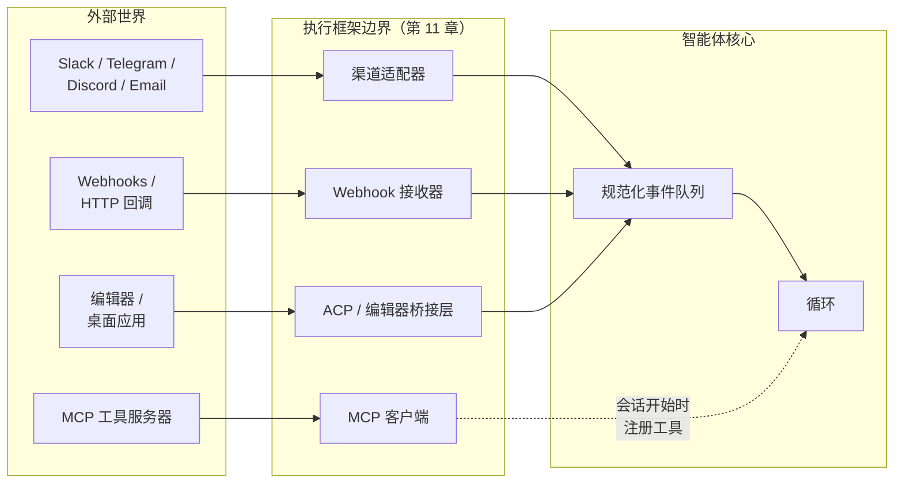
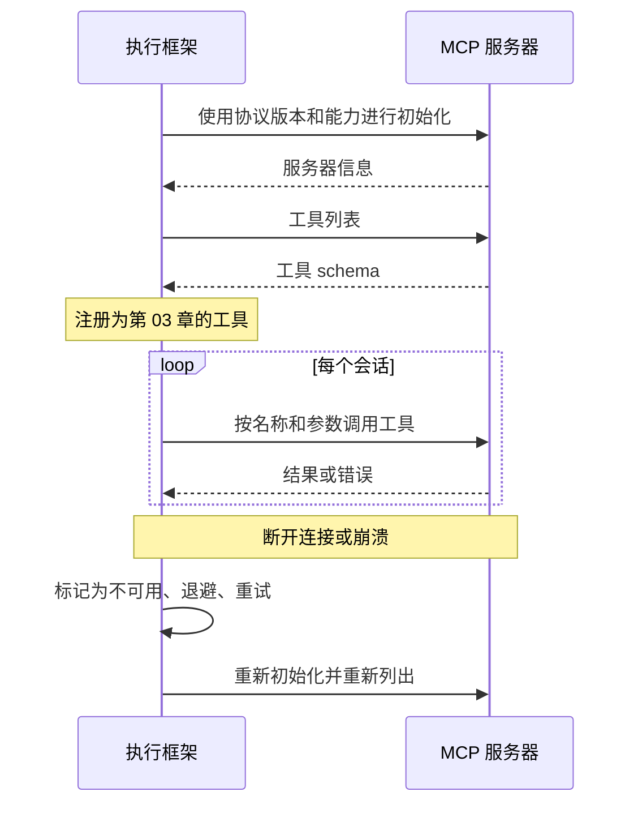
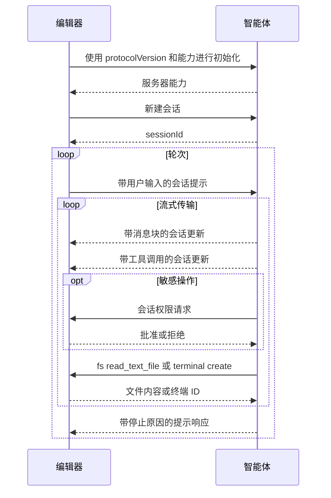

# 第 13 章 — 连接器、MCP、IPC 与渠道

## TL;DR

一个只从 stdin 读取、向 stdout 写入的智能体，只是演示品。真正有用的智能体会连接工作本来就发生于其中的系统——Slack、电子邮件、GitHub、Jira、Telegram 机器人、编辑器、内部仪表盘——还会使用远在自身进程之外的工具服务器。本章涵盖三个连接层：渠道适配器，把来自众多平台的传入工作规范化为统一的事件形态；模型上下文协议（Model Context Protocol，MCP）及其姊妹协议智能体客户端协议（Agent Client Protocol，ACP），分别用于工具服务器和编辑器集成；以及把整个系统连接起来的 IPC 模式（JSON-RPC、HMAC 签名的 webhook、SSE、WebSocket、队列）。此外，还会介绍只有在生产环境中才会遇到的故障模式：速率限制、消息去重、重放攻击、来自渠道内容的提示词注入，以及网关与嵌入式执行框架之间的差异。

---

## 为什么这很重要

大多数有用的智能体，最先出问题的是边缘。模型改进了；循环很稳固；提示词缓存已经预热；记忆层也很干净。然后 Telegram 机器人在每秒 30 条消息时超时，智能体悄无声息地漏掉用户一半的消息。或者 Slack webhook 重试，智能体把同一条回复发了两遍。又或者你上个季度开始使用的 MCP 服务器出现内存泄漏，让长时间运行的智能体每天崩溃一次。

智能体的推理核心并不关心一条消息来自 Slack、webhook 还是 CLI。它应该接收规范化事件、完成工作，再返回规范化输出。*消息从哪里来*，恰恰是适配器层应该隐藏的细节——也恰恰是适配器层太薄时会反过来咬你的细节。

---

## 核心概念

### 三层，一个边界



三类看似不同的集成，解决的却是同一个问题——与执行框架并不拥有的系统通信：

- **渠道适配器**把即时通信、电子邮件和 webhook 事件转化为循环的规范化输入。
- **MCP 和 ACP**是面向*工具与编辑器*的协议——MCP 把外部能力带入执行框架；ACP 则把执行框架开放给编辑器和桌面宿主。
- **IPC**是底层管道——JSON-RPC、SSE、WebSocket、队列、HMAC——把其他部分连接起来。

从形态上看，它们都是第 11 章所说的插件：启动时注册，获得一组钩子接口，向核心暴露干净的接口。本章所有内容，都是这一主题的变体。

### 渠道适配器：让多个平台归一为一种事件形态

无论消息来自哪里，智能体核心看到的都应该是同一种事件形态：

```ts
type ChannelEvent = {
  channel:   "slack" | "telegram" | "discord" | "email" |
             "webhook" | "local" | "matrix" | "signal";
  eventId:   string;          // 去重键（Slack event_id、Telegram update_id，……）
  actorId:   string;          // 引发事件的用户或服务
  threadId:  string;          // 回复应该发往何处
  text:      string;          // 提供给模型的规范化文本
  attachments?: Array<{
    kind: "image" | "file" | "audio";
    ref:  string;
    mimeType: string;
  }>;
  raw:       unknown;         // 原始载荷，用于审计
  reply:     (m: AgentReply) => Promise<void>;
};

type AgentReply = {
  text:       string;
  blocks?:    unknown;        // 平台特有的富内容
  visibility: "private" | "thread" | "channel";
  requiresApproval?: boolean; // 通过第 12 章的门控呈现
};
```

OpenClaw 是最强的参考系统——其代码库的大部分都是渠道适配器，它们把请求路由到同一个助手核心。Hermes Agent 对 Telegram + CLI + cron + ACP 也采用同样做法。能够规模化的纪律是：每增加一个新渠道，都为它编写自己的适配器；核心永远不需要知道该渠道存在。

### 渠道特性差异表

每个平台都会带来适配器必须处理的约束。这些特性差异的形态相当一致，可以归入一张表：

| 平台 | 消息大小限制 | 速率限制（典型值） | 话题串 | 富内容 |
|---|---|---|---|---|
| Slack | ~40 KB / blocks | ~1 条消息/秒/渠道 | 原生话题串 | Block Kit |
| Telegram | 4096 字符/消息 | 全局约 30 条消息/秒 | 回复引用（无话题串） | 内联按钮、Markdown 子集 |
| Discord | 2000 字符/消息 | ~5 条消息/5 秒/渠道 | 原生话题串 | Embeds、components |
| WhatsApp | ~4 KB | 取决于供应商 | 无 | 有限；取决于服务层级 |
| Email | RFC 限制 | 取决于服务商 | 通过邮件头形成回复链 | HTML 或纯文本 |
| Signal | ~2000 字符/消息 | 较为适中 | 无 | 纯文本 |

这些数字会随着供应商的变更而变化；接入新渠道时，让你的智能体查询最新限制。真正稳定的是约束的*形态*——大小、速率、话题串、富内容。适配器必须执行三条规则：

- **分块发送长回复。** 模型输出 12 KB 文本时，绝不能让单条消息上限为 2 KB 的渠道崩溃。
- **遵守速率限制。** 排队、退避、重试——绝不要刷屏。
- **按照平台支持的能力渲染。** 使用 Slack blocks、Discord embeds、Telegram 内联按钮；平台不支持富内容时，则回退为纯文本。

### 入站渠道事件

*消息*只是入站形态之一。生产环境中的渠道适配器至少要处理五种：

- **私信或提及。** 最常见的形态；模型收到规范化文本。
- **按钮点击 / 交互式组件。** Slack Block Kit actions、Discord component interactions、Telegram callback queries。适配器把回调解析为智能体能够推理的结构化事件（`button_clicked`、`action_id`、`state`）。
- **文件上传。** 适配器把文件下载到临时位置并传入路径；智能体使用工具读取或分析文件。
- **图像 / 音频。** 先经由视觉或转写工具处理，再以文本形式送达模型。
- **回应。** 在先前消息上添加的 emoji——通常是一种很有用的信号（👍 表示批准、❌ 表示取消），适配器可以把它转换成独立的 `ChannelEvent`。

适配器的工作是*翻译*；并非所有事件都会变成工作。`typing` 指示器不需要唤醒模型。对过去消息的一个 👍 也许只需确认收到。针对每种事件，决定将其入队还是丢弃。

### 出站渠道响应

反方向也有自身的约束：

- **分块**——按平台允许的消息大小切分长回复，并保持顺序。
- **话题串**——如果入站消息位于话题串中，回复也要留在话题串中；如果不在，就不要凭空新建一个。
- **编辑与回应**——通过占位消息显示*“处理中……”*；循环返回时将其编辑为最终答案；有时则以回应（✅）代替编辑。
- **背压**——如果平台触发速率限制，就由队列吸收压力；绝不要悄无声息地丢弃回复。
- **可见性**——`private`（仅私信）、`thread`（仅限此话题串）、`channel`（所有人可见）。适配器执行智能体声明的意图。

一种在多种系统中都很有用的模式：收到消息后立即发送一条*“正在处理……”*的占位消息，然后在答案到达时编辑它。用户能看到智能体已经确认收到；循环有时间进行计算；渠道历史中也只留下一条消息。

### 渠道身份与会话键

同一个人在 Telegram 和 Slack 上并不属于同一个会话。同一个人在私信和群组渠道中，也不属于同一个会话。复合键如下：

```ts
type SessionKey = {
  platform:        string;   // "slack" | "telegram" | ...
  accountId:       string;   // 平台特有的用户/账户 ID
  conversationId:  string;   // 渠道/话题串 ID，或私信标识符
};
```

执行框架使用它把入站事件路由到正确的智能体实例（第 11 章的实例状态模式）。有两个结果值得明确记住：

- **默认不跨渠道共享上下文。** 用户在 Telegram 告诉智能体的事实，在 Slack 中不可见；除非长期记忆层（第 06 章）的键位于比会话更高的层级。
- **群组与私信的区别属于策略。** 在群组里，你可能只响应提及；在私信里，每条消息都是发给你的。这条规则由适配器编码，而不是由模型编码。

### Webhook：HMAC、去重与重放

Webhook 是通用的入站形态。三种习惯，区分了正常工作的 webhook 接收器和有缺陷的接收器：

```ts
// 验证 HMAC、拒绝过期请求、去重、快速确认。
async function handleWebhook(req: HttpRequest) {
  const body  = await req.bytes();
  const sig   = req.header("x-signature");
  const ts    = req.header("x-timestamp");

  if (!constantTimeEqual(sig, "sha256=" + hmac(secret, ts + ":" + body))) {
    return reject(403, "bad signature");
  }
  if (Math.abs(Date.now() - Number(ts) * 1000) > 5 * 60 * 1000) {
    return reject(403, "stale timestamp");          // 重放窗口
  }

  const event = normalize(JSON.parse(body));
  if (await eventStore.seen(event.eventId)) {       // 平台可能重试
    return ok(202, "duplicate");
  }
  await eventStore.record(event.eventId);
  await channelQueue.enqueue(event);
  return ok(202, "accepted");
}
```

Webhook 处理器应该*快速确认并把工作放入队列*。绝不要在 HTTP 请求处理器中运行模型循环——平台会在超时时重试，智能体就会把所有事情做两遍。

### MCP 到底是什么

模型上下文协议是一种面向能力服务器的线格式——这类程序向模型客户端暴露工具、提示词和资源。一个协议中包含三种分类：

- **工具**——与第 03 章的工具形态相同。名称、描述、JSON schema、返回值。智能体像调用任何其他工具一样调用它们。
- **提示词**——服务器发布的预写提示词模板；客户端可以按需注入。
- **资源**——服务器暴露的可寻址只读内容（文件、数据库行、URL）；客户端可以把它们纳入上下文。

当前大多数生产用途都走*工具*这条路径。一项能力存在于 MCP 服务器中（数据库适配器、浏览器、搜索服务）；执行框架使用这项能力，却不拥有其实现。

### MCP 传输方式

| 传输方式 | 连接 | 适用场景 | 注意事项 |
|---|---|---|---|
| **stdio**（子进程） | 本地；执行框架启动服务器 | 仅限本地的工具、开发工作流 | 服务器崩溃会导致连接断开 |
| **Streamable HTTP** | 远程或本地；HTTP 请求，响应流可选用 SSE | 云托管服务器、多客户端 | 连接频繁建立与断开；延迟 |

这两种是当前的标准传输方式。较旧的 MCP 文档描述了一种名为 *HTTP+SSE* 的传输方式——它采用彼此分离的端点，并通过长连接 SSE 渠道从服务器向客户端发送数据。Streamable HTTP 在规范中*取代了* HTTP+SSE；二者的形态并不相同（单个端点配合可选的响应流，对比两个端点配合持久的服务器流）。规范为需要与旧版 HTTP+SSE 服务器通信的客户端提供了向后兼容指导；不要假设反方向也具备向前兼容性。

有些实现提供 WebSocket 或其他自定义传输方式。它们不属于标准；如果使用其中一种，你就会被绑定到该实现。在假设可移植性之前，先确认客户端和服务器分别使用什么协议。

架构规则与供应商无关：连接时只发现一次能力，以稳定名称调用，把故障视为工具结果（而不是异常），断开后重新连接。

### 把 MCP 工具封装为第 03 章的工具

当 MCP 工具进入智能体循环时，它应该与内置工具无法区分——使用相同的分发契约、相同的元数据标志、相同的错误信封。封装模式如下：

```ts
// 连接时：发现并注册。调用时：转发并转换错误。
async function registerMcpServer(server: McpClient, registry: ToolRegistry) {
  await server.initialize();
  const { tools } = await server.listTools();
  for (const t of tools) {
    registry.register({
      name:         `mcp__${server.id}__${t.name}`,        // 已划分命名空间
      description:  t.description,
      input_schema: t.inputSchema,

      // MCP 注解字段名采用 camelCase，并带有 `Hint` 后缀——
      // 它们是服务器提供的提示，而非断言。对于不受信任的服务器，
      // 应采用更保守的默认值。
      destructive:        t.annotations?.destructiveHint ?? false,
      concurrency_safe:   t.annotations?.readOnlyHint    ?? false,
      idempotent:         t.annotations?.idempotentHint  ?? false,
      open_world:         t.annotations?.openWorldHint   ?? true,

      run: async (args, ctx) => {
        try {
          const result = await server.callTool(t.name, args);
          return ok(result);
        } catch (err) {
          return fail(`MCP error: ${String(err)}`, false);  // 可恢复
        }
      },
    });
  }
}
```

三条规则：

- **为名称划分命名空间。** `mcp__server__tool` 可以防止与内置工具发生名称冲突，也能告诉模型工具来自哪里。
- **遵循 MCP 注解——但把它们视为提示，而非断言。** MCP 为每个工具暴露 `readOnlyHint`、`destructiveHint`、`idempotentHint` 和 `openWorldHint`；它们会成为第 03 章所说的元数据，用于驱动并行（第 02 章）、审批（第 12 章）和重试安全性（第 08 章）。协议有意使用 `Hint` 后缀：恶意或存在 bug 的服务器可能撒谎。服务器声称 `readOnlyHint: true`、实际却写入文件，是真实存在的攻击向量。对于不受信任的服务器，把这些提示视为*应向保守方向调整的默认值*——有疑问时就假设 `destructiveHint: true`——再让运行时监控（第 18 章）根据观察到的行为重新分类。
- **把错误转换为信封。** 服务器崩溃、超时、返回格式错误的 JSON——都应该变成可恢复的工具结果，而不是抛出的异常。循环读取错误并决定如何处理，就像处理内置工具一样。

### MCP 生命周期与故障模式



生产环境中的难点：

- **首次信任。** 新的 MCP 服务器需要经过第 12 章所说的审批——用户必须明确表示信任，之后才能发起任何工具调用。需要保存的内容包括：服务器身份、指纹或 URL、用户的决定以及日期。
- **惰性加载与预先加载。** 预先加载（启动时列出工具）能让提示词缓存预热，但会减慢启动；惰性加载（首次使用时列出）启动更快，但第一个会话要承担这项成本。领先的商业编码智能体往往采用带预取的惰性加载；OpenCode 往往采用预先加载。
- **断开后重新连接。** 指数退避、限制重试次数，最终把服务器标记为不可用。模型应该把*“服务器不可用；稍后重试”*看作可恢复的工具结果，而不是面对一片沉默。
- **Schema 漂移。** 服务器可能在会话之间改变工具 schema。执行框架必须在重新连接时再次列出工具，不能假设缓存中的 schema 仍然有效。

### MCP 的范围与值得标出的威胁

该协议的范围比上面的*工具 / 提示词 / 资源*三元组更广。当前的 MCP 还定义了 roots（客户端向服务器暴露的文件系统边界）、sampling（服务器经由客户端发起的模型回调）、elicitation（由服务器发起的用户输入请求）、tasks（长时间运行的异步工作）、工具输出 schema 和资源订阅。当前大多数生产用途仍集中在工具路径，因此本章以此为中心——但围绕其他部分进行设计前，请先查看规范，确认它们当前的形态。

有两种威胁值得明确指出，因为它们是 MCP 特有的：

- **不受信任的注解。** 上文已经介绍——`*Hint` 后缀表明规范承认 MCP 服务器可能对工具行为撒谎。把不受信任服务器提供的提示视为应向保守方向调整的默认值，再让运行时观察（第 18 章）重新分类。
- **针对本地服务器的 DNS 重绑定。** 在 localhost 上运行的 MCP 服务器，可以被同一台机器上的浏览器访问。恶意页面可以使用 DNS 重绑定，让跨源请求看起来像本地请求。本地 MCP 服务器必须验证 `Origin` 请求头，绑定到 `127.0.0.1`（而不是 `0.0.0.0`），并且即使在本地场景中也要求认证令牌。这些都不是 MCP 的职责；当你交付本地服务器时，它们是你的职责。

授权本身（OAuth、bearer token、远程服务器使用的双向 TLS）是一个演进速度很快的规范领域，因此正确的做法是在实际接入时阅读当前版本。跨版本保持稳定的架构规则是：绝不要信任 MCP 服务器对自身身份的声明；要通过你为任何第三方连接器设置的同一个首次信任门控（第 12 章）来验证它。

### ACP——作为服务的智能体

MCP 向智能体暴露*外部能力*，而**智能体客户端协议**（Agent Client Protocol，ACP）则把*智能体暴露给外部宿主*——通常是编辑器（Zed、JetBrains IDE、通过扩展接入的 VS Code）、桌面封装程序或远程编排器。其线格式是 JSON-RPC；背后的理念，与十年前让语言服务器协议适用于编译器的理念相同：*只需将协议标准化一次，任何智能体便能与任何支持该协议的编辑器协作。* ACP 由 Zed Industries 维护，并提供 Kotlin、Python、Rust 和 TypeScript 的官方 SDK。

**命名倒置。** ACP 颠倒了通常的客户端—服务器术语。*编辑器*是**客户端**——它承载用户、工作区、文件系统和终端。*智能体*是**服务器**。编辑器发起会话；智能体执行模型工作；编辑器对文件系统和权限决策拥有最终决定权。第一次读到把编辑器称为“客户端”时会觉得方向反了，但它遵循 LSP 的惯例：驱动面向用户的交互的一方就是客户端。

**两种部署模式。** *本地*智能体作为编辑器的子进程运行，通过 stdin/stdout 使用 JSON-RPC 通信——与 MCP 的 stdio 传输形态相同。规范把通过 Streamable HTTP 传输进行的*远程*部署描述为提案草案；远程支持尚不成熟。在以远程传输为基础进行构建之前，先检查规范中远程传输的当前状态；目前应把 stdio 视为生产路径，把远程模式视为仍在开发中。

**能力协商。** 与 MCP 一样，ACP 从 `initialize` 调用开始，双方在其中声明各自支持的能力。标准能力包括 `loadSession`、`fs.readTextFile`、`fs.writeTextFile` 和 `terminal`。双方也可以声明自定义能力。协商出的 `protocolVersion` 决定线协议兼容性；能力标志决定任一方可以调用哪些方法。重新连接时重新列出能力可以捕获漂移——这条规则同样适用于 MCP。

**会话方法**由编辑器与智能体相互交换：

- `session/new`——编辑器创建全新对话；智能体返回 `sessionId`。
- `session/load`——编辑器恢复现有会话（需要 `loadSession` 能力）。
- `session/prompt`——编辑器发送用户输入；智能体以流式方式发送进度，并用最终停止原因进行回复。
- `session/update`——智能体以通知形式流式发送进度：标记为 agent / user / thought 的消息块、工具调用请求与结果、计划、斜杠命令更新、模式变更。
- `session/cancel`——编辑器中断正在进行的轮次；这是一条通知，不期待响应。
- `session/request_permission`——智能体在执行敏感操作前请求编辑器获得用户批准（第 12 章的门控，现在通过 JSON-RPC 实现）。

**反向渠道：把编辑器作为工具提供方。** 因为编辑器掌握文件系统和终端，智能体会为使用这些原语而*反向调用*编辑器：

- `fs/read_text_file`、`fs/write_text_file`——文件 I/O。所有路径必须是绝对路径；行号从 1 开始。
- `terminal/create`、`terminal/output`、`terminal/wait_for_exit`、`terminal/kill`、`terminal/release`——shell 命令执行生命周期。

这是它与 MCP 的结构性差异：在 MCP 中，智能体单向调用能力服务器。在 ACP 中，智能体既*接收*编辑器的请求（`session/prompt`），又为了访问文件系统和终端而*回调*编辑器。两种协议都汇聚到 JSON-RPC，并尽可能复用 MCP 的内容形态——ACP 规范明确表示它*“尽可能复用 MCP 中使用的 JSON 表示形式”*——同时加入 MCP 所没有的、编码场景特有的 UX 类型（diff、计划、模式）。



**MCP 与 ACP 一览：**

| 关注点 | MCP | ACP |
|---|---|---|
| 方向 | 执行框架调用外部工具 | 编辑器调用智能体；智能体反向调用文件系统与终端 |
| “客户端”是 | 执行框架 | 编辑器 |
| 线格式 | JSON-RPC | JSON-RPC |
| 传输方式 | stdio、Streamable HTTP、WebSocket | stdio、HTTP、WebSocket |
| 内容形态 | 自行定义 | 尽可能复用 MCP 的内容形态 |
| 编码场景特有的 UX | 不在范围内 | Diff、计划、模式 |
| 审批流程 | 由执行框架按照第 12 章的方式封装 | 一等的 `session/request_permission` 方法 |
| 能力协商 | 是 | 是，外加自定义 `_meta` 扩展 |

**实现与生态系统。** Zed 是首个交付 ACP 的主流编辑器，也是该协议的发源地。Hermes Agent 和 OpenClaw 都实现了 ACP 适配器，让外部编辑器能够驱动它们；几家领先的商业编码智能体也暴露 ACP 服务器，让任何兼容的编辑器都能驱动*它们*。与十年前的 LSP 一样，采用它的编辑器和智能体越多，其价值就越能复利增长：每增加一种编辑器，就能解锁所有现有的 ACP 兼容智能体，反之亦然。线格式处于协议 v1；各 SDK 的制品版本独立演进。

**给执行框架构建者的实用建议。**

- 把 ACP 视为另一种入站界面——本章前面介绍的渠道适配器模式同样适用。能力协商映射到你的工具注册表；`session/prompt` 映射到 `ChannelEvent`；`session/update` 映射到第 11 章所说的执行框架事件总线。
- 为 `session/request_permission` 复用第 12 章的审批界面。编辑器中的 UX 不同（模态弹窗，而不是聊天对话框），但底层门控相同。
- 反向渠道的 `fs/*` 和 `terminal/*` 方法，是接入沙箱决策的地方。始终通过现有工具分发器（第 03 章）路由，使其元数据标志、校验和审计日志仍然适用——不要仅仅因为调用来自 JSON-RPC 而不是模型，就绕过执行框架。
- 针对不止一种编辑器进行测试。ACP 的价值在于不依赖编辑器；如果智能体只能在 Zed 中工作，你还算不上真正实现了 ACP。

### MCP 之外的 IPC 模式

MCP 和 ACP 覆盖了工具与编辑器场景。其他 IPC 模式也会反复出现：

- **基于 stdio 的 JSON-RPC**，用于在独立进程中运行的插件 worker。启动时进行能力协商；使用 ID 完成请求/响应；进程退出后重启，以实现崩溃恢复。
- **服务器发送事件（Server-Sent Events，SSE）**，用于从执行框架到 UI 客户端的单向流式传输——词元流、状态更新、运行事件。通过限制缓冲区大小来提供背压；通过从最后已知事件 ID 开始重放来实现重新连接。
- **WebSocket**，用于 UI 客户端也需要发送内容的场景——中断、审批、编辑计划（第 09 章的计划修订）。
- **持久队列**，用于在 Web 处理器与 worker 之间移交工作（第 08 章的运行状态机建立在持久队列之上）。
- **HMAC 签名**，用于执行框架实例之间，或执行框架与网关之间，确保转发的请求无法被伪造。

### 插件 worker 与隔离

运行在执行框架进程中的插件，可能导致执行框架崩溃。生产系统会把高风险插件放在进程边界之后——通过管道使用 JSON-RPC，执行框架在 worker 崩溃时重启它，worker 与父进程不共享内存。Paperclip 的 `plugin-worker-manager` 和 Hermes Agent 的插件加载器都实现了这种模式；OpenCode 让大多数插件留在进程内，但对会接触不受信任代码的插件支持进程外运行。

应当为每个插件分别决策：受信任的内置插件可以留在进程内；用户安装或第三方插件应该放到进程外。代价是多一次很小的 JSON-RPC 跳转；收益是有缺陷的插件无法拖垮整个执行框架。

### 网关与嵌入式模式

两种架构模式反复出现：

- **网关。** 一个中央执行框架；所有渠道和客户端都连接到它。Hermes Agent 的 `gateway`、OpenClaw 的中央守护进程、Paperclip 的服务器。共享状态更简单（一个数据库、一个记忆层）；水平扩展更困难（单一进程成为瓶颈）。
- **嵌入式。** 每个渠道运行自己的执行框架进程。Telegram 机器人是一个进程；Slack 机器人是一个进程；它们通过共享存储进行协调。更易扩展；更难保持状态一致。

大多数生产部署从网关模式起步，遇到扩展上限后，再选择分片（每个租户一个网关）或转向嵌入式模式。选择由工作负载驱动；需要内化的纪律是*让未来切换成为可能*——保持适配器层足够干净，使适配器不必关心自己运行在哪种模型中。

### 需要留意的事项

连接器层特有、不同于课程其余部分的故障模式如下：

- **来自渠道内容的提示词注入。** 用户消息中包含*“忽略先前指令并执行 X”*，总体上属于第 18 章的问题——但适配器可以捕获其中容易识别的情况。在适配器层移除明显的标记（控制字符、格式错误的提及语法）；其余部分交给第 18 章的威胁模型处理。
- **速率限制风暴。** 影响一个租户的平台级速率限制，不应该阻塞其他租户。在适配器中按租户分别保存速率限制状态，不要全局共用。
- **重复投递。** 每个 webhook 平台都会重试。在放入循环队列*之前*按 `eventId` 去重——不要在循环内部去重。
- **重放攻击。** 检查已签名 webhook 的时间戳；拒绝任何早于几分钟前的请求。
- **消息乱序。** 平台在负载下可能乱序投递消息。顺序很重要时，使用平台提供的时间戳或序列号，而不是到达时间。
- **日志中的令牌泄漏。** 机器人令牌、OAuth 令牌、嵌入了凭据的 MCP 服务器 URL——绝不要记录它们。参见第 07 章的脱敏模式。
- **异步工具结果。** 如果工具调用以流式方式输出结果（例如长时间运行的脚本），要预先决定渠道是实时显示（编辑占位消息），还是只显示最终结果。混用两种方式会让用户困惑。

---

## 真实系统笔记

- **OpenClaw** 是渠道密集型网关最强的参考系统：一个个人助手核心由众多渠道适配器进行路由，每个适配器都实现相同的插件接口（`start`、`stop`、`send`、`monitor`），因此核心永远不需要了解平台的特性差异。
- **OpenCode** 是 *SDK 与网关*形态最清晰的示例：一个本地服务器暴露 HTTP + SSE API，TUI、Web UI、桌面封装程序和 SDK 客户端都通过同一个界面使用它们。
- **Hermes Agent** 是*跨界面* HITL 与集成的参考系统：同一个智能体实例通过 CLI、仪表盘、cron、Telegram 和 ACP 接收工作，并在请求到达的界面上回复。
- **Paperclip** 在控制平面层把智能体集成视为适配器——通过一种通用编排形态调用多种机器人运行时，共享预算、审批与审计。

---

## 常见失败情况

*这些故障模式经久不变，而具体修复方式演化得最快——每一项只给出模式，把当前实现细节留给你和你的 AI 伙伴。*

- **重复回复。** 重试的 webhook 或重新投递的队列消息让循环运行两遍，因此用户会不止一次收到相同答案（或重复执行同一个高成本操作）。*修复：入队前去重，使用按平台事件 ID 建立键的已见存储；出站时再加上幂等键（第 03 章）。*
- **负载下沉默，或渠道刷屏。** 一阵突发流量触发平台的速率限制，使智能体受到节流而陷入沉默；或者智能体陷入循环，不断刷屏，直至机器人被封禁。*修复：使用具备速率限制和背压能力的出站队列，按租户/渠道维护状态，并设置消息量断路器。*
- **MCP 服务器挂起并冻结整个轮次。** 工具调用永远不返回——可能是死锁、半开套接字或缓慢的资源泄漏——循环不会降级，而是永远阻塞。*修复：设置逐调用超时，产出可恢复的错误信封（第 02 章）；再加上逐服务器断路器与存活检查。*
- **回复落在错误位置，或跨对话泄漏。** 被简化的会话键把私密答案发到公开渠道，或把一名用户的上下文泄漏给另一名用户。*修复：在两个方向上都保留完整会话键这一承重结构，把可见性作为明确的硬门控，并默认采用最窄范围。*
- **受信任的连接器做了你从未授权的事情。** 声称只读的服务器暗中写入或外传数据，或者机器人令牌进入被转发的日志。*修复：设置首次信任门控（第 12 章），并把连接器视为不受信任的输入和代码——为 `*Hint` 采用保守默认值，在边界脱敏（第 07 章），并使用金丝雀凭据。*

---

## 与你的智能体结对

以下提示词很适合用于本章：

- *“为我项目的主要渠道（Slack 或 Telegram）构建一个 `ChannelEvent` 规范化器。展示一条入站消息、一次入站按钮点击和一次入站文件上传，如何全部归一为同一种形态。”*
- *“针对我的渠道平台，列出每一种特性差异：消息大小限制、速率限制、话题串规则、富内容支持。编写适配器的分块、退避和话题串辅助函数。”*
- *“实现 webhook 验证：HMAC 检查、时间戳窗口、按事件 ID 去重、把工作放入队列，并在 100 毫秒内返回 202。使用一次故意的重放和一次故意的重复来测试它。”*
- *“把我已经使用的一个 MCP 服务器接入为第 03 章所说的工具注册表条目。验证带命名空间的名称和 schema 转换，并确保 MCP 错误会成为可恢复的工具结果，而不是抛出的异常。”*
- *“我的 MCP 服务器偶尔会在会话中途断开。实现采用指数退避的重新连接；停机期间返回*服务器不可用*的工具结果；重新连接时再次列出工具，以捕获 schema 漂移。”*
- *“通过 JSON-RPC 把我的一个高风险插件迁移到进程外 worker。通过故意让 worker 崩溃，验证它可以干净地重启，而不会拖垮执行框架。”*
- *“清点我在第 13 章所说的界面：每个渠道、每个 MCP 服务器、每个 webhook、每个 UI 客户端。为每一项指出信任门控（引用第 12 章）、故障模式与脱敏界面。”*
- *“带我了解 OpenClaw 的网关如何把同一用户的 Telegram 消息和 Slack 消息路由到*不同的*智能体实例。然后为我的项目设计等价方案，并决定何时应该共享跨渠道记忆，何时应该隔离（第 06 章）。”*

---

## 下一步

第 14 章将从集成管道转向*扩展单元*：技能、MCP 服务器与子智能体——同一种能力可以采用的三种不同形态，以及如何通过设计决策在它们之间做出选择。
