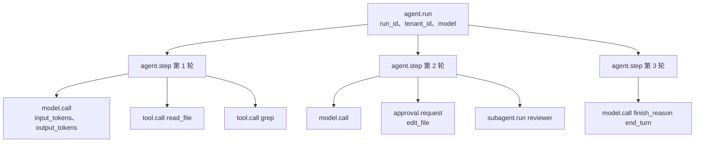
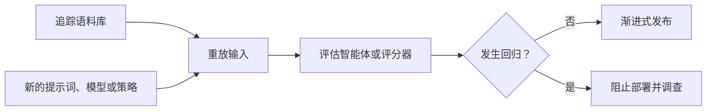

# 第 16 章 — 可观测性

## TL;DR

仅靠日志很难调试智能体。你需要一棵追踪树，展示哪次模型调用引发了哪次工具调用、哪个工具结果改变了下一条提示词、使用了多少词元、延迟出现在哪里，以及运行为什么停止。本章介绍智能体可观测性的四大支柱（追踪、指标、日志、评估）、LLM 操作的 OpenTelemetry 属性约定、将一切串联起来的关联 ID 链、汇总此前每一章所埋下的全部可观测性信号的指标目录、采样与脱敏规则，以及关键项与可选项的划分——每个智能体从第一天起必须检测什么，又有哪些内容可以等到规模迫使你行动时再做。

---

## 为什么这很重要

没有追踪，*“智能体糊涂了”*并不能指导行动。有了追踪，你可以打开一次运行并检查：提示词组装、检索到的记忆、工具参数、工具输出大小、停止原因、重试次数、审批决定和成本。可观测性不会让智能体变得可靠。它会让故障变得足够可见，从而可以修复。

另一个重要原因是：之前的每一章（第 04 章至第 15 章）都埋下了一个依赖本层的特定指标。缓存命中率（第 04 章）。压缩方法直方图（第 05 章）。检索触达率（第 06 章）。整理器动作直方图（第 07 章）。运行状态转换计数（第 08 章）。重新规划率（第 09 章）。子智能体成功率（第 10 章）。审批漏斗（第 12 章）。成本账本（第 15 章）。本章将赋予这些散落的信号一种共享形态——可收集、可关联、可查询。

---

## 核心概念

### 四大支柱，而非三大支柱

经典的可观测性框架有三大支柱：追踪、指标、日志。对于智能体，*评估*是同等重要的第四大支柱——因为仅凭延迟和词元数量，无法回答*“智能体做对了吗？”*这个问题。

| 支柱 | 它回答的问题 | 数据量 | 形态 |
|---|---|---|---|
| **追踪** | 这次特定运行发生了什么？ | 每次运行一条 | span 组成的树 |
| **指标** | 所有运行整体发生了什么？ | 连续 | 时间序列 |
| **日志** | 系统在某个特定时刻说了什么？ | 高 | 结构化行 |
| **评估** | 智能体是否产出了正确结果？ | 采样 | 带分数的通过 / 失败 |

在成熟的部署中，每个支柱面向不同的受众。追踪供工程师调试事故；指标供 SRE 监看仪表盘；日志用于取证审查和审计轨迹（第 05 章）；评估则供负责智能体质量的团队使用。

### 一次智能体运行的追踪树

天然的单位是运行。一次运行成为根 span；其下的一切都是子节点：



这棵树是调试单位。日志和指标会指回某个 trace ID；出问题时，你真正打开查看的是追踪。

### OpenTelemetry 属性约定

OpenTelemetry GenAI 语义约定是目前最接近智能体遥测标准的东西。其中许多字段在 OpenTelemetry 中仍处于*开发（Development）*稳定性级别——这是该语义约定表示*可能会重命名*的方式——但其整体形态已经足够稳定，值得现在就采用，之后再迁移。相关属性如下：

| 属性 | 它承载的内容 |
|---|---|
| `gen_ai.provider.name` | `anthropic`、`openai`、`bedrock` 等 |
| `gen_ai.request.model` | 请求的模型 ID |
| `gen_ai.response.model` | 实际提供服务的模型 ID（回退时可能不同） |
| `gen_ai.usage.input_tokens` | 计费的输入词元 |
| `gen_ai.usage.output_tokens` | 计费的输出词元 |
| `gen_ai.usage.cache_read_input_tokens` | 缓存命中（第 04 章） |
| `gen_ai.usage.cache_creation_input_tokens` | 缓存写入（第 04 章） |
| `gen_ai.response.finish_reasons` | `end_turn`、`tool_use`、`max_tokens`…… |
| `gen_ai.tool.name` | 模型调用的工具 |

在你自己的命名空间中添加智能体专属属性：

```ts
function modelAttributes(call, result) {
  return {
    "gen_ai.provider.name":              call.provider,
    "gen_ai.request.model":              call.modelId,
    "gen_ai.response.model":             result.modelId,
    "gen_ai.usage.input_tokens":         result.usage.inputTokens,
    "gen_ai.usage.output_tokens":        result.usage.outputTokens,
    "gen_ai.usage.cache_read_input_tokens":     result.usage.cacheRead     ?? 0,
    "gen_ai.usage.cache_creation_input_tokens": result.usage.cacheCreation ?? 0,
    "gen_ai.response.finish_reasons":    [result.finishReason],
    "agent.profile":                     call.profile,
    "agent.run_id":                      call.runId,
    "agent.session_id":                  call.sessionId,
    "agent.tenant_id":                   call.tenantId,
    "agent.parent_run_id":               call.parentRunId,        // 子智能体
  };
}
```

把属性字符串集中放在一个地方。将它们散布在整个代码库中，会让最终的重命名异常痛苦，而重命名迟早会发生。

### 关联 ID：将一切串联起来的链

三个 ID 必须贯穿每一行日志、每一个指标标签和每一个 span：

- **`run_id`**——智能体运行。每次调用一个。在整棵树中保持稳定。
- **`session_id`**——对话线程（第 05 章）。每个持续进行的会话一个；一个会话包含多次运行。
- **`step_id`**——循环的一次迭代（第 02 章）。用于区分同一次运行中的第 3 轮和第 7 轮。

此外还有可选 ID：`tool_call_id`（与第 01 章的往返匹配）、`subagent_run_id`（委派时使用，第 10 章）、`parent_run_id`（反向关联）。

没有这条链，调试生产事故就需要猜测哪行日志属于哪次运行——通常只能根据时间戳，而两次运行一旦重叠，这种方法就会失效。有了这条链，一次 `grep run_id=abc123` 就能找回该次运行的每一条日志、每一个指标和每一个 span。

### 检测循环、模型调用和工具调用

有三个地方值得拥有自己的 span：

```ts
async function invokeAgent(input, ctx) {
  return ctx.tracer.startActiveSpan("agent.run", async (span) => {
    span.setAttributes({
      "agent.run_id":     input.runId,
      "agent.session_id": input.sessionId,
      "agent.tenant_id":  input.actor.tenantId,
    });
    try {
      const result = await runLoop(input, ctx);
      span.setAttribute("agent.status", "completed");
      return result;
    } catch (err) {
      span.setAttribute("agent.status", "failed");
      span.recordException(err);
      throw err;
    } finally {
      span.end();
    }
  });
}

async function callModel(call, ctx) {
  return ctx.tracer.startActiveSpan("model.call", async (span) => {
    const start = performance.now();
    let firstTokenAt;
    const result = await ctx.modelProvider.stream(call, {
      onToken: (token) => {
        if (firstTokenAt === undefined) {
          firstTokenAt = performance.now();
          span.addEvent("model.first_token", {
            ttft_ms: Math.round(firstTokenAt - start),
          });
        }
        ctx.stream.emit(call.runId, { type: "token", token });
      },
    });
    span.setAttributes(modelAttributes(call, result));
    return result;
  });
}

async function executeTool(call, ctx) {
  return ctx.tracer.startActiveSpan("tool.call", async (span) => {
    span.setAttributes({
      "gen_ai.tool.name":   call.name,
      "agent.tool.call_id": call.id,
      "agent.run_id":       call.runId,
    });
    const result = await ctx.tools.dispatch(call.name, call.input, ctx.toolContext);
    span.setAttributes({
      "agent.tool.ok":           result.ok,
      "agent.tool.fatal":        result.ok ? false : result.fatal,
      "agent.tool.result_chars": result.ok ? JSON.stringify(result.result).length : 0,
    });
    return result;
  });
}
```

首词元时间是流式智能体最受关注的用户体验指标。总时长是最受关注的容量指标。两者都要记录。

### 指标目录——组合此前的每一章

之前每一章都至少埋下了一个可观测信号。它们共同构成智能体专属的指标目录：

| 指标 | 来源章节 | 它告诉你什么 |
|---|---|---|
| `cache_hit_ratio` | 第 04 章 | 提示词缓存物有所值吗？这取决于工作负载——对于稳定的多轮工作负载，一个合理的初始目标是超过一半，但完整情况请参阅第 04 章。 |
| `compaction_method_count{method}` | 第 05 章 | 哪种压缩技术在发挥作用？ |
| `compaction_compression_ratio` | 第 05 章 | 每轮压缩节省了多少？ |
| `retrieval_empty_hand_rate` | 第 06 章 | 查询是否什么都没返回？可能是记忆糟糕，也可能是查询糟糕。 |
| `retrieval_reach_rate` | 第 06 章 | 模型是否真的使用了我们注入的内容？ |
| `memory_write_rejection_rate` | 第 07 章 | 安全过滤器是否频繁拦截？ |
| `curator_action_count{action}` | 第 07 章 | 整理器是否在修剪任何内容？ |
| `run_state_transition_count{from,to}` | 第 08 章 | 运行把时间花在哪些状态上？ |
| `replan_rate` | 第 09 章 | 计划需要多频繁地更新？ |
| `subagent_success_rate{role}` | 第 10 章 | 每个专家是否都尽到了职责？ |
| `health_check_success_rate{probe}` | 第 11 章 | 运行框架是否健康？ |
| `approvals{state}` | 第 12 章 | 按终止状态划分的审批漏斗。 |
| `channel_inbound_count{channel}` | 第 13 章 | 每个渠道的流量。 |
| `cost_usd{tenant,model}` | 第 15 章 | 每个租户按模型划分的支出。 |
| `outbox_depth` | 第 15 章 | 副作用交付延迟。 |
| `queue_depth{queue}` | 第 15 章 | 积压量。 |
| `ttft_ms` | 本章 | 首词元时间。 |
| `tokens_per_run` | 本章 | 每次运行的成本驱动因素。 |

这不是愿望清单——它是此前章节中每一次*“这也属于可观测性”*所形成的并集。如果像上面那样检测追踪树，这些指标没有一个难以接入；当某个指标第一次发生变化，而你开始追问原因时，它们都会带来回报。

### 将成本视为一等指标

成本既出现在追踪中（每个 `model.call` span），也出现在指标中（按租户、模型和日期统计）。依据第 04 章的属性集，计算公式是机械性的：

```ts
function costFromUsage(usage, model) {
  const r = pricing[model];                  // 向你的智能体询问当前费率
  return (usage.inputTokens               * r.input)
       + (usage.cacheReadInputTokens      * r.cache_read)
       + (usage.cacheCreationInputTokens  * r.cache_creation)
       + (usage.outputTokens              * r.output);
}
```

聚合到每租户每天，在运维人员仪表盘（第 15 章）中展示，并根据预算设门槛（第 17 章负责路由决策）。在各种生产智能体中，最有用的单项告警是对每租户每日成本进行*异常检测*。一条合理的初始规则是：当某租户的每日成本超过 7 日滚动平均值的 3 倍时发出寻呼告警。Hermes Agent 和 Paperclip 都会在各自的仪表盘中展示此类信号；阈值取决于工作负载，值得调优。

### 日志、指标与追踪——何时使用哪一种

三种角色：

- **追踪**具有*因果性*。用它们回答*为什么这次特定运行会那样做？*它们过于冗长，不适合一目了然的仪表盘。
- **指标**具有*聚合性*。用它们回答*所有运行整体表现如何？*它们会丢失个体故事。
- **日志**是*细粒度事件*。用它们进行取证审查（第 05 章的审计日志是典型示例），以及记录不适合放入 span 的内容——启动错误、周期性后台任务、第 07 章的整理器动作日志。

贯穿这三者的规则是：每一行日志、每一个指标数据点和每一个 span 都携带相同的关联 ID，因此你可以从一个支柱切换到另一个支柱。点击某次指标尖峰，获取造成尖峰的 trace ID；打开其中一条追踪，查看其时间窗口内的日志。

### 智能体追踪的采样策略

在规模化场景下，记录每一个 span 会变得昂贵。一种务实的采样策略是：

- **始终开启（100%）**——任何出错的运行、任何超出预算的运行、任何涉及审批的运行、任何触及破坏性工具的运行，以及任何子智能体生成事件。
- **基于尾部（100%）**——如果树中任意 span 出错，就追溯性地捕获整棵树。这需要带缓冲能力的收集器（使用 `tail_sampling_processor` 的 OpenTelemetry Collector）。
- **基于头部（10–25%）**——其余一切，在会话开始时根据 `run_id` 的确定性哈希进行采样，使一个会话中的所有运行要么全部被采样，要么全部不被采样。

最大的错误是以很低的比率进行均匀采样。有意思的运行恰恰是异常运行；均匀采样 1% 会丢掉其中绝大多数。错误和昂贵运行始终开启，其余运行采用基于头部的采样。

### 在追踪边界进行脱敏

遥测可能泄漏信息。以下三类内容必须在到达追踪接收端*之前*完成脱敏：

- **机密信息**——API 密钥、OAuth 令牌、从第 15 章的 `$secret:` 引用解析出的值。进行模式匹配，并替换为 `[REDACTED_<KIND>]`。
- **个人身份信息（PII）**——电子邮件地址、电话号码、社会安全号码、支付详情。采用相同方法；有些团队会为每个租户维护一份允许持久化的字段白名单。
- **模型输入与输出**——默认情况下，只在 span 上记录词元*数量*，绝不记录完整文本。将完整文本存入一个单独设有访问门禁、采用严格访问控制的审计存储（第 05 章的仅追加审计日志正适合存放这些内容）。

Hermes Agent 的 `RedactingFormatter` 在日志格式化器层面处理这件事；在追踪管道中，正确的位置是 OpenTelemetry Collector 的*导出器*或流内处理器。事后脱敏——在 span 已经发送到第三方后端之后——为时已晚。

### 评估即可观测性

追踪会成为回归数据集。在更改系统提示词、模型配置、工具 schema 或路由策略之前，重放具有代表性的追踪并对结果评分。



架构很简单：收集生产追踪，针对候选变更重放这些追踪，对结果评分（语义相似度、结构化字段比较、第 10 章验证模式中的评估子智能体），并以此为发布设置门禁。评估套件是抵御静默回归的安全网——这类回归能够通过测试，在抽查中看起来也合理，直到一周后才在生产环境中显现。

对于更丰富的配置，可以持续运行一个规模较小的评估：每小时采样最近的 50 次生产运行，针对基线配置重新运行，并在出现差异时发出告警。Hermes Agent 有执行此工作的后台模式；Paperclip 则通过其 `heartbeat_runs` 审计日志提供了构建模块。

### 评估方法——评什么，怎么评

上一小节介绍了*门禁*——重放、比较、发布。本节介绍*方法*——究竟评什么、用什么裁判评，以及输入来自哪里。这是你在不盲飞的情况下交付并改进智能体所需的最低限度评估工具集。

**要评分的四个维度。**大多数智能体评估都可以归结为以下四个维度，其主观性大致依次递增：

- **功能正确性**——智能体是否完成了要求它做的事？对于有封闭形式答案的任务，采用二元评分（测试通过、值匹配）；对于部分正确的情况，采用分级评分。这是最重要的维度，也是任务具有真实答案时最容易自动化的维度。
- **步骤效率**——它花了多少轮、多少次工具调用或多少词元？这是一个成本代理指标，与用户感知的延迟和账单相关。可以直接从上面的追踪树中低成本计算。
- **输出质量**——格式规范性、准确性、实用性。通常需要裁判（能确定性判断时使用确定性方法，否则使用 LLM 作为裁判）。
- **用户满意度**——显式反馈（点赞/点踩、接受/拒绝差异），或隐式反馈（接受所需时间、用户是否重试）。这是最重要的信号，也是最难大规模收集的信号。

只要可以，就在全部四个维度上评分；根据用户实际付费购买的价值来确定权重。

**三种裁判模式。**按大致的优先顺序排列：

- **确定性检查**——正则表达式、JSON Schema 校验、代码执行、与已知答案做相等性比较。最便宜、最快、最可靠。优先使用；凡是可以采用确定性方法的，都应该采用。
- **LLM 作为裁判**——由一个更便宜的模型根据评分标准对智能体输出评分。这是非确定性任务的标准做法。需要针对三种偏差进行设计：*冗长偏差*（裁判偏爱更长的输出）、*位置偏差*（裁判偏爱先看到的选项），以及*自我偏好*（与被评模型属于同一模型家族的裁判会给自家模型家族更高评分）。缓解措施：为裁判配上严格的评分标准、随机化选项位置、使用不同于智能体的模型家族。
- **成对比较**——向裁判展示两个输出（基线与候选），询问哪一个更好。对于模糊任务，这比绝对评分更可靠——模型对*“A 是否比 B 更好？”*的回答，比对*“这个好吗？”*的回答更一致。

对于高风险评估，将两三个裁判组成集成，并采用多数意见。分歧本身就是一个有用的信号——裁判意见不一致的案例，正是值得人工查看的案例。

**评估语料库从哪里来。**对于生产智能体，以下三个来源按实用程度排序：

- **生产追踪语料库。**第 05 章的审计日志，加上本章前面介绍的追踪树，是你拥有的成本最低、相关性最高的评估集。采样最近的 50–100 次运行；针对候选方案重放；评分。因为是真实流量，所以始终具有代表性。
- **合成数据集。**使用更强的模型生成测试输入，覆盖生产流量尚未触及的边界情况。适合扩展覆盖范围；对分布的代表性较弱。
- **公开基准。**适合确定方位，以及与业界交流，不适合直接用作生产门禁。用它们了解当前技术水平，而不是决定是否发布。

**值得了解、用于确定方位的基准。**它们有助于理解哪些问题困难，以及业界的标杆在哪里。这些基准都不能替代在你自己的工作负载上进行评估，但花几分钟记住这些名字是值得的：

- **SWE-bench / SWE-bench Verified**——编码智能体解决真实的 GitHub issue。用于回答*“智能体能否交付修复？”*的首要参考。
- **τ-bench**——在真实领域（航空、零售）中使用工具。测试多轮工具调用能否完成目标。
- **GAIA**——通用 AI 助手回答复杂的现实世界问题。端到端结合检索、推理和工具使用。
- **WebArena**——网页导航任务。使用浏览器的智能体的参考基准。
- **AgentBench**——横跨操作系统、代码、网页和知识任务的广泛能力基准。

基准还有很多，每个季度都会出现新的。与你一起阅读本课程的智能体可以告诉你当前排行榜的领先者；上面这些名字足够稳定，值得记住以帮助确定方位。

**交付所需的最低限度评估工具集。**开始时，你不需要上面的任何复杂配置。最低限度只包括：

- 一个小型固定语料库——10 到 50 个真实工作负载输入，检入仓库。
- 一个评分函数——能使用确定性方法时就使用，否则由 LLM 评判。
- 一个基线与候选方案对比运行器，为两边各生成一个数字。
- 当数字回归并超过某个阈值时发出告警。

仅此而已。除此之外的一切——裁判集成、公开基准集成、合成数据生成、奖励模型——都应当等到工作负载证明有必要时再逐步采用。交付出最有用智能体的团队，通常是那些拥有最小评估工具集、但会在*每次变更时真正运行它*的团队，而不是那些拥有最精巧的评估框架、却从不阻止部署的团队。

### 评估治理——保持评估管道诚实可信

对生产运行进行评分的评估管道，本身也是一个生产系统。运行该系统的团队需要负责四个问题：

- **数据集版本控制。**评估语料库会变化——你会添加边界情况、淘汰过时案例、修复标签。固定一个版本，记录每个分数由哪个数据集版本产生；相对于 `eval_set@v3` 的回归，不一定也是相对于 `eval_set@v4` 的回归。
- **评分标准版本控制。**LLM 作为裁判时采用的评分标准也是不断变化的目标。对其进行版本控制，并记录每次运行由哪个版本评分。如果不这样做，*“模型退化了”*和*“我们收紧了评分标准”*看起来完全相同。
- **评估器漂移。**更换裁判模型——更便宜的版本、不同家族、新版本——即使智能体没有变化，也会导致绝对分数偏移。裁判变化时重新建立基线；相比绝对阈值，优先采用*相对*评分（使用同一个裁判比较基线与候选方案）。
- **重放隐私。**追踪语料库包含用户数据。重放追踪会再次处理可能受第 07 章删除标记或第 08 章恢复隐私规则约束的内容。重放前过滤语料库；评估管道不能成为复活用户已要求删除内容的途径。

对评估管道采用与它所评估的智能体相同的版本控制、审计和隐私纪律。否则，它声称提供的门禁就是虚构的——一个会因为无人能够重建的原因而变化的数字。

### 追踪重放调试界面

面向运维人员的指标仪表盘有一个互补界面：打开一次运行，内联查看其内容。

Paperclip 和 OpenCode 最终都采用了以下模式：

- 顶部是根 span，带有关键属性（模型、词元、成本、状态、时长）。
- 下方是缩进显示的子 span 树——步骤、模型调用、工具调用、子智能体运行。
- 点击任意 span，查看属性、对应时间窗口的日志、错误和堆栈跟踪。
- 一个*重放（Replay）*按钮，使用相同输入在当前代码上重新运行同一轮。
- 一个时间线视图，显示墙钟时间花在了哪里（等待模型、执行工具或等待队列）。

这是调试智能体时最有价值的单项运维工具。把底层追踪树构建好，这个 UI 就很直观；构建不好，任何 UI 都救不了你。

### 关键项与可选项——第一天该检测什么

本章中的指标并非全都必不可少。诚实的分类如下：

**关键项——每个智能体从第一天起都必须具备：**

- 根 `agent.run` span，包含 `run_id`、`tenant_id`、`status`、总词元数和成本。
- 每次 LLM 调用对应一个 `model.call` span，并包含 OpenTelemetry 词元属性。
- 每次分发对应一个 `tool.call` span，并包含名称、ok/fatal、result_chars。
- 每一行日志都带有关联 ID。
- 每个未捕获异常都有一条错误日志。
- 缓存命中率指标（第 04 章——成本太低，没有理由跳过）。
- 每租户每日成本指标（第 15 章——这是运维必需项，不是可选项）。

**应尽早加入的高价值项：**

- 运行状态转换计数（第 08 章）。
- 审批漏斗（第 12 章）。
- TTFT 和总时长直方图。
- 出错时基于尾部采样。
- 在导出器处进行结构化脱敏。

**在规模迫使你行动之前都可选：**

- 持续评估套件。
- 成本异常检测。
- 每工具延迟直方图。
- 追踪属性的 schema 版本控制。
- 追踪重放 UI。
- 超出第 02 章运行时检测范围的死循环告警。

要避免的陷阱是：在关键层之前构建可选层。一个没人信任、带有二十张图表的仪表盘，还不如一张能够捕捉每次事故的图表。从关键项清单顶部开始，只有当上一层已经稳固时才添加下一层。

### 追踪属性的 schema 版本控制

你今天交付的属性将来需要改变。养成三个习惯：

- **为自定义属性设置命名空间**（`agent.*`），使重命名的范围受到约束。
- **添加新属性；不要改变旧属性的用途。**如果含义改变，就换一个新名称。
- **显式设置追踪 schema 版本**，在根 span 上添加 `trace_schema_version` 属性。查询就会变成*给我 `schema=v2` 且……的运行*——旧运行不会破坏查询。

OpenTelemetry GenAI 约定本身也在演变。今天将其视为规范名称，一年后则将其视为迁移候选项。

---

## 真实系统笔记

- **OpenCode** 从服务器流式传输结构化会话事件，将会话和消息组成部分持久化到 SQLite，并通过 SSE 客户端暴露事件总线——对于编码智能体而言，这是一个实用的可观测性界面，同时也能作为你接入的任何 OTLP 导出器的追踪种子。
- **Paperclip** 记录 `heartbeat_run_events`、`cost_events`、`issue_approvals` 和适配器执行状态，为运维人员提供控制平面视图，可直接映射到本章的指标目录。它是追踪重放 UI 模式最强的参考。
- **Hermes Agent** 提供用于结构化日志的 `RedactingFormatter`、通过 FTS5 实现的审计会话搜索，以及可运行持续评估的后台模式——是源头脱敏和“评估即可观测性”模式的实用参考。
- **OpenClaw** 提醒我们，追踪必须包含*渠道*和*适配器*元数据：同一种智能体行为可能因平台而异，而把 Slack 和 Telegram 混在一起的可观测性会掩盖真实故障。

---

## 常见失败情况

*这些故障经久不变，而具体修复方式演化得最快——每一项只给出模式，把当前实现细节留给你和你的 AI 伙伴。*

- **基数爆炸。**每次运行的 ID 被放进指标标签，时间序列数量暴增，指标后端变慢，并按活跃时间序列收费。*修复：遵循有界标签规则——标签只承载较小的封闭集合，无界 ID 放入追踪和日志，并用 exemplar 将指标桥接回有代表性的追踪。*
- **一堆相互断开的扁平 span。**追踪上下文没有跨越异步或进程边界，因此子 span 各自成为新的根，整棵树碎裂成孤儿。*修复：在每个边界显式传播追踪上下文，并针对树形结构（孤儿 span 比率、每次运行一个根）而不是 span 数量设置告警。*
- **从不阻止部署的评估门禁。**一个显示绿色“评估已通过”的检查变得不稳定、缓慢或陈旧，于是回归越过一个几个月都没拦下任何东西的门禁进入生产。*修复：跟踪门禁自身的阻止率和裁判稳定性，让阻断性套件保持小而快，并按计划刷新语料库。*
- **机密信息泄漏到追踪中。**凭据通过脱敏器从未遍历过的路径到达追踪接收端——嵌套的工具载荷、被记录的异常、被原样回显的模型输出。*修复：在追踪边界实施纵深防御——采用 span 属性白名单、清理异常，并使用持续运行的金丝雀机密信息来证明防护有效（第 18 章）。*
- **没人信任的仪表盘。**每个指标都设置阈值告警，正常波动也会不断触发，于是值班人员学会忽略那个真正告警也会出现的渠道。*修复：只针对用户能感受到的症状告警，并划分寻呼/工单/仅仪表盘三个层级；删除那些触发后很少带来行动的告警。*

---

## 与你的智能体结对

- *“使用 `gen_ai.*` 属性约定，将 OpenTelemetry 接入我的运行框架。验证每次模型调用、工具调用和审批都会发出 span。在我的 OTLP 后端中打开一次运行，确认追踪树与实际发生的事情一致。”*
- *“为每一行日志、每一个 span 和每一个指标添加关联 ID（`run_id`、`session_id`、`step_id`、`tool_call_id`）。向我展示一次 `grep run_id=...`，它能跨越全部三大支柱，找回一次运行的完整故事。”*
- *“将本章的指标目录实现为一组统一的 Prometheus 或 OTLP 指标。为每个租户构建一个仪表盘：今日成本、缓存命中率、运行状态分布、审批漏斗、按错误率排序的主要工具。”*
- *“设置采样策略：错误和昂贵运行（超过 0.10 美元）始终开启，任意错误 span 都采用 100% 基于尾部的采样，其余一切采用 10% 基于头部的采样。通过压力测试验证。”*
- *“在 OTLP 导出器或收集器中添加脱敏。参照 Hermes 的 `RedactingFormatter` 规则建模。在工具参数中注入一个故意放入的机密信息，并验证它永远不会到达追踪后端。”*
- *“搭建一个‘评估即可观测性’循环：每小时采样 50 次生产运行，针对我的当前配置重放，使用评估子智能体（第 10 章）评分，并在差异超过 5% 时告警。”*
- *“为一次运行构建追踪重放 UI：树、属性、日志，以及一个能重新运行同一轮的*重放（Replay）*按钮。使用我的 OTLP 后端 API。”*
- *“添加成本异常检测：当某租户的每日成本超过其 7 日滚动平均值的 3 倍时发出寻呼告警。使用一个月的历史数据调优倍数。”*
- *“带我检查本章指标目录中还有哪些指标*尚未*接入我的智能体。按照关键项 / 高价值项 / 可选项的划分确定优先级。”*

---

## 下一步

现在，你已经可以看见智能体在做什么。下一章会利用这些测量结果，决定使用*哪个模型*和*哪个提供商*、何时回退、何时限流，以及如何实时执行每租户预算。第 17 章讨论成本与延迟策略。
