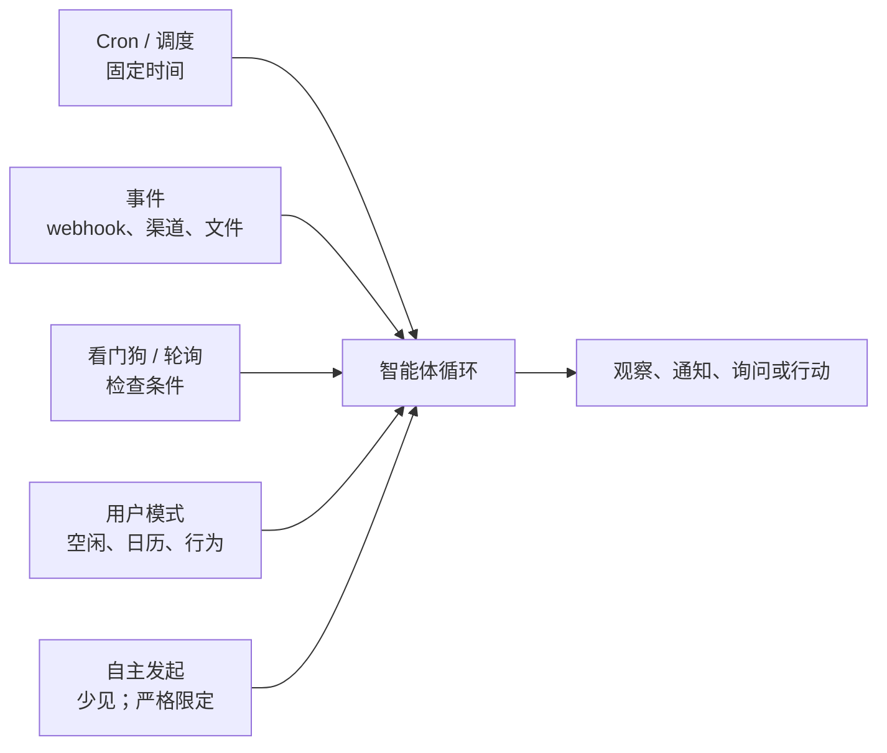
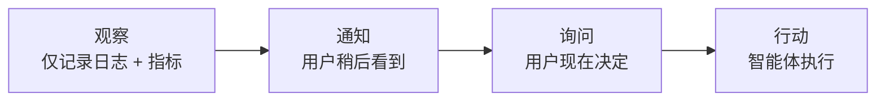

# 第 20 章 — 主动式智能体

## TL;DR

本课程大部分内容都假定一种响应式形态：用户消息到达，智能体循环运行，响应返回。主动式智能体则会在*没有用户提出请求时*工作——执行定时 cron 作业、由事件驱动唤醒、通过看门狗响应外部状态变化、进行后台整理，以及偶尔发起自主任务。其机制大多来自前面章节中已经熟悉的内容（第 08 章的运行状态机、第 13 章的渠道适配器、第 15 章的心跳调度器），但设计纪律是真正全新的：何时打断、何时排队、何时汇总；怎样设计选择加入语义，让主动性带来帮助而不是烦扰；从通知、询问到行动的升级阶梯；无人看管时所做工作特有的故障模式；以及这样一条规则——主动性是用户*按类别*授予的权限，绝不是默认行为。

---

## 为什么这很重要

响应式智能体最糟糕的故障是给出错误答案。主动式智能体最糟糕的故障则有三种：在无人阻止时采取了*错误行动*、在无人监控时陷入*成本螺旋*，或用*通知洪流*训练用户忽略智能体发来的一切。这些事故类别都不会出现在同步请求—响应系统中；如果交付主动式功能时不遵守本章的纪律，它们就会成为可预见的故障模式。

另一个重要原因在于：主动式功能决定了一个系统究竟是用户想起来才会打开的工具，还是会融入用户工作方式的智能体。每天上午 9 点的简报、部署失败时发出警报的看门狗、汇总本周 PR 的 cron 作业——正是在这些时刻，智能体赢得了自己的位置。做得好，它们会不断积累用户的信任；做得不好，一周之内就会把信任挥霍殆尽。

---

## 核心概念

### 响应式与主动式——各自适合什么场景

大多数智能体以响应式起步，也始终保持响应式。只有满足以下任一条件时，才应该增加主动式形态：

- 用户有一项**周期性需求**，但不需要每次都投入注意力——日报、周报、定期健康检查。
- 外部世界中有些事情发生了**变化**，用户需要在几分钟而不是几小时内知道——部署失败、某项指标越过阈值、监视名单中的发件人发来了邮件。
- 这项工作本身最适合在用户*不在场*时完成——后台整理、评估运行、空闲时段训练（第 21 章会继续讨论这一点）。

如果以上条件均不成立，就不要增加主动式形态。*主动性是一项功能；空转是一种成本。*

### 触发器分类

五类触发器覆盖了生产环境中几乎所有主动式工作：



- **Cron / 调度。** 固定时间——每个工作日上午 9 点、每小时整点。它最简单、最可预测，适合例行的周期性任务。
- **事件驱动。** Webhook 触发（第 13 章）、渠道消息到达、文件发生变化、日历事件触发。它响应最快；由于响应的是外部世界而不是时钟，因此显得很智能。
- **看门狗 / 轮询。** 智能体定期检查某项条件（价格、队列深度、状态页），只有满足条件时才行动。适用于源系统不会发出事件的情况。
- **用户模式触发。** 智能体注意到某种行为模式——用户处于空闲状态、日历中有空档、已经 N 小时没有回复——并主动提供帮助。这最难做好，也最容易惹人厌烦。
- **自主发起。** 很少使用。智能体在没有触发器的情况下自行判断某件事值得去做。只应保留给边界严格、风险较低的行动（第 07 章的后台整理器就是一例）。

大多数真实系统会组合两种或更多触发器。*Cron + 事件*是最常见的组合：一个 cron 作业负责检查某些内容，同时在特定事件发生时由事件处理程序触发。

### Cron——主力机制

以下三点区分了有效的 cron 和失效的 cron：

- **持久化的作业定义。** Hermes Agent 把 cron 作业存储在 `~/.hermes/cron/jobs.json` 中，调度器会在每个 tick 读取该文件。Paperclip 把例行任务存储在 Postgres 的 `routines` 表中，重启后仍然存在。OpenClaw 则把它们保存在配置中。存储必须经得起进程重启——否则重新部署时，所有调度工作都会丢失。
- **错过触发策略。** 如果进程停机期间错过了作业的计划时间，会发生什么？有三个选项——*恢复时触发一次*（现在运行）、*跳过*（视为已经运行）、*逐次补发所有错过的实例*（每个错过的时间窗口各运行一次，以追赶进度）。必须明确选择一种；许多 cron 库的默认行为由具体实现决定，容易造成困惑。
- **幂等性。** 如果 cron 作业在执行途中崩溃后再次触发，就不应该把工作执行两次。使用由 cron 表达式和计划时间派生的运行键；执行前先用它去重。第 08 章的发件箱模式在这里可以原样应用。

```ts
// 能够经受重启并避免重复触发的 Cron 作业形态。
type CronJob = {
  id:           string;
  agent:        string;          // 运行该作业的智能体配置
  schedule:     string;          // cron 表达式
  missedFire:   "skip" | "once_on_recovery" | "fire_each";
  payload:      unknown;         // 智能体应该执行的工作
  enabled:      boolean;
  createdAt:    string;          // 第一个计划时间窗口的锚点
  lastFiredAt?: string;
  ownerUserId:  string;          // 用于租户作用域和审计（第 05、15 章）
};

function runKey(job: CronJob, scheduledFor: Date): string {
  return sha256(`${job.id}:${scheduledFor.toISOString()}`).slice(0, 32);
}

async function maybeFireCron(job: CronJob, now: Date, ctx: SchedulerCtx) {
  // 从上一次触发的时间窗口开始计算下一次；如果作业从未触发，
  // 则从 createdAt 开始。如果这里从 `now` 开始计算，就会静默跳过
  // 从创建到现在之间所有本应触发的时间窗口，而除 "skip" 之外，
  // 任何错过触发策略都不应该这样做。
  const anchor = job.lastFiredAt ?? job.createdAt;
  const next   = nextScheduledTime(job.schedule, anchor);
  if (next > now) return;

  const key = runKey(job, next);

  // 原子认领：去重记录、队列插入和 lastFiredAt
  // 更新在同一个事务中提交。如果没有原子性，进程在入队和记录之间崩溃，
  // 就会在恢复时再次触发作业——从而重复执行
  // 可能无法安全重做的副作用（第 08 章的发件箱模式
  // 形态相同，只是更加通用）。
  await ctx.db.transaction(async (tx) => {
    const claimed = await tx.dedup.tryClaim(key);   // 如果 key 已经出现，则为 false
    if (!claimed) return;
    await tx.runs.enqueue({ agent: job.agent, payload: job.payload, runKey: key });
    await tx.cron.markFired(job.id, next);
  });
}
```

锚点会与错过触发策略相互作用：`fire_each` 从 `createdAt` 向前遍历，并为每个错过的时间窗口认领一个键；`once_on_recovery` 无论错过多少个时间窗口都只认领一次；`skip` 不触发作业，直接把 `lastFiredAt` 推进到最近一个已经过去的时间窗口。每租户隔离在这里同样重要：租户 A 的 cron 作业使用租户 A 的数据运行，费用计入租户 A 的预算（第 15 章），并记录到租户 A 的日志中（第 05 章）。一个租户失控的 cron 绝不能阻塞另一个租户。

### 事件驱动唤醒

事件触发器建立在第 13 章的连接器层之上，有三种形态：

- **Webhook 触发器。** 当事件发生时，平台会发起 HTTP 回调——Slack 消息、Stripe 事件、GitHub push。第 13 章的 webhook 处理程序（HMAC + 去重 + 先返回 202、再入队）把事件交给智能体循环。智能体把它视为一个 `ChannelEvent`——形态与用户消息相同，语义不同。
- **渠道事件订阅。** Discord WebSocket、Slack Events API、IMAP 推送通知。渠道适配器保持一条开放连接，并在事件到达时将其放入队列。
- **文件系统或存储监视器。** `inotify`、S3 存储桶通知、云存储触发器。文件创建或修改时，监视器触发；智能体检查文件并决定是否行动。

贯穿三种形态的纪律是：事件与用户消息进入同一个队列（第 15 章），因此智能体循环、可观测性和预算执行都能以统一方式工作。*事件只是一条并非由用户键入的消息。*

### 看门狗与轮询

当源系统不发出事件时，智能体就进行轮询。需要遵守三条规则：

- **让频率匹配变化速度。** 每秒轮询一次的价格监视器是在浪费资源；每小时轮询一次的部署状态检查器又太慢。选择与数据源变化速度和消费者延迟预算相匹配的频率。
- **稳定时退避。** 当被监视的值一段时间没有变化，就增大轮询间隔。发生变化时，再降回基准间隔。这样可以避免给源系统带来不必要的负载。
- **把监视本身作为指标呈现。** 第 16 章的可观测性模式同样适用——轮询器每次检查都发出一个 span，为*值发生变化*维护计数器，并记录轮询延迟的直方图。一个沉默的轮询器，是一个你无法信任的轮询器。

Paperclip 的 `scanSilentActiveRuns`（第 15 章）是应用在智能体*自身*上的看门狗——检查超过阈值仍没有输出的运行，并进行升级处理。把同一种模式应用于外部，就是让智能体监视一个系统，并在发生偏移时升级处理。

### 选择加入语义——主动性是一种权限

最重要的一条规则是：*主动性是用户按类别授予的权限，而不是默认行为。*用户不应该被迫静音智能体；他们应该主动选择接受打断。

```ts
// 一条粗粒度权限记录。按类别，而非按消息。
type ProactivePermission = {
  category:       string;        // "daily_brief"、"deploy_alerts"、"weekly_summary"
  enabled:        boolean;
  channel:        "inline" | "email" | "slack" | "push";
  frequencyCap?:  { count: number; per: "hour" | "day" | "week" };
  quietHours?:    { start: string; end: string; timezone: string };
  snoozeUntil?:   string;
};

// 发送主动式通知前，检查所有门槛。
async function shouldNotify(
  user: User,
  category: string,
  now: Date,
  ctx: ProactiveCtx,
): Promise<boolean> {
  const perm = await ctx.permissions.get(user.id, category);
  if (!perm?.enabled)                                           return false;
  if (perm.snoozeUntil && now < new Date(perm.snoozeUntil))    return false;
  if (perm.quietHours && isInQuietHours(now, perm.quietHours)) return false;
  if (perm.frequencyCap) {
    const sent = await ctx.notifyLog.countRecent(
      user.id, category, perm.frequencyCap.per,
    );
    if (sent >= perm.frequencyCap.count) return false;
  }
  return true;
}
```

类别是粗粒度的，而非逐消息定义——用户只需选择加入*部署警报*一次，不必为每次部署单独选择。渠道按类别设置——紧急事项使用内联通知，汇总信息使用电子邮件。即使某个类别已经启用，频率上限和免打扰时段也能防止智能体违背隐含预期。

坦率地说，每项主动式功能交付时都应该*默认禁用*，而智能体对该功能的第一项工作，就是询问用户是否需要它。*意外是信任的敌人。*

### 时机智能——打断、排队还是汇总

每个主动式事件都有三种时机选择：

| 模式 | 何时使用 | 成本 | 示例 |
|---|---|---|---|
| **立即打断** | 紧急程度高、价值有时效性 | 用户注意力 | 生产部署失败 |
| **排队到下次会话** | 很快会有用，但并不紧急 | 少量认知积压 | 周一需要审查的新 PR |
| **汇总** | 聚合后有用，单项价值较低 | 每项为零 | 每日邮件摘要 |

大多数主动式功能默认都应该采用*汇总*。只有用户明确告诉你某件事值得打断时，才应该打断。即使在同一次会话中，也要批量发送相关通知——把五条 PR 评论一起送达，比五次单独提醒干扰更少。

MetaClaw 的空闲窗口调度器（第 21 章关于自我演进的内容会进一步展开）把时机智能应用于训练：重型工作在睡眠时段、键盘空闲时和日历空档中运行。同一原则适用于任何主动式工作——*在用户没有把注意力放在其他事情上时去做。*

### 升级阶梯

对于任何一类主动式行动，智能体都可以从四个阶梯级别中选择：



- **观察。** 只记录事件。不在面向用户的界面上呈现。适合用来建立数据集，为之后的阶梯级别提供依据。
- **通知。** 在汇总或低优先级渠道中呈现。用户会看到它，但系统不会代表用户采取行动。
- **询问。** 以需要回应的提示呈现。用户决定是否行动；智能体的工作是让这个决定变得容易。
- **行动。** 智能体直接采取行动。只有当用户此前已经为该类别选择加入自主行动、行动可逆，并且审计日志会记录它时，这才有效（第 05 章）。

一条实用规则是：*从观察开始，凭表现赢得向上攀升的权利。*一项新的主动式功能交付时只进行观察，直到你有数据表明用户需要下一个阶梯级别。然后是通知，再然后是询问。最后——只有在用户明确选择加入并具备回滚纪律时——才是行动。

### 通知设计与洪流问题

主动式智能体最可预见的故障是通知洪流。有三道防线：

- **按类别设置频率上限。** 每小时五次 Slack 提醒令人烦躁；一次则会受到欢迎。达到上限后，把其余通知排入汇总。
- **自适应频率。** 当用户连续忽略 N 条通知时，降低频率。明确询问是否继续启用该类别。
- **把稍后提醒和静音作为一等操作。** 每条通知都附带一个*暂时安静，稍后再说*的控制项。用户选择稍后提醒本身就是信息——记录下来，让它影响发送频率。

成熟通知系统（Slack、GitHub、Linear）普遍遵循一种模式：用户每多一次不参与互动，通知得到的注意力就会更少。能够从不参与中学习的主动式智能体，用户会保留；不能学习的，则会被静音并遗忘。

### 无人值守工作的权限与审批

第 12 章的审批门假定用户就在现场，可以点击操作。主动式工作打破了这一假设。有三种策略：

- **预先批准的类别。** 用户已经明确启用的任何类别（即上文的选择加入），每次执行都不需要再次审批——*前提是*行动范围有限、非破坏性且可逆。类别级别的*同意*绝不能绕过第 12 章针对破坏性行动（删除、发送、收费、部署）的审批门；即使在预先批准的类别中，这些行动仍然需要逐次审批。关于始终必须升级处理的剩余清单，请参阅下文的*哪些事情绝不能主动执行*。
- **异步审批。** 智能体提出行动，通过允许延迟响应的渠道（Slack、电子邮件、移动推送）呈现，并在获得批准后才执行。等待必须有界——如果 N 小时内没有响应，默认*不采取行动*，并记录超时。
- **默认拒绝。** 任何不属于预先批准类别、也没有经过询问并得到回答的事情，都不会运行。没有例外。

需要避免的陷阱是*默示同意*——*“用户已经连续一周忽略我的主动式邮件，这意味着没问题。”*事实并非如此。没有反对不等于批准。如果某个类别没有证明自己的价值，就把这一点呈现给用户，并询问是否将其禁用。

### “没有用户在看着”的故障模式

主动式工作特有三类故障：

- **静默错误。** 某个 cron 作业已经失败两周；由于没有人手动运行它，也就没有人注意到。防御措施：每次主动式运行都发出一个 span（第 16 章），并在连续失败时发出警报。
- **成本螺旋。** 某个看门狗每 30 秒轮询一次，持续整整一年；直到账单送达，才有人看到费用。防御措施：每租户预算门（第 15 章）应用于主动式运行时，必须*与交互式运行完全相同*。在成本仪表盘（第 16 章）中呈现趋势。
- **失控循环。** 一个自主发起任务的智能体创建子智能体，而子智能体又创建更多子智能体。第 10 章的递归上限和第 02 章的步骤上限仍然适用，但对于主动式工作，限制应该比交互式工作*更严格*——用户不在现场，无法中断。

一个实用的生产细节是：每次主动式运行都在追踪中携带一个标签（`triggered_by: cron | event | watchdog | pattern | self`）。仪表盘按触发器类型拆分。出现问题时，你就能知道这次运行是用户发起的，还是系统发起的。

### 哪些事情绝不能主动执行

下面按风险类别列出反向清单：

- **破坏性行动。** 任何删除、发送、收费、部署操作。即使属于预先批准的类别，也始终要求用户逐次明确决定。
- **跨租户操作。** 租户 A 的主动式运行绝不能接触租户 B 的数据。第 06 章的命名空间规则不可妥协。
- **不可逆的副作用。** 如果无法回滚，就不要让智能体自行执行。
- **任何用户从未先看过的事情。** 如果某个类别从未向用户演示过，也从未得到用户明确表示的*是的，请让它自行运行*，它就不应该自行运行。

一条实用规则是：*如果一位通情达理的用户看到结果时会说“等等，什么情况？”，这项行动就不应该以主动方式运行。*

---

## 真实系统笔记

- **Hermes Agent** 是基于文件的 cron 和后台整理器模式的最强参考：`~/.hermes/cron/jobs.json` 配合使用文件锁的 tick 调度器，`spawn_background_review_thread` 用于轮次结束后的主动式整理，`maybe_run_curator` 用于空闲时间的技能生命周期管理。执行前会扫描 cron 作业中的提示词注入模式——主动式运行采用比交互式运行更严格的安全门（第 18 章）。
- **Paperclip** 是编排层主动式调度的参考：心跳调度器每 30 秒进行一次 tick，`routineService.tickScheduledTriggers` 触发到期的 cron 例行任务，`scanSilentActiveRuns` 看门狗检测卡住的智能体，重试延迟从 2 分钟逐步升级到 2 小时。无论触发器类型如何，每公司预算门都会应用于所有运行。
- **OpenClaw** 是渠道事件驱动型主动式工作的参考：渠道插件维护自己的订阅（Discord WebSocket、Slack Events、Telegram 轮询），事件与用户消息通过同一个网关。默认情况下，cron 作业拥有完整的工具访问权限——当主动式运行需要更严格的信任边界时，这是一个关于*不该怎么做*的有用反例。
- **OpenCode** 大体上是响应式的（由用户发起编码会话），但它的会话事件 SSE 流和快照系统值得研究，可以了解如何向已连接的 UI 呈现主动式活动。

---

## 常见失败情况

*这些故障经久不变，而具体修复方式演化得最快——每一项只给出模式，把当前实现细节留给你和你的 AI 伙伴。*

- **智能体训练用户忽略自己。** 主动式提醒的频率逐渐升高，直到用户将渠道静音，并因此错过真正重要的那一次。*修复：在投递界面而不是类别层面限制打断次数，并自动把参与度低的类别降级为汇总。*
- **Cron 作业停止触发，却无人察觉。** 某次计划运行悄无声息地不再发生，而没有输出并不会触发错误警报。*修复：针对预期运行建立失联保险式存活监控——对缺失的事件报警，而不只是对失败报警。*
- **同一条通知触发两次（或同一个作业运行两次）。** 重试、副本，或工作完成后的崩溃，导致系统重新运行一个已经执行过的作业，有时还会重复某项现实世界中的行动。*修复：使用跨进程的原子去重认领，并让下游副作用具备幂等性（第 08、03 章）。*
- **看门狗悄悄让你付了一整年账单。** 轮询器以基准频率永远运行，不断消耗稳定成本，直到发票送达，才有人追查费用归属。*修复：让主动式工作与交互式工作受到相同的每租户预算门约束（第 15 章），并在成本账本中按触发器类型归因（第 16 章）。*
- **智能体在无人值守时做了本可由人类阻止的事情。** 某个预先批准的类别根据陈旧数据或已经变化的外部世界自主行动，却没有人在场发现问题。*修复：在预先批准的类别内部也保持审批门有效（第 12 章），把破坏性或不可逆的实例升级到异步审批，并采用超时后默认拒绝。*

---

## 下一步

现在，你已经拥有一套主动式设计框架——触发器分类、选择加入纪律、升级阶梯、时机模式，以及无人看管时所做工作特有的故障模式。第 21 章会从一个相关角度继续：如果不只是*智能体自行行动*，而是让*智能体自行改进*呢？自我演进的智能体——记忆整合、技能学习、提示词优化、LoRA 个性化——是主动式调度的自然补充；二者需要相同的门控纪律，也同样需要第 07 章所述的回滚路径。
