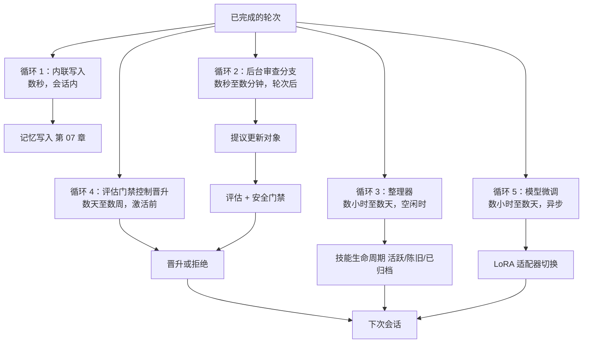
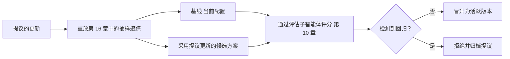
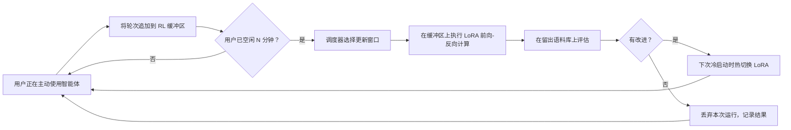

# 第 21 章 — 自我演化智能体

## TL;DR

自我演化智能体会在两次运行之间更新自身的记忆、技能、提示词、工具描述，甚至模型权重——把昨天的经验转化为明天的能力。如果做得好，智能体无需人类介入每次变更，就能持续变得更敏锐。如果做得不好，它就会发生漂移、污染自身记忆，或悄悄改写自己的安全控制。确保这一过程安全的纪律，完全由前面章节构建的模式组合而成：使用提议更新对象而非直接写入，由评估子智能体审查提议，通过取代链实现回滚，以评估门禁控制晋升，并在*允许演化的内容*与*仍由人类控制变更的内容*之间划出严格界线。本章介绍完整循环、近期研究前沿（MetaClaw、Tinker、agentskills.io 联邦中心以及基于 LoRA 的个性化），以及防止演化沦为突变的规则。

---

## 为什么这很重要

永不学习的智能体会重复犯错——每次会话都重新发现同一套项目约定、再次遭遇相同的工具调用失败、重新执行相同的搜索。没有护栏便自我更新的智能体则更加糟糕：它可能污染自己的记忆、削弱自己的工具、从单次糟糕交互中学到错误教训，或悄悄积累彼此冲突的技能。

目标是*受控适应，而非自主突变。*Hermes Agent 的后台审查分支，是受控版本最清晰的生产参考——即下文的循环 1–3，如今已经交付。MetaClaw（一个 2025 年推出的框架，以持续 LoRA 微调和技能演化封装个人智能体）则是更具雄心版本的早期参考之一——即下文的循环 5，属于研究级，但已在少数系统中交付。两者都能工作——而且之所以能工作，是因为每次更新都必须经过由人类或运行框架控制的门禁。

---

## 概念

### 演化究竟意味着什么

智能体的五个层级都可以演化，每层都有自己的节奏和门禁。前两层在生产环境中普遍存在；后三层在 2026 年仍属研究级，只在少数系统中交付。

| 层级 | 变化内容 | 节奏 | 门禁 | 示例 |
|---|---|---|---|---|
| **记忆** | `MEMORY.md`、`USER.md`、结构化事实 | 每次会话或后台运行 | 安全过滤器（第 07 章）；整理器 | Hermes Agent 后台审查 |
| **技能** | 模型可调用的具名流程（第 14 章） | 后台整理器 | 整理器生命周期（第 07 章） | Hermes 的 `skill_manage`；MetaClaw 技能库 |
| **提示词区块** | 项目上下文、术语表、偏好 | 手动或由整理器提议 | 评估门禁（第 16、17 章） | OpenCode 的 `plan.md`；智能体配置档案覆盖项 |
| **工具描述** | 措辞、示例、“不得用于”说明 | 手动；极少自动化 | 缓存失效（第 04 章）；变更审查（第 19 章） | 各工具描述的编辑 |
| **模型权重** | LoRA 适配器、经 RL 微调的权重 | 数小时至数天，异步 | 评估套件 + 金丝雀发布 | MetaClaw + Tinker；同策略蒸馏 |

其他一切——安全策略、工具注册表构成、密钥访问、审批阈值——仍由人类显式变更（第 19 章的变更管理）。界线非常鲜明：*影响半径小、可逆的输出可以演化；任何会扩大权限的内容都不可以。*

### 五循环演化架构

自我演化不是一个循环，而是五个在不同时间尺度上彼此重叠的循环。生产系统会有意识地组合它们。



- **循环 1——内联写入。** 智能体在会话中途调用 `memory.write`。成本最低，风险最高。仅用于用户刚刚陈述的事实。
- **循环 2——后台审查分支。** 一个守护进程子智能体（Hermes Agent 的经典模式）审查刚刚完成的对话记录，并提议更新记忆或技能。非阻塞；写入在*下次会话*中可见。
- **循环 3——整理器。** 一个独立进程在空闲时运行，整理技能存储（第 07 章中的活跃 → 陈旧 → 已归档）、合并重复项并修剪索引。
- **循环 4——评估门禁控制晋升。** 循环 2 或 3 提出的任何更新，都必须通过一个小型评估套件才能激活。门禁会阻止*看似合理但实际错误*的更新上线。
- **循环 5——模型微调。** 最新的循环。对话变成训练样本；LoRA 适配器（Tinker、MinT、Weaver）更新模型权重本身。异步执行；发生在空闲窗口期间。

你不需要全部五个循环。大多数智能体交付循环 1–3。循环 4 区分了生产级演化与聪明演示级演化。循环 5 则位于前沿。

### 后台审查分支——经典模式

Hermes Agent 的 `spawn_background_review_thread` 是循环 2 最清晰的参考。一次符合触发阈值、成功且未被中断的轮次结束后，运行框架会派生一个守护进程子智能体，并施加三项约束：

- **受限的工具允许列表**——通常只有 `{memory, skill_manage, skills_list, skill_view}`。审查分支无法执行命令、在记忆范围外写入，也不能调用外部 API。
- **接收已完成的对话记录**以及一条审查提示词（Hermes 的 `_MEMORY_REVIEW_PROMPT` 和 `_SKILL_REVIEW_PROMPT`）。
- **写入以原子方式落盘，并在下次会话而非本次会话中可见**——这是第 04 章的缓存规则再次应用于写入：正在运行的提示词不能在执行中途改变。

```ts
// 后台审查分支——非阻塞；写入在下次会话中可见。
async function spawnBackgroundReview(completed: CompletedTurn, ctx: HarnessContext) {
  if (!completed.successful || completed.interrupted)            return;
  if (!ctx.policy.meetsNudgeThreshold(completed))                return;

  spawnDaemon(async () => {
    const reviewer = ctx.subagents.fork({
      profile:        "memory_curator",                          // 第 10/14 章
      tools:          ["memory", "skill_manage", "skills_list", "skill_view"],
      model:          "auxiliary_cheap",                          // 第 17 章
      systemPrompt:   ctx.prompts.memoryReviewPrompt,
      maxSteps:       5,
    });
    const proposals = await reviewer.run({ transcript: completed.transcript });
    for (const p of proposals) await ctx.evolution.submitProposal(p);
  });
}
```

这种模式*从构造上便具备较小的影响半径。*即使审查者的每项提议都错了，运行框架仍会在应用前逐项设置门禁。即使某项提议通过了门禁，也可以通过取代链撤销。而且主循环会不受阻塞地继续——用户永远不必等待演化完成。

### 技能编译——把观察到的流程转化为具名技能

当智能体为了处理一项重复任务，可靠地以相同顺序运行三四个工具时，这个序列就是一项*等待被命名的技能。*这种模式如今已成为编码智能体和助理智能体的标准做法：

- 在多次运行中观察一套成功的流程。
- 为其命名：清晰的 `name`、`description`、有序步骤和先决条件。
- 将其保存为带 YAML 前置元数据的 Markdown 技能文件（第 14 章的形态）。
- 加载到下次会话的技能索引中；模型需要时调用 `skill_view(name)` 读取正文。

Hermes Agent 的整理器做的正是这件事——它根据观察到的序列提议新技能，再由评估门禁决定是否将其晋升到活跃索引中。MetaClaw 的 *Skills Injection & Evolution* 模块是同一个循环，但会显式总结每次会话：每段对话都会贡献潜在的技能候选项，再由一个演化器 LLM 将它们综合进技能库。

确保这一过程安全的纪律是：技能只*新增*，不编辑。如果智能体希望更改现有技能，它会提议一个在前置元数据中提升了版本号的新版本；旧版本会归档，而不是被覆盖。第 07 章的取代链可以直接应用于此。

### 提议更新对象

自我演化中最重要的单一模式是：*智能体提议；运行框架裁决。*智能体不会直接写入记忆或技能——它会发出结构化提议，由运行框架校验、设置门禁，然后应用或拒绝。

```ts
type ProposedUpdate = {
  id:                string;
  kind:              "memory" | "skill" | "prompt_section" | "tool_description" | "lora_weight";
  targetId?:         string;                            // 要更新的现有条目
  patch:             string;                            // 差异或新内容
  rationale:         string;                            // 智能体提出此项更新的原因
  proposedByRunId:   string;                            // 第 05 章审计日志链接
  proposedByLoop:    "inline" | "background_review" | "curator" | "fine_tune";
  risk:              "low" | "medium" | "high";
  reversibility:     "instant" | "next_session" | "requires_redeploy";
  evalRequired:      boolean;
  evalResults?:      { baseline: number; candidate: number; delta: number };
  status:            "proposed" | "evaluating" | "approved" | "rejected" | "applied" | "rolled_back";
};
```

这项纪律之所以重要，有三个原因：

- **原子化审计。** 每次变更都是一个显式对象，带有来源运行、理由和可逆性层级。事故后审查可以通过一次查询回答：*是谁提出了这项建议，为什么？*
- **可组合门禁。** 同一项提议依次流经安全过滤器（第 07 章）、评估门禁（第 16/17 章）和审批门禁（第 12 章），每个门禁都无需了解其他门禁。
- **从构造上可逆。** 回滚就是“设置 `status = rolled_back` 并重新激活上一版本”——无需考古，也无需猜测。

### 评估门禁控制晋升

在激活提议的更新前，运行一个小型评估套件，将提议的配置与基线进行比较。这是第 16 章的“评估即可观测性”模式在自我演化中的具体应用。



来自生产实践的三条规则：

- 在固定的评估语料库上使用**评估子智能体**（第 10 章的验证模式），不要使用生成该提议的同一批追踪。否则，你就是用提议者自己的示例来评估它。
- **逐步晋升。** 如果一项技能更新通过评估，先在 5% 的会话中激活；收到一天的干净信号后扩大至 25%；只有一周后才能全面发布。
- **检测到回归时自动回滚。** 第 16 章的成本异常模式同样适用于质量：如果晋升后的评估分数比基线下降超过 5%，就还原变更，并将提议呈交人类审查。

这种模式让智能体的自我改进与捕获模型升级和提示词编辑问题的同一条评估流水线保持一致（第 17、19 章）。复用这条流水线，正是让演化在运维上可行的关键。

### 版本控制与回滚——取代链

每项已应用的更新都会获得一个版本、一个来源提议 ID，以及一个指向上一版本的指针。第 07 章针对记忆介绍了取代链；同一形态也适用于技能、提示词区块，甚至 LoRA 权重。

```ts
type VersionedArtifact = {
  artifactId:        string;          // 跨版本保持稳定
  version:           number;          // 单调递增
  content:           string;          // 实际的技能正文、记忆条目或提示词区块
  createdAt:         string;
  createdBy:         "user" | "agent" | "curator" | "fine_tune";
  sourceProposalId?: string;          // 链接回 ProposedUpdate
  supersedes?:       string[];        // 此版本取代的版本
  status:            "active" | "stale" | "archived";
};
```

回滚是机械操作：重新激活上一版本，将当前版本标记为 `archived`，并记录该动作。无需手术式修改，没有特殊情况，也不会留下存储状态不一致的风险。*如果你无法回滚一项更新，就不能允许智能体自动提议它。*

### RL 个性化——新的前沿

让自我演化真正变得强大的 2025–2026 年进展是：根据生产对话对模型权重进行 LoRA 微调，并在活跃会话之间异步运行。参考系统包括：

- **Tinker**（Thinking Machines Lab，2025）——一个参数高效微调 API，提供 `forward_backward` 和 `sample` 原语。多个训练运行通过 LoRA 共享计算资源。支持包含多轮工具使用的自定义 RL 循环。
- **MetaClaw**（Aiming Lab，2025）——一个位于用户与个人智能体之间的透明代理。三种模式：仅技能（无需 GPU）、RL（持续微调）和自动（使用空闲窗口调度的 RL）。过程奖励模型异步对响应评分；LoRA 适配器无需重启即可热切换。
- **同策略蒸馏（On-Policy Distillation，OPD）**——将更大教师模型逐词元的对数概率蒸馏到更小的 LoRA 学生模型中，MetaClaw 使用它以低成本提升质量。

所有 RL 个性化系统最终都会收敛到这样的架构：

- **对话变成训练样本。** 每一轮——输入、输出、工具调用、结果——都会记录到缓冲区中。
- **异步裁判为响应评分。** 独立的评估器（通常是更强的模型）为每个样本标注奖励信号。
- **LoRA 适配器离线微调。** 调度器定期从缓冲区中提取一个批次，运行 `forward_backward`，再写入更新后的适配器权重。
- **适配器在会话边界热切换。** 智能体在下次冷启动时加载新适配器；正在进行的会话继续使用当前权重。

这些系统共同遵守两条安全规则：

- **微调后的适配器必须通过与其他所有提议更新相同的评估门禁。** 评估分数下降就还原适配器——使用与技能和记忆相同的取代链。
- **基础模型保持不变。** 个性化发生在适配器层；你始终可以回退到基础模型。希望拥有这种控制能力的运维人员应使用 LoRA，而不是全量微调。

对循环 5 的任何生产部署而言，还有两项关于同意与策略的承重问题——它们不属于架构问题，但绝非可选项：

- **用户同意训练。** 上述每一种个性化方案都会把生产对话转化为训练数据。必须先征得用户同意——法律意义上的明确同意——才能以这种方式使用其内容。第 20 章的类别级选择加入框架，是捕获这类同意的架构主干；法律解释（在你所在的司法辖区内，怎样才算同意、是否必须细分、是否必须允许撤回并删除）属于第 18 章的范畴。把“我们将使用你的对话来改进智能体”视为第 12 章形态的显式请求，而不是一条藏起来的条款。
- **提供商条款。** 一些模型 API 禁止使用其输出来训练其他模型——包括从这些输出衍生的 LoRA 适配器。在围绕循环 5 进行设计之前，请阅读底层模型的服务条款；违反上游提供商条款的个性化技术栈，只需一次策略更新就可能被关闭，而你绝不希望在交付后才发现这种故障模式。

### 元学习调度器——在空闲窗口期间更新

MetaClaw 最有趣的贡献是*元学习调度器：*微调发生在睡眠时间、键盘空闲期或计划好的日历空档。这可以避免用户等待训练，也避免始终占用 GPU 的成本。



对于在用户机器上运行的智能体（前沿部署，第 19 章），空闲窗口调度是让 RL 个性化切实可行的唯一途径——GPU 属于用户，训练不能阻碍他们的工作。对于云托管智能体，同一模式可以控制成本：在非高峰时段训练成本更低，也更少与服务流量争用资源。

### 联邦技能库——agentskills.io 与市场

技能是带有前置元数据的 Markdown 文件，非常适合共享。2024–2025 年间让它成为真正模式的进展是：`agentskills.io`，一个用于发布和拉取版本化技能的中心，通过 GitHub App 进行身份验证，并提供语义化版本式的版本固定。

Hermes Agent 提供一流集成：`hermes skills install <name>` 从中心拉取技能；`hermes skills push <name>` 将本地技能发布回中心。确保使用安全的纪律包括：

- **从中心导入的技能仍是提议更新。** 它们要经过与智能体提议的技能相同的门禁——新技能激活前，要对其运行评估套件。
- **固定版本，而非浮动版本。** 安装时使用 `version: 1.2.0`，而不是 `version: latest`。中心侧回滚是一回事；你安装的版本才是真相。
- **来源信息在导入后继续保留。** 技能携带说明其来源的元数据；审计日志（第 05 章）记录安装动作；如果之后不再使用，整理器（循环 3）可以将其归档。

同一种中心模式还可以扩展到评估子智能体、计划模板，以及（当 LoRA 适配器可以通过中心分发时）个性化权重本身。

### 不应自动化的内容

自我演化应该让智能体更擅长完成自己的工作，而不是默认让它更强大。请将以下内容置于手动变更之后（第 19 章的变更管理纪律）：

| 层级 | 不应自我演化的原因 |
|---|---|
| 安全与安全保障策略 | 对约束的自我修改正是那种故障模式（第 18 章的智能体失调） |
| 工具注册表构成 | 添加工具会改变能力面；需要人类审查 |
| 权限规则和审批阈值 | 放宽这些规则正是攻击者想要的 |
| 密钥访问模式 | 即使是读取权限，也会改变威胁模型 |
| 生产部署规则 | 超出智能体的影响半径 |
| 模型提供商选择或回退链 | 运维决策，不是可学习的决策 |
| 成本预算执行 | 智能体总会想要更高预算 |

一条实用规则是：*如果变更让智能体更谨慎、范围更窄或更透明，就可以自动化。如果变更让智能体范围更广、更自信或更难审计，就必须保持手动。*

### 漂移问题与漂移检测

一个经过 1000 次会话自我演化的智能体，已经是另一个智能体。它的记忆已经整合，技能已经增殖，提示词也积累了上下文。如果不做检测，你只会在用户投诉时才注意到。

有三项具体防御措施，它们都组合了前面章节的内容：

- **在智能体初始化时创建评估基线快照。** 在全新的智能体上运行评估套件（第 16 章）；保存分数。每 N 次会话重新运行套件；如果分数下降超过阈值，就发出告警。
- **限制技能与记忆增长。** 整理器（循环 3）会归档 30/90 天内未使用的条目（第 07 章）。记忆大小预算（第 06 章）将前缀中存储的记忆总量限制在 10–20 KB。如果触及任一上限，就触发运维人员审查。
- **提供定期基线重置选项。** 运维人员应当拥有一个通过单条命令*重置记忆并仅重新导入固定技能*的路径。很少使用；没有版本控制就无法实现。Hermes Agent 的整理器状态文件让它成为一次归档操作。

诚实的表述是：漂移不是需要修复的 bug，而是需要管理的属性。有些漂移是智能体在学习你的项目；有些漂移则是智能体忘记了自己本应做什么。评估门禁和快照可以帮助你区分二者。

### 影子演化——晋升前进行并行测试

评估门禁控制晋升有一个更保守的版本：在 N 次真实会话中，让候选配置与生产智能体*并行*运行，比较结果，只有双方一致时才晋升。评估门禁是在离线环境中近似实现这一做法；影子演化则在线执行。

OpenCode 的会话分支原语为你提供了构建模块：派生会话，运行候选方案，根据在线智能体的输出对其评分（具体 API 会随时间变化；请在项目的会话模块中检查当前方法名称）。Hermes Agent 和 OpenClaw 可以在同一个网关后启动并行智能体实例。这种模式目前在生产中并不常见——运维复杂度不可小觑——但对于高风险演化，它是在离线评估门禁之后自然的下一步。

### 基于种群的演化——罕见，但值得了解

这个范围的最远端是：维护一个智能体变体*种群*——不同的提示词、不同的技能集、不同的微调适配器——并让它们在真实工作负载上竞争。得分高的变体繁衍，得分低的变体退役。ADAS 等研究论文以及更广泛的“智能体即基因组”文献都在探索这一方向；生产系统尚未实现它，主要是因为对于当前工作负载，运维复杂度超过了收益。

为了第 22 章的设计画布，值得了解这种模式——如果你的工作负载确实多种多样，而且拥有足够的工程预算，基于种群的演化可以优于单智能体演化。对其他所有人而言，上述五循环架构就是切实可行的边界。

---

## 真实系统说明

- **Hermes Agent** 是循环 1–3 加技能中心集成方面最强的生产参考：`spawn_background_review_thread` 用于轮次后的审查分支，`agent/curator.py` 用于空闲时运行的技能生命周期管理器，`agentskills.io` 中心集成用于联邦技能，在记忆边界扫描威胁模式（第 07 章），并固定安装的技能版本。它目前*没有*交付循环 5（模型权重演化）；该前沿位于 MetaClaw 和基于 Tinker 的技术栈中。
- **MetaClaw**（Aiming Lab，2025；请查看项目 README 了解当前状态）是循环 5 最早的开放参考之一：位于个人智能体前方的透明代理，三种模式（仅技能 / RL / 自动），通过 Tinker/MinT/Weaver 风格的后端进行 LoRA 微调，使用同策略蒸馏（On-Policy Distillation）以低成本提升质量，并通过元学习调度器将训练推迟到空闲窗口。它值得一读，因为它是迄今对受大脑启发的持续学习最成熟的表达——但应把它视为研究级架构，而不是当前的生产默认选择。
- **OpenCode** 提供基础原语——用于影子演化的会话分支、带父会话链的会话压缩（第 05 章）、用于版本化 schema 的 Drizzle 迁移——但默认不会运行自我演化循环。它是构建这种循环的强大基础。
- **Paperclip** 代表治理视角：每项自我提议的更新都是一个带有 `approval` 流程的 `issue`，经过审计、可逆，并在运维人员仪表盘中可见。这种形态适合要求自我演化必须经过显式签核、而不只是评估门禁的组织。

开源仓库之外还有一条参考线索：Anthropic 关于*后训练*的文章，以及 Thinking Machines Lab 对 *Tinker* 的公告，是了解基于 LoRA 的个性化将走向何方的最佳短篇读物。

---

## 常见故障案例

*这些故障经久不变；它们的修复方法演化得最快——每一项只点明模式，把当前具体做法留给你和你的 AI 搭档。*

- **评估门禁从不拒绝任何内容。** 每项提议都顺利通过，智能体持续变化，而门禁却依据一个不断漂移的基线，用自己的作业给自己评分。*修复：重放提议者从未见过的留出语料库，在初始化时冻结一条黄金基线，并跟踪提议拒绝率，以确认门禁依然具有约束力（第 16 章）。*
- **智能体从一次糟糕交互中学到错误教训。** 一次偶发事件、一次服务中断或一位言辞简短的用户，从单个样本变成永久事实或技能。*修复：根据 N 次独立会话中重复出现的情况，而不是单次事件，对演化设置门禁；并在新记忆影响行为之前将其隔离（第 07 章）。*
- **技能不断堆积，最终彼此冲突。** 一个只增不减的技能库不断增长，产生近似重复项，模型选错技能，而整理器的空闲窗口始终没有到来。*修复：设置技能数量和字节数上限，迫使系统在接纳每个新条目前执行一次整合，并使用混合式整理器触发条件（空闲、时间间隔或突破上限）。*
- **个性化适配器悄悄偏离正轨。** 不透明的权重通过奖励攻击蒙骗裁判，或相对于一条只创建过一次、此后再未重跑的基线逐渐退化。*修复：每次切换适配器时都重新运行冻结的黄金评估，使用多信号评估而不是单一裁判分数进行评分，并持续演练基础模型回退（第 18 章负责策略层面）。*
- **自动应用的更新扩大了智能体可以做的事情。** 权限通过记忆条目、技能正文或提示词区块横向扩张，而门禁仅因其 `kind` 看起来安全便将其晋升。*修复：对补丁内容运行影响半径分类器，对于任何涉及权限的提议，无论其处于哪一层都默认拒绝，并将其路由到人类变更管理流程（第 19 章）。*

---

## 与你的智能体结对

- *“盘点我的智能体中目前会演化的内容，以及硬编码的内容。针对五循环架构中的每个层级（记忆、技能、提示词区块、工具描述、模型权重），告诉我哪些已经具备、哪些尚缺，以及哪些我明确*不应*自动化。”*
- *“实现 Hermes Agent 的后台审查分支模式：每次符合触发阈值的成功轮次结束后，创建一个工具允许列表为 `{memory, skill_manage, skills_list, skill_view}` 的守护进程子智能体，让它提议更新，并通过本章的提议更新对象提交这些更新。”*
- *“构建包含全部字段的提议更新对象：id、kind、patch、rationale、来源运行 ID、risk、reversibility、eval results、status。将安全过滤器（第 07 章）、评估门禁（第 16 章）和审批门禁（第 12 章）作为可组合中间件接入提议流程。”*
- *“接入评估门禁控制晋升：针对每项提议，从我的第 16 章语料库中重放 20 条追踪，分别经过基线配置和候选配置。使用评估子智能体（第 10 章）评分。只有在回归不超过 5% 时才晋升。逐步发布（5% → 25% → 100%），并在质量下降时自动回滚。”*
- *“为技能和提示词区块添加取代链。验证回滚只需一次操作。端到端运行一次*提议 / 应用 / 检测回归 / 回滚*演练。”*
- *“搭建漂移检测：在智能体初始化时创建评估基线快照，每 50 次会话重新运行一次，当近期平均分比基线低 5% 时发出告警。提供通过单条命令*重置记忆并仅重新导入固定技能*的运维操作选项。”*
- *“如果我想尝试使用 Tinker 或 MetaClaw 进行 LoRA 个性化，请带我完成集成：对话如何进入缓冲区、裁判如何评分、调度器如何选择空闲窗口、适配器如何在会话边界热切换。向我展示防止糟糕适配器被晋升的评估门禁。”*
- *“审计我即将允许智能体自我修改的内容。针对每个层级，应用*更谨慎、范围更窄、更透明，对比范围更广、更自信、更难审计*这条规则。标记所有不符合要求的内容。”*

---

## 下一步

现在，你已经拥有一条完整的智能体 + 集成 + 规模化 + 可见性 + 经济性 + 安全 + 运维 + 主动性 + 演化主干。走过二十一章后，问题变成了：你自己的智能体需要交付什么？第 22 章将以设计画布收束课程——用一种结构化方式，把第 01–21 章的一切转化为你项目的具体形态：智能体范型、有边界的工具集合、规划模式、记忆层、部署拓扑、安全控制、主动触发器、演化策略。少读一些；多做决定。
