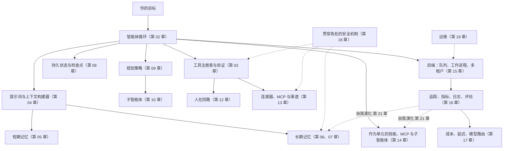

# 第 22 章 — 设计你自己的智能体

你已经读完了二十一章。这一章并非又一个普通章节，而是一幅设计画布——一种把第 01 章至第 21 章的全部内容转化为*你的*项目所需具体形态的方法。以意图为先，而非架构：用例、目标、范围、预算、用户、成功标准、最坏情况错误。一旦意图足够清晰，架构基本上就只剩下一个问题：选择前面章节中的哪些组件承重，哪些可以等待。

教程项目通常让每个人构建同样的东西。这有利于评分，却不利于培养品味、建立主人翁意识，也不利于交付你真正关心的东西。智能体系统的范围很广——个人助理、编码智能体、研究智能体、工作流控制平面、内部工具、企业自动化，以及那些尚未归入任何类别的事物。本课程已经给了你构建模块；本章则帮助你判断，自己的项目究竟真正需要哪些模块。

本章还刻意做了另一件事：它不再编写代码。此前每一章都是一幅地图；这一章则是一枚指南针。最小可信的第一个版本有一项明确的工作、几个工具、基本可观测性和一个停止条件。代码将来自你与智能体围绕自身问题展开的对话。

---

## 概念

### 一幅图看懂整个系统

阅读这幅图时，把它当作一份检查清单，用于判断*哪些内容可能承重*，而不是一张规定*哪些内容必须存在*的蓝图。你的第一个构建版本也许只会使用其中四个方框——循环、几个工具、基本记忆和一个追踪接收器。其余大多是等工作负载证明有必要后再添加的层。第 11 章是把这一切连接起来的组合层；第 19 章讨论它如何随时间持续运行；第 20 章涵盖智能体如何主动采取行动；第 21 章则闭合了反馈边：从可观测性回到智能体下一次会话所使用的记忆和技能。

如果你能说出每个方框的名称，并向朋友解释它的作用，就已经可以开始构建了。

### 意图优先——项目画布

在做出任何架构决策之前，先回答这些问题。这幅画布上的问题没有一个在问*如何做*；它们问的全是*做什么*以及*为什么做*。

- **用例。** 用一句话说明智能体会执行哪项具体的重复性任务。*“它对收到的支持工单进行分类，并起草回复供人类审阅”*是一个用例；*“它是一个 AI 助理”*则不是。
- **目标。** 对用户而言，成功是什么样子？节省工时？缩短周转时间？减少错误？要具体。
- **范围。** 第一个版本的范围内与范围外分别是什么？要毫不留情。范围之外的一切都属于*下一个*版本。
- **预算。** 每次运行最多可以花费多少？每位用户每月多少？如果你无法回答，智能体会用一张出乎你意料的账单告诉你答案。
- **用户。** 有多少人？他们是谁？支持模式是什么？一名操作员和五名同事使用的系统，与一万名陌生人使用的系统截然不同。
- **成功标准。** 你如何知道它正在发挥作用？指标是什么？由谁衡量？
- **最坏情况错误。** 智能体可能犯下的、合理可预见的最严重错误是什么？*“发错一封电子邮件”*可以挽回；*“删除客户的数据”*则无法挽回。这里的答案决定了第 12 章中的审批机制和第 18 章中的控制措施。

七个问题，花十分钟写下来。如果其中任何一个含糊不清，后续架构决策也会含糊不清。如果它们都足够清晰，架构基本上就会自行组合成形。

### 架构画布——与你的智能体一起逐项梳理

意图确定后，与你的智能体坐下来，共同逐项梳理以下内容。每一项都指向完整讨论该主题的章节；智能体可以和你一起阅读这些章节。目标不是现在回答所有问题——而是要知道哪些问题已经回答，哪些问题暂时搁置。

- **循环形态（第 02、09 章）。** 任务是一次性的、多步骤的，还是长期运行的？它需要显式计划，还是选择工具就足够？哪个停止条件能够证明运行已经结束？
- **工具与权限（第 03、12 章）。** 智能体需要哪些工具？哪些是只读的、破坏性的、幂等的？哪些需要审批门禁？
- **记忆层（第 05、06、07 章）。** 它是否需要记住用户偏好、项目事实和此前的失败？采用文件支持、结构化、向量，还是混合形式？谁可以检查、编辑或删除记忆？
- **持久化（第 08 章）。** 这次运行是否需要经受住崩溃或部署？恢复机制是什么？
- **连接器（第 13 章）。** 使用哪些渠道——Slack、Telegram、Web、CLI、MCP server，还是自定义渠道？你需要编写哪些适配器？
- **扩展形态（第 14 章）。** 智能体学到的哪些内容应该成为技能（Markdown）、MCP 工具（外部），或子智能体（拥有自己的循环）？
- **后端拓扑（第 15 章）。** 采用嵌入式单进程、网关，还是多机架构？使用量增长到 10 倍时，规模化是什么样子？
- **可观测性（第 16 章）。** 哪些指标重要？一条成功的追踪是什么样子？你将随系统一起交付的最小评估套件是什么？
- **成本策略（第 17 章）。** 哪些地方可以用确定性工具替代 LLM 调用？模型配置是什么？预算门禁有哪些？
- **安全（第 18 章）。** 每个输入源分别属于哪个信任层级？哪些攻击与你的用例相关？纵深防御是什么？
- **运维（第 19 章）。** 操作员是谁？采用前沿部署还是托管？第一天就有哪些运行手册？
- **主动式触发器（第 20 章）。** 智能体是否会在没有用户请求时工作——cron、webhook、看门狗？哪些类别需要用户选择加入？升级阶梯是什么？
- **自我演化（第 21 章）。** 哪些内容允许自动演化？哪些内容仍由人类变更？回滚路径是什么？

你不需要回答所有这些问题。你需要知道哪些问题已经决定，哪些已经暂时搁置，以及哪些甚至还没有想过。与你一起阅读本章的智能体可以按需带你深入梳理其中任何一项。

### 选择一种原型

生产级智能体系统中反复出现五种原型。选择与你的项目最接近的一种；该原型的承重章节会一并列出。

- **个人助理网关**——多个入站渠道接入一个自托管智能体。参考系统：OpenClaw、Hermes Agent。承重章节：连接器（第 13 章）、记忆（第 05–07 章）、安全（第 18 章）、可观测性（第 16 章）、前沿部署运维（第 19 章）、主动式触发器（第 20 章）、自我演化（第 21 章）。
- **编码智能体**——读取、编辑、测试代码，并对代码进行推理。参考系统：OpenCode。承重章节：工具验证（第 03 章）、循环与停止条件（第 02 章）、状态与恢复（第 08 章）、权限与审批（第 12 章）、可观测性（第 16 章）、成本策略（第 17 章）。
- **工作流控制平面**——协调多个智能体、任务、审批、预算和工作区。参考系统：Paperclip。承重章节：后端基础设施（第 15 章）、HITL 与治理（第 12 章）、连接器（第 13 章）、可观测性（第 16 章）、持久状态（第 08 章）、多租户安全（第 18 章）。
- **知识与研究智能体**——检索、综合、引用，并保持知识库常新。参考系统：Hermes Agent 的记忆模式、OpenCode 的压缩机制。承重章节：长期召回（第 06 章）、上下文与缓存（第 04、05 章）、工具验证（第 03 章）、带显式评估的可观测性（第 16 章）、知识库的自我演化（第 21 章）。
- **前沿部署企业智能体**——定制化、本地优先，工程师随系统一同交付。参考系统：Hermes Agent、OpenClaw，以及 OpenCode 的部分内容。承重章节：运维（第 19 章）、具有严格信任边界的安全机制（第 18 章）、记忆隐私（第 06、07 章）、运行手册纪律（第 19 章）、面向无人值守工作的主动式触发器（第 20 章）、自我演化门禁（第 21 章）。

这些是观察视角，不是必须构建的系统。大多数真实项目会混合其中两种——例如，采用工作流控制平面编排的编码智能体，或结合知识库检索的个人助理网关。选择两者中更接近的一种；等你逐渐超出第一种的能力边界时，再让第二种加入进来。

---

## 最后的思考

本课程的目的从来不是让你复刻他人的产品或背诵某个框架，而是要给你一幅系统地图。一旦你能说出循环、边界、提示词、记忆、持久化、规划器、委派、运行框架、审批门禁、连接器、技能、后端、追踪、路由、安全策略、运行手册和演化反馈边，你就能凭借好得多的直觉设计自己的东西——而你的智能体可以补齐其余部分。

去构建一个你真正希望它存在的东西吧。与你一起阅读本章的智能体，已经准备好与你一同开始。
