# 第 14 章 — 技能、MCP 与子智能体：一种能力的三种形态

## TL;DR

模型需要但尚不具备的能力，可以采用三种形态之一：**技能**——以 Markdown 文件编写、教模型如何做某件事的指令；**MCP 服务器**——将能力作为工具暴露出来的外部进程（第 13 章）；或**子智能体**——拥有自身上下文和结果契约的独立智能体循环（第 10 章）。三者不可互换。技能成本低，教模型*如何做*；MCP 服务器成本适中，隔离的是*执行*；子智能体成本高，隔离的是*推理*。本章会介绍选择形态的决策准则、每种形态的设计规则与故障模式，以及随着系统成熟，如何将一种能力从一种形态迁移到另一种形态。

---

## 为什么这很重要

每个团队在构建智能体时，一旦遇到新的能力缺口，第一反应都是*“再创建一个智能体。”*大多数时候，正确答案是*“写一个技能。”*其次常见的正确答案是*“调用 MCP 服务器。”*完整的智能体循环是最强大、成本也最高的选项——只有当工作需要自己的上下文和推理时才有用，除此之外几乎都不适合。

默认使用子智能体的团队，会积累看不见的成本（每次创建都是一个完整的模型循环），以及最终必须偿还的复杂性（多智能体编排会引入单智能体没有的故障模式）。掌握决策准则、从最轻量层级起步的团队，行动更快，交付的系统也更整洁。

---

## 核心概念

### 用一句话概括三种形态

- **技能**——嵌入智能体提示词的 Markdown 指令，教模型如何使用已有工具完成重复出现的任务。
- **MCP 服务器**——一个独立进程，暴露可供智能体调用的工具；能力位于智能体外部，并可供多个智能体复用。
- **子智能体**——由父智能体为一项有边界的子任务创建的完整智能体循环，拥有自己的提示词、工具集、预算和结果契约（第 10 章）。

同一种能力——*“审查这个 PR”*——可以采用全部三种形态。选择能满足需求的最轻量形态。

### 技能——剖析

技能是一个带有 YAML frontmatter 和自由形式正文的 Markdown 文件：

```markdown
---
name: review_typescript
description: 审查 TypeScript 代码中的类型、异步和安全问题。
version: 1.2.0
platforms: [coding-agent, code-review-bot]
prerequisites: [typescript-installed]
---

# 审查 TypeScript 代码

审查 TypeScript 代码时，按以下顺序进行：

1. 检查公开函数的输入是否有类型标注。
2. 检查异步错误是否得到处理（没有被吞掉的 promise）。
3. 检查用户可控字符串是否安全地到达 shell / SQL / HTML 接收端。
4. 先报告发现的问题，再评论风格问题。
5. 引用你所评论的 file:line。

不要编造问题。如果不确定，标记为*建议进一步审查*，然后继续。
```

生产系统中反复出现五个字段：`name`、`description`、`version`、`platforms`、`prerequisites`。正文是 Markdown——指令、示例、易踩的坑。Hermes Agent 的技能格式遵循 agentskills.io 社区约定——它是一个新兴的技能共享中心，并非由治理机构发布的正式标准。OpenClaw 和 OpenCode 使用相同的形态，只有细微差异。

### 技能——发现、加载与中心

在不同系统中，技能存在于四类位置：

- **内置**——随智能体一同发布。用于通用模式和基线行为。
- **用户安装**——位于 `~/.hermes/skills/`、`~/.openclaw/skills/` 或工作区的 `skills/` 目录下。作用于单台机器或单个项目。
- **插件贡献**——由插件（第 11 章）在启动时注册。按用户安装的技能对待，但与插件一起进行版本管理。
- **中心分发**——Hermes Agent 与 `agentskills.io` 集成：`hermes skills install <name>` 从中心拉取技能，智能体在下一个会话中读取它。这是市场模式；预计会有更多智能体采用。

发现过程是在启动时扫描目录；扫描器读取 frontmatter 并注册每个技能。扫描时不会把完整正文加载进内存——那发生在之后。

### 技能——渐进式披露（简述）

第 06 章完整介绍了这种检索模式：每一轮提示词中都包含技能*索引*（名称 + 描述 + 版本）——无论有多少技能，都只占几百个词元——而技能*正文*则通过 `skill_view(name)` 工具按需加载。从第 14 章的角度，值得重申的是：索引中的每个条目都是前缀成本，每份正文都可能造成提示词注入（参见下文的信任小节），而二十个清晰明确的技能，始终优于两百个大多不相关的技能。第 06 章的预算规则同样适用——归档智能体数月未触及的技能——而下文的信任规则适用于你索引的任何内容。

### 技能——策展

技能会老化。智能体从不使用的技能，或调用已弃用 API 的技能，比没有技能更糟——它会把模型引向陈旧模式。第 07 章介绍了完整的策展生命周期（活跃 → 过时 → 已归档）；具体应用于技能时：

- **活跃**——最近 N 天内使用过；出现在索引中。
- **过时**——30 天内未使用；仍在索引中，但已被标记。
- **已归档**——90 天内未使用；从索引中移除，但可以恢复。

Hermes Agent 的策展器按空闲时段计划运行，并且可以做一件更强大的事：*从成功的操作序列中编写新技能*。如果智能体为了处理一项重复任务，总是可靠地按相同顺序运行三个工具，策展器就会把这个序列提升为模型可以按名称调用的技能。这是生产环境中更为强大的模式之一——*能够编写技能的技能*。

### 技能——来源、信任与提示词注入风险

技能是智能体每个会话都会作为指令读取的文本。因此，它成了整个系统中杠杆效应最高的攻击面之一——从机制上说，恶意技能只是换了个名字的提示词注入。正确的默认做法是：*把所有用户安装或中心分发的技能视为不受信任，直到有理由信任为止。*即使相关协议仍在成熟，以下信任模型也值得明确固定下来：

- **来源。** 每个技能都携带 `name`、`version`，*以及*一个 `source`——它的来源 URL、中心条目、文件路径，或贡献它的插件。安装门禁（第 12 章）读取 `source` 并决定是否询问用户。来自内置集合之外的技能不应悄无声息地进入索引。
- **安装时批准。** 新技能需要经过第 12 章所述的批准，就像新的 MCP 服务器一样。在它进入索引之前，向用户展示技能正文——每一行都要展示。*“信任来自此来源的这个技能”*的授权范围由来源、版本和正文指纹共同限定；正文被重写会使信任失效，并触发新的询问。
- **签名。** 如果中心或分发渠道支持，就使用已发布的密钥验证签名。技能注册表还处于早期阶段，签名语义尚未标准化——跟踪规范，在可行时签名，并默认拒绝安装来自公共来源的未签名技能。
- **正文检查。** 在将技能加入索引之前，对正文运行第 18 章的威胁扫描——使用与第 07 章记忆层相同的模式。包含*“忽略之前的指令”*的技能绝不能进入提示词。
- **一键卸载。** 如果来源变得不可信（中心遭到入侵、作者账号遭到入侵），用户必须能够在不编辑文件的情况下移除技能。第 07 章的策展器负责归档；卸载是它在运维层面的对应机制。

有一条通用规则，团队第一次认真思考时往往会感到意外：*技能比 MCP 服务器更危险*。服务器的工具在进程隔离中执行；技能的文本则在模型提示词内部执行。对待技能边界至少要像对待 MCP 信任边界一样谨慎——通常还应更加谨慎。

### MCP 服务器——何时自行编写

第 13 章介绍了 MCP 协议。剩下的问题是：*什么时候应该编写 MCP 服务器，而不是内置工具或技能？*有三个信号：

- **能力位于智能体进程之外**——数据库、浏览器、第三方 SaaS，或使用不同语言或运行时的服务。进程隔离确实有用。
- **能力可供多个智能体复用**——你只构建一次，组织中的多个不同智能体都可以使用。
- **能力需要自己的凭证或信任边界**——MCP 服务器持有 API 密钥；智能体进程从不接触它。

如果这些条件全都不成立，更轻量的答案通常是内置工具（第 03 章）或技能。

### MCP 服务器——命名、schema、认证

如果确实要编写 MCP 服务器，以下设计选择至关重要：

- **单一用途与多种能力。** 小型、专注的服务器（`pg-query`、`s3-list`）比拥有二十个不相关工具的服务器更容易测试、保护和进行版本管理。宁可选择多个小型服务器，也不要选择一个巨型服务器。
- **工具命名。** 运行框架会把工具命名为 `mcp__<server>__<tool>`（第 13 章）；请选择清晰、简短的工具名称，因为它们每一轮都会出现在模型的提示词中。
- **Schema。** 工具 schema 是前缀的一部分（第 04 章）。保持精简；每个可选字段都会占用前缀字节，也会增加模型错误填写的机会。
- **注解。** 通过 MCP 的 `readOnlyHint`、`destructiveHint`、`idempotentHint` 和 `openWorldHint` 明确标记每个工具的元数据——这样运行框架在接入你的服务器时，才能正确连接第 02 章的并行机制、第 12 章的批准机制和第 08 章的重试安全机制。`Hint` 后缀是有意为之：接入方运行框架应将它们视为服务器*声称*的保守默认值，而不是服务器已经*证明*的断言（第 13 章）。
- **认证。** 凭证保存在服务器内部；绝不要接受模型把凭证作为工具参数传入。使用 OAuth 或通过环境挂载的密钥；轮换凭证时无需让智能体知情。

### 子智能体——以配置档案为单元

第 10 章介绍了委派机制。*本*章关心的是扩展单元：理解子智能体的最佳方式，是把它看作一种可以创建的*配置档案*——一个具名角色，拥有固定的系统提示词、工具列表、模型、预算和结果 schema。

```ts
type SubagentProfile = {
  name:           string;       // "reviewer"、"implementer"、"researcher"
  description:    string;       // 监督者进行选择时所读取的内容
  systemPrompt:   string;       // 特定于角色的指令
  model:          string;       // 通常比父智能体的模型便宜
  toolAllowlist:  string[];     // 比父智能体的更严格
  maxSteps:       number;
  recursionDepth: number;       // 通常为 1——参见第 10 章
  resultSchema:   JsonSchema;
};
```

监督者（第 10 章）按名称选择配置档案；注册表只是一个映射。OpenCode 的内置配置档案——`build`、`plan`、`general`、`explore`——是典型参考。自定义配置档案则是为项目添加专家的方式。

### 子智能体——内置配置档案与自定义配置档案

纵观生产系统，以下是一组实用的起始配置：

- **`explore`**——只读工具、便宜的模型，返回结构化发现。对于*查找某项内容*的任务，它是最安全的默认选项。
- **`build`**——拥有包含写入能力的完整工具集，使用昂贵的模型。通用型工作者。
- **`plan`**——只读工具、便宜的模型，返回结构化计划（第 09 章）。输出是计划，而不是行动。
- **`reviewer`**——只读工具，接收另一个子智能体的输出作为输入，返回*批准*或*发现问题*。这是第 10 章验证模式提供的一种低成本保障。

自定义配置档案采用相同的形态。需要遵守的纪律是：根据配置档案在项目中扮演的角色来命名，而不是根据底层工具来命名。*“数据库迁移审查者”*是配置档案名称；*“调用 pg_query 和 write_file”*是实现细节。

### 决策准则

| 维度 | 技能 | MCP 服务器 | 子智能体 |
|---|---|---|---|
| 增加的内容 | 给模型的指令 | 外部工具 | 独立的推理循环 |
| 单次使用成本 | 少量提示词词元；仅在加载时加入正文 | 一次工具调用协议跳转 | 一个完整的模型循环 |
| 隔离 | 无 | 进程边界 | 上下文 + 工具 + 模型边界 |
| 最适合 | 模型不断重新发明的稳定流程 | 智能体进程之外的能力 | 需要独立推理的有边界子任务 |
| 故障模式 | 模型忽略或误用 | 服务器崩溃、schema 漂移 | 子智能体循环、偏离、超额支出 |
| 更新节奏 | 会话启动时 | 独立的服务器部署 | 每次智能体配置变更时 |
| 版本管理 | YAML frontmatter 中的 `version` | 服务器发布版本 | 配置档案定义 |

如果能在自己的技术栈中进行测量，就加入具体的成本估算：扣除索引成本后，每次使用技能基本上是免费的；一次 MCP 工具调用会增加几毫秒延迟和序列化开销；一次子智能体运行则会增加数百毫秒延迟，并消耗一个完整模型循环的词元。

<div style="text-align:center; margin:1.5em 0;">

</div>

生产系统最终形成的默认选择是：先尝试技能，最后才使用子智能体。如果你的团队面对大多数新能力时都直接采用子智能体，那么技能层很可能尚未得到充分发展。

### 同一种能力的三种实现方式

用一个具体示例让决策准则变得直观。这项能力是*“总结一篇长文档。”*

**作为技能**——文档已经在智能体上下文中，模型只需要处理流程时：

```markdown
---
name: summarize_document
description: 总结上下文中已有的文档。
version: 1.0.0
---

# 总结文档

1. 用一句话陈述核心主张。
2. 列出最多五个支持要点。
3. 提及来源中的限制条件。
4. 摘要不超过 150 字。
不要添加缺乏依据的观点。
```

**作为 MCP 工具**——总结需要外部处理时：解析 PDF、访问文档存储、执行向量检索：

```ts
const summarizeTool = {
  name: "summarize_document",
  description: "按 ID 总结已存储的文档。",
  input_schema: {
    type: "object",
    required: ["documentId"],
    properties: { documentId: { type: "string" } },
  },
  // 实现位于 MCP 服务器中，并调用私有存储。
};
```

**作为子智能体**——总结本身就是一项研究任务时：存在多份文档、相互冲突的证据、迭代阅读和结构化综合：

```ts
await delegate({
  role:         "researcher",
  objective:    "综合这些文档中最有力的主张。",
  context:      buildContextPacket(documentIds),
  allowedTools: ["read_document", "search_documents"],
  maxSteps:     12,
  outputSchema: ResearchSummarySchema,
});
```

三种形态，三种成本结构，三种故障模式。能力相同；如何选择取决于复杂性位于何处。

### 组合：三种形态如何结合

三种形态从设计上就可以组合：

<div style="text-align:center; margin:1.5em 0;">

</div>

生产环境中有三种模式：

- **调用 MCP 工具的技能。** 技能指导模型如何组合一系列由 MCP 封装的工具调用。模型读取技能，然后分发工具。
- **拥有自身技能的子智能体。** 子智能体被创建时（第 10 章），默认继承父智能体的技能索引；OpenCode 允许传入一个子集。子智能体能看到与父智能体相同的 `skill_view` 工具。
- **工具内部运行子智能体的 MCP 服务器。** 插件把对子智能体的调用封装为通过 MCP 暴露的工具。从外部看，它像一个工具；内部则会创建一个完整的智能体循环。它适合在多个智能体安装环境中复用专家，而不必重复实现配置档案。

这三层并不构成层级关系。你应该根据决策准则，针对每项能力混合使用它们。

### 在不同形态之间迁移

随着系统成熟，能力会在不同形态之间迁移。有四种常见迁移：

- **一次性工具序列 → 技能。** 如果模型不断按相同顺序调用相同的三个工具，就编写一个技能来命名这种模式。模型可以直接使用它，而不必反复重新发现。
- **技能 → MCP 服务器。** 如果技能变得庞大，或开始需要凭证或外部状态，就把它提升为服务器。技能变成一句指令——*“调用 mcp__server__do_thing”*——而工作则移出提示词。
- **MCP 服务器 → 内置工具。** 如果每一轮都会调用某个 MCP 工具，单次调用的协议成本会不断累积。将它提升为内置工具（第 03 章），以降低延迟。
- **子智能体 → 技能 + 工具。** 如果子智能体配置档案本质上只是在执行流程（而不是探索），就将其收缩为父智能体读取的技能，并使用父智能体自身的工具执行。这样每次调用都能省去一个完整的模型循环。

迁移很正常，并不代表初始设计很差。第一周适合的形态，到第六个月时很少仍然合适。

### 每种形态的故障模式

| 形态 | 故障 | 如何发现 | 如何处理 |
|---|---|---|---|
| 技能 | 模型忽略它 | 从未调用 `skill_view(name)`；模型输出绕过技能流程 | 收紧描述；将关键步骤提升为内置工具 |
| 技能 | 指导内容过时 | 模型遵循过时步骤 | 由策展器归档（第 07 章）；使用版本字段；明确标记弃用 |
| MCP 服务器 | 崩溃或超时 | 工具结果错误信封 | 使用退避策略重新连接（第 13 章）；如果有内置工具可用，则回退到内置工具 |
| MCP 服务器 | Schema 漂移 | 新一次 `tools/list` 返回了不同形态 | 每次连接时重新列出；如果工具消失，向操作人员发出警告 |
| 子智能体 | 循环、偏离 | 步骤预算达到上限；审查者意见不一致 | 收紧配置档案的工具和系统提示词；降低预算；增加审查者 |
| 子智能体 | 超额支出 | 超出词元或成本预算 | 设置预算上限（第 10 章）；为配置档案使用更便宜的模型 |

适用于全部三种形态的一点实用提醒：命名问题通常是出现故障的*第一个*迹象。与 `reviewer` 相比，名为 `review_typescript` 的技能更不容易和其他技能混淆。与 `create_pr` 相比，带有前缀的 MCP 工具 `mcp__github__create_pr` 更不容易被错误分发。与 `subagent-7` 相比，名为 `db-migration-reviewer` 的子智能体对监督者而言更清晰易懂。命名就是设计。

### 插件技能、插件工具、插件智能体

补充说明第三条轴线：插件（第 11 章）可以贡献三种形态中的任何一种。单个插件可以发布：

- 一个**技能集**——注册到技能索引中的 Markdown 文件；
- 一个 **MCP 服务器**——打包的二进制文件或通过 stdio 创建的进程；
- 一个**子智能体配置档案**——系统提示词 + 工具列表 + 结果 schema，并注册到配置档案注册表中。

OpenClaw 和 Hermes Agent 同时具备全部三种形态；OpenCode 插件可以扩展技能和工具，但不能扩展配置档案。插件内部的选择遵循相同准则——选择符合插件用途的最轻量形态。

---

## 真实系统笔记

- **Hermes Agent** 是技能方面内容最丰富的参考：与 `agentskills.io` 兼容的完整 SKILL.md 格式、目录扫描器、将成功序列提升为新技能的策展器、通过 `hermes skills install/push` 实现的中心集成，以及能够感知版本的归档机制。
- **OpenCode** 同时提供子智能体式委派（`task` 工具）和 `skill` 工具，并通过智能体权限筛选工具。对于作为起始分类法的内置配置档案集合（`build`、`plan`、`general`、`explore`），它是最清晰的参考。
- **Paperclip** 使用技能和适配器来协调外部智能体运行时——它展示了这三种原语如何在组织层面成为运维控制：技能作为指令，适配器作为 MCP 形态的边界，智能体则在控制平面中充当子智能体。
- **OpenClaw** 最清晰地展示了插件层：插件通过一个插件 SDK 贡献技能、MCP 服务器和渠道适配器。它是*由一个插件提供全部三种形态*的优秀参考。

---

## 常见失败情况

*这些故障模式经久不变，而具体修复方式演化得最快——每一项只给出模式，把当前实现细节留给你和你的 AI 伙伴。*

- **每项能力都变成子智能体。** 随着完整模型循环嵌套在完整模型循环中，词元账单的增长速度超过流量。*修复：坚持“技能优先，子智能体最后”的默认原则，并跟踪形态构成指标；每选择一个比技能更重的层级，都必须给出具体理由（第 10 章）。*
- **技能堆积在索引中，模型不再遵循它们。** 数百个条目拖累每一次提示词，而模型仍然在内联地重新发明流程。*修复：按照字节预算修剪索引——检测每个技能的加载率，并通过策展器归档无用负担（第 07 章）。*
- **一个出故障的 MCP 服务器拖垮无关能力。** 一个不稳定的大杂烩服务器发生故障，连带拖垮同处其中的其他能力。*修复：将服务器设计为单一用途，并为关键能力提供备用形态，在重新连接时重新列出工具（第 13 章）。*
- **技能在你不知情时发生变化，并悄悄引导模型。** 一份曾经受信任的正文在上游被重写，却沿用原有授权进入提示词。*修复：将信任绑定到正文指纹，而不是来源名称，并在每次变更时重新扫描（第 12 章、第 18 章）。*
- **第一周适合的形态，到第六个月时已经不合适。** 一个技能膨胀成庞然大物，或某个 MCP 工具每一轮都被调用，却没有人重新调整它的形态。*修复：让迁移触发条件可度量，并定期执行形态迁移审计。*

---

## 与你的智能体结对

以下提示词很适合用于本章：

- *“列出我可能会添加到智能体中的十项新能力。对每一项应用决策准则，告诉我它应该是技能、MCP 工具还是子智能体。使用决定选择的维度来论证每个结论。”*
- *“审计我当前的智能体。对 `skills/` 中的所有内容、我正在调用的每个 MCP 服务器，以及每个子智能体配置档案进行分类。标记任何采用了错误形态的内容，并提出迁移方案。”*
- *“针对我的技术栈，编写三种版本的*总结文档*能力——一种作为技能，一种作为 MCP 工具，一种作为子智能体。使用相同的 10 KB 输入，测量每种实现的延迟和词元消耗。”*
- *“使用 `skill_view` 实现技能索引模式。添加一个指标，统计模型实际调用每个技能的 `skill_view` 的频率。告诉我索引中的哪些技能只是无用负担。”*
- *“建立一个子智能体配置档案注册表，其中包含 `explore`、`build`、`plan`，以及一个用于我项目的自定义配置档案。展示监督者的配置档案选择逻辑，以及每个配置档案的结果 schema。”*
- *“从我的智能体过去一个月的日志中找出迁移候选项。哪些工具序列重复得足够多，应该变成技能？哪些 MCP 工具每一轮都会调用，应该变成内置工具？哪些子智能体配置档案本质上是确定性的，应该收缩为技能？”*
- *“编写一个贡献全部三种形态的插件：一个技能、一个 MCP 工具、一个子智能体配置档案。验证每一项都能正确注册，并且智能体可以在一次会话中使用全部三项。”*

---

## 下一步

现在，你已经了解扩展单元。第 15 章会转向支持运行框架规模化运转的*后端*——队列、流式端点、持久副作用机制，以及在同时存在多个用户和多个进行中会话时，用于承载循环、记忆、持久化与连接器的运行时。
